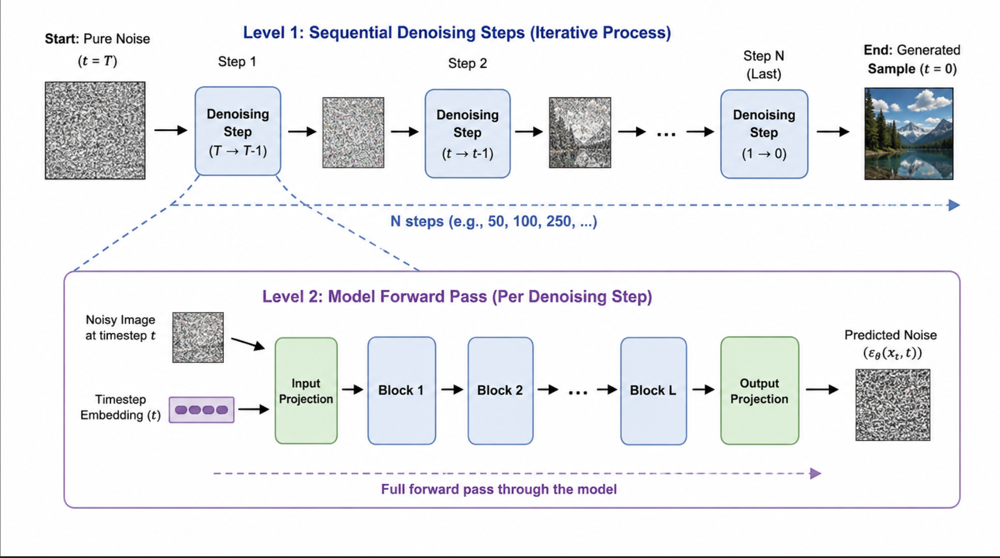
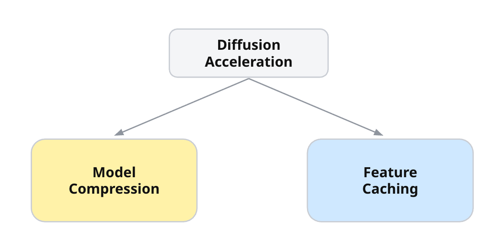
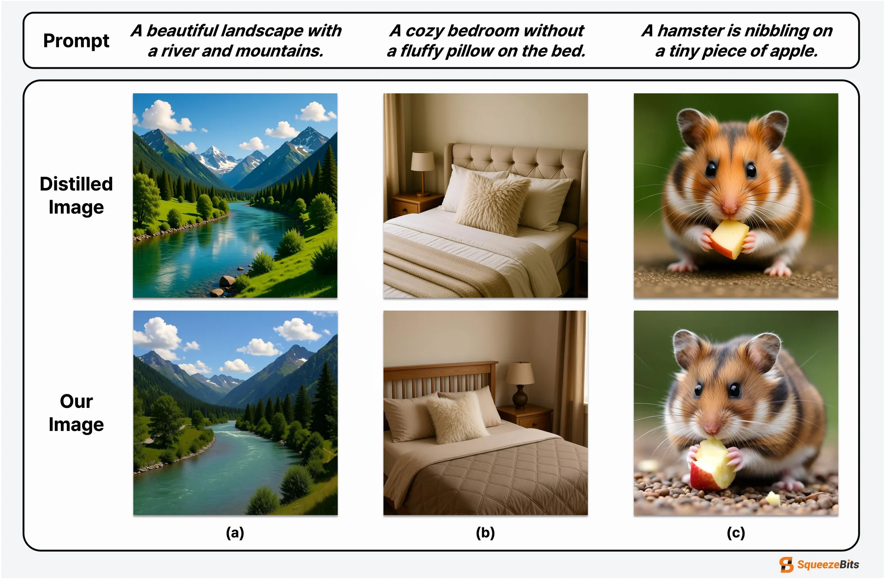
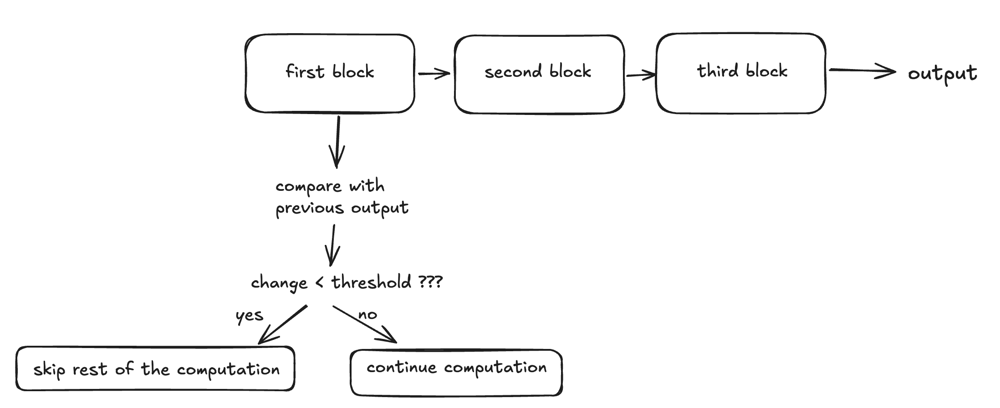
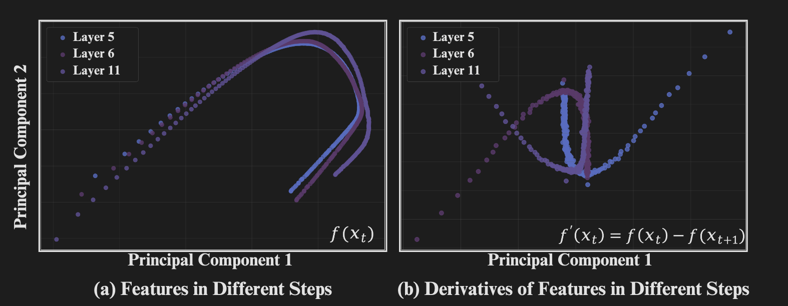
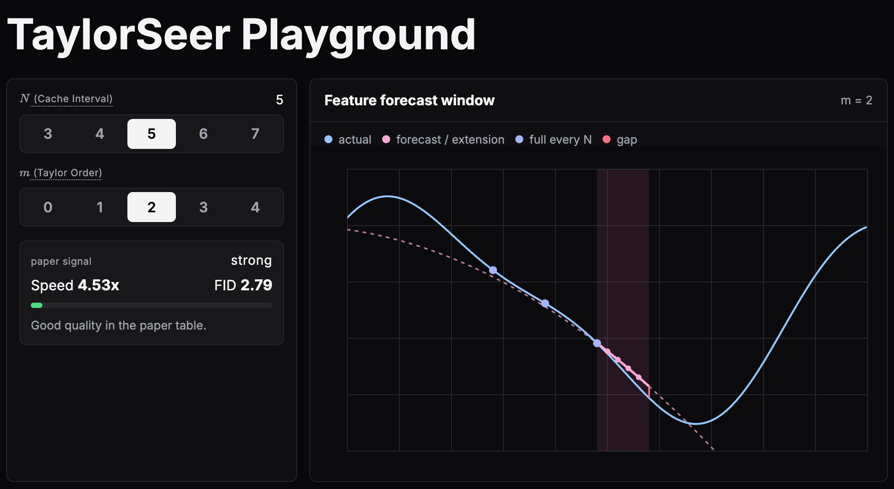
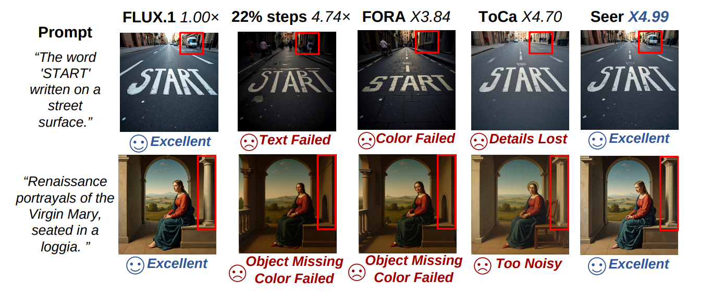
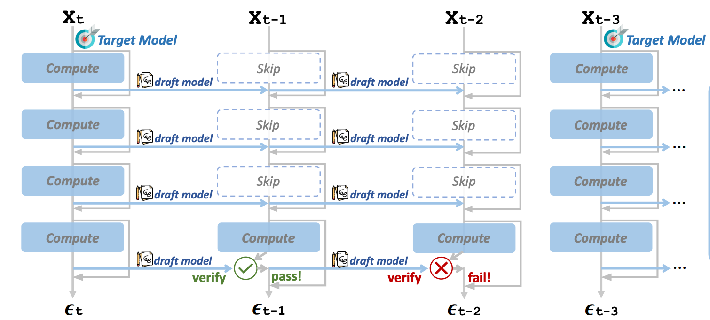
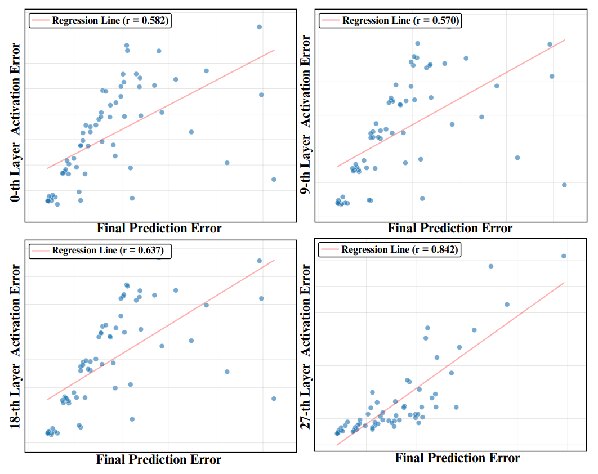
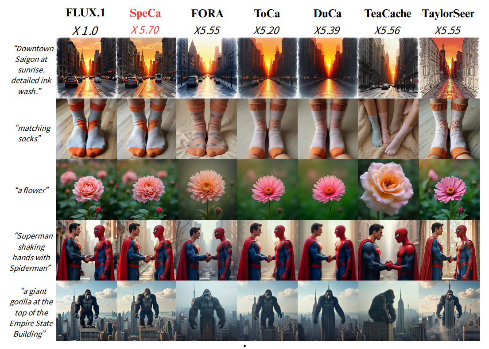

# Accelerating Diffusion Inference via Caching

## Introduction

In this article, we explore how to achieve significant inference speedups in Diffusion models such as FLUX. Rather than diving deep into the mathematical foundations of diffusion or flow matching, I'll concentrate on the algorithmic ideas on reducing computation and accelerating inference while maintaining generation quality.

## Diffusion Models

At a high level, a diffusion model works by progressively adding noise to an image until it becomes pure noise, then learning to reverse that process, recovering a coherent image by iteratively denoising the latent representation. During this process the model learns how to generate data from noise to actual distribution. For this post, we focus specifically on the inference side of diffusion models.

## Diffusion Inference vs LLM Inference

>[!Note] Note
> "LLM inference" here excludes Text Diffusion / Diffusion LLMs, which blend language modeling with diffusion-style generation.)

  
   
  Figure 1. Diffusion inference first encodes text and then repeatedly denoises a latent image through many sampling steps.

Diffusion models require dozens to hundreds of sequential denoising steps at generation time, each demanding a full forward pass through the denoising network. Compared with autoregressive LLM decoding, where KV cache movement and weight bandwidth often dominate at small batch sizes, diffusion/flow-matching inference tends to spend a large fraction of time in dense transformer or U-Net computation repeated across timesteps.

This doesn't strictly mean memory bandwidth never matters for diffusion models. Operations such as attention, normalization, or kernel launch overhead still matter. However algorithmically, meaningful speedups often come from reducing how much denoising-network computation is performed per sampling trajectory.

## Main Approaches in Accelerating Diffusion Inference

At the algorithmic layer, diffusion inference acceleration is often approached in two broad ways: compressing or distilling the model or reducing the number of sampling steps (often via caching).

  
   
  Figure 2. Algorithmic diffusion acceleration can either make the model cheaper to run or reuse computation across denoising steps.

**Model compression** refers to making the neural network cheaper to execute, which can involve distillation, quantization, pruning, low-rank adaptation, or token reduction. However, it is very hard to preserve the original model's quality in the compressed model, especially when compressed aggressively (if we could preserve 100% of the quality, why would we use the original model anyway?).

  
   
  Figure 3. More aggressive compression can reduce visual quality even when latency improves.<a href="#reference-1">[1]</a>

As we reduce the model size or numerical precision, expressive power and accuracy can decline if the compression is too aggressive. Some accelerated/distilled pipelines also disable or weaken classifier-free guidance (CFG), which can make negative prompts less effective. A case study by the SqueezeBits team<a href="#reference-1">[1]</a> illustrates the practical quality-efficiency tradeoff well. Additionally distillation and pruning typically require extra training or fine-tuning, which comes with a non-negligible cost.

**Feature caching methods** (e.g., FBCache, TeaCache, and TaylorSeer) are adopted by diffusion libraries such as HuggingFace Diffusers<a href="#reference-2">[2]</a>, or inference engines such as MAX. Currently, only TaylorSeer is supported in MAX.<a href="#reference-3">[3]</a>

These methods use features from the previous timestep (e.g., attention and MLP representations) and reuse or forecast them when possible. Unlike compression methods, separate model retraining is not required. However, these methods cannot avoid the tradeoff between computational efficiency and image quality either.

We will look at two examples of these caching methods, starting with FBCache.

### FBCache

FBCache (First Block Cache)<a href="#reference-4">[4]</a> is an approach that detects when changes are likely to be minor and skips the later blocks of the denoiser.

  
   
  Figure 4. FBCache checks the first block and reuses the cached full output when the feature change is small.<a href="#reference-5">[5]</a>

To do this, we run only the first Transformer block of each step. Each step typically consists of multiple blocks, which can be represented as:

$$f_{\theta}(x_t) = f_{\mathrm{rest}} \left(f_{\mathrm{first}}(x_t)\right)$$

If the first-block feature changes only slightly across adjacent timesteps (e.g. $\left\| h_t - h_{t+1} \right\| < \text{threshold}$) we consider the next timestep likely similar to the current one and skip the $f_\text{rest}$ computation by reusing the previously cached final output.

$$f_{\mathrm{rest}}(h_t) \approx f_{\mathrm{rest}}(h_{t+1})$$

This intuitively makes sense because not every time step in a diffusion model's denoising process requires the same amount of computation. Only some steps produce large changes, while others make only minor adjustments to the latent.<a href="#reference-5">[5]</a>

Using the first Transformer block's output is, however, a heuristic rather than a mathematical guarantee. This means that image quality may vary depending on how high the threshold is set. As noted in the SqueezeBits blog post<a href="#reference-1">[1]</a>, FBCache can preserve output quality well at moderate speedups, but in their FLUX experiment, the practical speedup range was limited to around 2-3x before visible degradation became more likely. Beyond that, image quality may degrade. For example, background can become blurry.

### TaylorSeer

Another example is TaylorSeer, which uses Taylor series-based approximation to predict the multi-step evolution of intermediate features.<a href="#reference-6">[6]</a>

Unlike previous caching methods such as FBCache, which simply reuse a previously computed feature as an approximation for the current step, TaylorSeer explicitly **forecasts** how features will change over future timesteps.

This relies on the observation that features in diffusion models tend to change slowly and continuously across adjacent timesteps.

  
   
  Figure 5. TaylorSeer motivates feature forecasting by showing smooth feature and derivative trajectories across denoising steps.<a href="#reference-6">[6]</a>

As shown above, both the features and their derivatives follow a relatively smooth trajectory without significant random changes. TaylorSeer assumes that feature representations evolve smoothly over time, making it possible to extrapolate future features from previous feature states.

### Taylor Series

**Taylor Series** is a calculus concept for approximating an unknown function $\mathcal{F}$ near a known point $x=a$. Instead of computing the entire function exactly, we use the function value and its derivative(s) at $a$ to build an $m$-th order polynomial approximation.

Intuitively, if we know the current value, its rate of change, and higher-order change patterns, we can estimate how the function will behave slightly before or after the current point $a$. This video may help to gain stronger intuition on the concept of Taylor Series.<a href="#reference-7">[7]</a>

>[!Note]
>From here, we will use $\mathcal{F}_{\mathrm{pred}}$ as the Taylor polynomial used for approximating the actual feature function $\mathcal{F}$.

Intuitively, the more information we have about how the feature changes, the better we can approximate its future value. For example, a second-order approximation that uses both the slope and curvature can capture the trajectory more accurately than a first-order approximation that uses only the slope.

Also, prediction becomes more reliable when the target timestep is closer, because the gap between the estimate and the actual feature generally grows as we forecast farther away.

  
   
  Figure 6. The TaylorSeer playground shows how cache interval and Taylor order affect quality, speedup, and compute.<a href="#reference-8">[8]</a>

I built a **TaylorSeer playground**<a href="#reference-8">[8]</a> where you can adjust the two knobs:
- $N$, which controls how aggressively caching is applied (target timestep is further away) and
- $m$, which controls the order of the Taylor approximation.

By adjusting these values, you can directly observe how quality, speedup, and compute changes by checking out the playground. (The playground is based on the actual ablation experiment presented in the paper).

### Directly Caching ($m=0$)

Let's start with naive feature reuse. This can be interpreted as a $0$-th order Taylor approximation, where we assume the feature does not change over the cached interval:

$$\mathcal{F}_{\mathrm{pred}}\left(x_{t-k}^{l}\right) = \mathcal{F}\left(x_t^{l}\right)$$

In a 2D graph, this simply means extending the current feature value as a flat horizontal line.

However the actual feature trajectory continues to evolve across diffusion timesteps, so directly reusing the previous feature can introduce approximation error.

When the cache interval is small, such as $N=3$, the gap between the reused feature and the actual feature may remain small. But when caching is applied more aggressively, such as $N=7$, this gap can grow significantly and may degrade image quality.

### Linear Prediction Method ($m=1$)

The simplest forecasting method is a first-order, or linear prediction. Instead of directly reusing the cached feature, we estimate how the feature is moving and extrapolate it $k$ steps ahead along the denoising trajectory. The authors refer to this as _short-term forecasting_.

$$\mathcal{F}_{\mathrm{pred}}\left(x_{t-k}^{l}\right) = \mathcal{F}\left(x_t^{l}\right) + \frac{\Delta \mathcal{F}\left(x_t^{l}\right)}{N}(-k)$$

where $x_t^{l}$ is the current timestep and $k$ is the number of denoising steps we are trying to forecast. The $(-k)$ term appears because sampling proceeds from higher-noise timesteps toward lower-noise timesteps, so the index direction in the formula is opposite to the historical finite-difference direction.

Unlike cache reuse, which only requires caching the latent feature itself, linear prediction additionally requires saving the derivative of latent feature:

$$C\left(x_t^{l}\right) := \left\{ \mathcal{F}\left(x_t^{l}\right), \Delta \mathcal{F}\left(x_t^{l}\right) \right\}$$

where

$$\Delta \mathcal{F}(x_t^l) = \mathcal{F}(x_{t+N}^l) - \mathcal{F}(x_t^l) \approx N \times \mathcal{F}'(x^l_t)$$

In TaylorSeer, **derivatives are not computed analytically** ($\mathcal{F}', \mathcal{F}''$). Instead, previously computed features at full-forward timesteps are used to approximate derivatives with finite differences. As the Taylor order $m$ increases, more historical feature states are needed to estimate higher-order differences.

### Higher-Order Prediction ($m \geq 2$) via Taylor Expansion

Using Taylor expansion, we can scale the prediction function to 2nd, 3rd, 4th order and beyond.

The $i$-th order forward finite difference can be defined as

$$\Delta^{i}\mathcal{F}\left(x_t^{l}\right) = \Delta\left(\Delta^{i-1}\mathcal{F}\left(x_t^{l}\right)\right) = \Delta^{i-1}\mathcal{F}\left(x_{t+N}^{l}\right) - \Delta^{i-1}\mathcal{F}\left(x_t^{l}\right)$$

This requires more cached finite-difference states and slightly more bookkeeping, but it avoids additional full forward passes.

>[!Note] Note
>Higher-order TaylorSeer does perform more arithmetic than direct cache reuse due to it evaluating more polynomial terms and store more finite-difference tensors. However, those operations are negligible compared to running the denoising block itself. So as long as higher-order forecasting lets us skip those block computations, the extra polynomial bookkeeping can be ignored.

A $m$-dimensional prediction function is

$$\mathcal{F}_{\mathrm{pred},m}\left(x_{t-k}^{l}\right) = \mathcal{F}\left(x_t^{l}\right) + \sum_{i=1}^{m} \frac{\Delta^{i}\mathcal{F}\left(x_t^{l}\right)}{i! \, N^{i}}(-k)^i$$

where $N$ is the gap between every full forward.

As an intuitive example, if we want to use a 3rd-order Taylor approximation, we need four values: $F_0, F_1, F_2, F_3$.

- 1st-order finite difference: $D_0 = F_1 - F_0$, $D_1 = F_2 - F_1$, $D_2 = F_3 - F_2$
- 2nd-order finite difference: $E_0 = D_1 - D_0$, $E_1 = D_2 - D_1$
- 3rd-order finite difference: $G_0 = E_1 - E_0$

If we generalize this, computing an $i$-th order finite difference requires $i+1$ values. Thus we additionally save the $m(m \geq 2)$ derivatives corresponding to the chosen Taylor order:

$$C\left(x_t^{l}\right) := \left\{ \mathcal{F}\left(x_t^{l}\right), \Delta \mathcal{F}\left(x_t^{l}\right), \ldots, \Delta^{m}\mathcal{F}\left(x_t^{l}\right) \right\}$$

However, increasing the Taylor order does not always improve prediction quality. Higher-order terms can reduce approximation error when the feature trajectory is smooth, but TaylorSeer does not compute exact derivatives; it estimates them from previously computed features using finite differences. These higher-order finite-difference estimates become increasingly sensitive to approximation error, discretization noise, and small irregularities in the feature trajectory. As a result, adding more Taylor terms can eventually amplify error rather than reduce it, which leads to diminishing returns beyond a certain order.

  
   
  Figure 7. TaylorSeer reaches about 5x FLOPs speedup while staying close to the full-compute baseline on FLUX.1-dev.<a href="#reference-6">[6]</a>

TaylorSeer makes high-ratio caching practical. Instead of topping out around 2-3x before quality collapses, it reaches roughly ~5x FLOPs speedup on FLUX.1 dev and HunyuanVideo while staying close to the full-compute baseline. For FLUX.1 dev, it generated about 5x less compute, with ImageReward slightly higher than the 50-step baseline (1.0039 vs. 0.9898).

### Limitation of TaylorSeer

One caveat of this method is that it lacks a validation mechanism. While it is known to accelerate inference, there is no guarantee on prediction accuracy.

In particular, as the interval between full forward passes ($N$) increases and more cached forecasts are used in between, the error is likely to accumulate, ultimately degrading image quality.

It has been shown experimentally that caching and forecasting can deliver large speedups. However, if compute is reduced too aggressively, image quality degrades which is precisely what users want to avoid. There is an inherent tradeoff between reducing compute and latency on one hand, and preserving image quality on the other.

Another limitation of existing approaches is that they often apply the same acceleration ratio to all samples, keeping the sampling intervals fixed regardless of the input. For example, an easy prompt whose feature trajectory is smooth and a hard prompt with complex structure may both be forced to reuse or forecast features at the fixed interval even though the latter may need more full computation to avoid visible artifacts.

To summarize what we have covered so far:
- Diffusion models require significant sequential computation.
- We want to reduce this burden while preserving image quality.
- However, existing methods (including TaylorSeer) struggle to preserve image quality when tuned too aggressively.

## Speculative Caching

The previous caching methods can be summarized as a _"cache-then-reuse"_ paradigm while TaylorSeer introduces _"cache-then-forecast"_.

SpeCa is a method that can be described as a _"forecast-then-verify"_ paradigm - it uses TaylorSeer but significantly reduces error by adding a verification step.<a href="#reference-9">[9]</a> This is inspired by one of the most successful and widely adopted LLM inference techniques, Speculative Decoding.

Speculative Decoding in LLMs uses a cheap draft model to propose tokens and the target model to verify them, often preserving the target model's exact output distribution. SpeCa uses feature-error based verification rather than a separate verifier model, so it does not provide bit-exact or distribution-exact equivalence to full inference. Still it borrows the core idea of cheaply drafting several future steps and using a lightweight check from the main(target) path to decide how far to trust the draft.

Concretely, it works in three steps:
1. Execute a full forward pass at key time step $t$ (what "key" means will be explained shortly) to obtain accurate feature representation ${f}(x^l_t)$
2. Predict the features for the subsequent $k$ timesteps $\{t-1, t-2, ... , t-k\}$ using TaylorSeer, where $k$ is the speculation step parameter.
3. For each drafted step, evaluate the reliability of the predicted features through a validation method and decide whether to accept or reject the prediction.

This is relatively straightforward. The two questions we need to solve are:
1. When is a timestep considered a key timestep?
2. How does the verification step work?

### Verifying with Last Transformer Layer

  
   
  Figure 8. SpeCa verifies a speculative Taylor step by comparing predicted and actually computed hidden states at a deep transformer layer.<a href="#reference-9">[9]</a>

To answer both questions at once, SpeCa uses a deep transformer layer as a lightweight verification point. During Taylor steps, most block computations are replaced with TaylorSeer-predicted attention/MLP features. At the verification layer, SpeCa compares the Taylor-predicted hidden state with the hidden state obtained by actually executing that layer from the same incoming activation.

The prediction error is measured with a norm-based feature distance and compared against an adaptive threshold. If the error is too large, SpeCa stops trusting the current speculative streak and schedules a full computation step to refresh the cache. In the paper's algorithmic description, rejected predictions and subsequent predictions in the streak fall back to standard computation; in the public DiT implementation, the measured `last_layer_error` is used by the next scheduling decision after `min_taylor_steps` is satisfied.

We also need to set `min_taylor_steps` and `max_taylor_steps`, where `min` is the minimum number of TaylorSeer predictions to make before the threshold can force a return to full computation, and `max` is the maximum number of continuous TaylorSeer predictions before a full refresh is forced.

In other words, a key timestep is not a fixed list chosen before generation. It is any timestep where the model performs a full forward computation and refreshes the Taylor cache. SpeCa decides these key timesteps dynamically using the current speculative streak length and the verification error.

The paper defines the verification score as a relative $\ell_2$ feature error. The public DiT example exposes several error metrics and defaults to `relative_l1`, so reproductions should be careful to distinguish the paper formulation from implementation defaults.

While the context and specific mechanism differ, this is somewhat symmetric to FBCache discussed earlier. FBCache uses early block feature change as a cheap signal for whether later computation can be skipped, while SpeCa uses deep layer prediction error as a cheap signal for whether the speculative streak should continue.

### So why the last transformer layer?

While it is ultimately a heuristic, the authors offer empirical support for this choice.

  
   
  Figure 9. Deeper transformer-layer activation error correlates more strongly with final output error than shallow-layer error.<a href="#reference-9">[9]</a>

Their layer-wise analysis shows that deeper-layer activation error correlates better with final output error than shallow-layer error.

For example in DiT-XL/2, layer 27 (the latter layer) is reported to correlate with the output error the most, so it provides a useful proxy for generation quality while costing only a small fraction of a full forward pass.

  
   
  Figure 10. SpeCa improves high-speed caching by adding verification, reducing quality loss at aggressive FLOPs speedups.<a href="#reference-9">[9]</a>

As a result, SpeCa makes more aggressive (5x+) caching safer. While the speedup does not improve dramatically compared to TaylorSeer's already strong baseline, SpeCa pushes beyond it while preserving image quality. The key is the lightweight verification step, which detects when TaylorSeer forecasts drift too far and forces a full refresh before error accumulation becomes visible. On FLUX.1-dev, for example, SpeCa reaches **6.34x FLOPs speedup** with **ImageReward 0.9355**, while TaylorSeer at a similar 6.24x FLOPs speedup drops to 0.8168.

### Future Works

I also investigated a SpeCa prototype on Modular MAX. MAX already supports TaylorSeer, but SpeCa needs a lower-level integration point than ordinary caching since the verification step must use intermediate transformer-layer activations. The current FLUX 2 serving path is optimized around a higher-level compiled boundary, which is less convenient for experimenting with layer-level verification.

The FLUX 2 module v3 path (which included FBCache and TeaCache as well) looked more suitable for this kind of experiment because it exposes a more flexible model structure. However, after seeing the recent deprecation/deprioritization of that path<a href="#reference-3">[3]</a>, I interpret this as a signal that this path is no longer the current priority. Hopefully soon I can get back and play around more with caching on MAX or other omni-inference engines.

While we have mostly covered the high-level, algorithmic side of diffusion optimization, the algorithmic side alone is not sufficient. We also need to optimize all the individual ops that go into the model, such as matmul, norm, and RoPE. It is also important to ensure that each optimized op can be composed and fused seamlessly to make an end-to-end impact. Hopefully we can explore low-level (kernel) optimizations in diffusion models in a future post as well.

## References

This learning journey was primarily inspired by the optimizations done by the SqueezeBits team on the Modular MAX framework<a href="#reference-10">[10]</a>, achieving one of the fastest FLUX image generation pipelines at the moment. Special thanks to the SqueezeBits team for their friendly introductory blog post on diffusion caching.<a href="#reference-1">[1]</a> I also experimented with the hybrid pipelining method introduced in the same post, but did not include it here.

Other additional resources include:
<ol>
  <li id="reference-1">SqueezeBits, "FLUX.1 inference optimization on Modular MAX." <a href="https://blog.squeezebits.com/77516">Link</a></li>
  <li id="reference-2">Hugging Face Diffusers, "Cache." <a href="https://huggingface.co/docs/diffusers/api/cache">Link</a></li>
  <li id="reference-3">Modular commit `f7674460ea9cd18650f0a9c748b4afbe77027043`, deprecating the FLUX module v3 path and noting TaylorSeer support. <a href="https://github.com/modular/modular/commit/f7674460ea9cd18650f0a9c748b4afbe77027043">Link</a></li>
  <li id="reference-4">ParaAttention README, "First-Block Cache." <a href="https://github.com/chengzeyi/ParaAttention/blob/7a266123671b55e7e5a2fe9af3121f07a36afc78/README.md#first-block-cache-our-dynamic-caching">Link</a></li>
  <li id="reference-5">Semih Berkay Ozturk, "First Block Caching." <a href="https://semihb.com/essays/first-block-caching/">Link</a></li>
  <li id="reference-6">Liu et al., "From Reusing to Forecasting: Accelerating Diffusion Models with TaylorSeers," ICCV 2025. <a href="https://www.openaccess.thecvf.com/content/ICCV2025/papers/Liu_From_Reusing_to_Forecasting_Accelerating_Diffusion_Models_with_TaylorSeers_ICCV_2025_paper.pdf">CVF paper</a>, <a href="https://arxiv.org/abs/2503.06923">arXiv</a></li>
  <li id="reference-7">3Blue1Brown, "Taylor series." <a href="https://youtu.be/3d6DsjIBzJ4?si=zFSI7hR48Bj3OFet">Link</a></li>
  <li id="reference-8">TaylorSeer playground. <a href="http://junupark.xyz/taylorseer-playground/">Link</a></li>
  <li id="reference-9">Liu et al., "SpeCa: Accelerating Diffusion Transformers with Speculative Feature Caching." <a href="https://arxiv.org/abs/2509.11628">Link</a></li>
  <li id="reference-10">The Elec, "SqueezeBits Modular MAX FLUX optimization interview." <a href="https://www.thelec.net/news/articleView.html?idxno=6428">Link</a></li>
  <li id="reference-11">Hugging Face Diffusers documentation. <a href="https://huggingface.co/docs/diffusers/">Link</a></li>
  <li id="reference-12">Modular MAX documentation, "Image generation." <a href="https://docs.modular.com/max/inference/image-generation/">Link</a></li>
  <li id="reference-13">Modular MAX CLI documentation, "serve." <a href="https://docs.modular.com/max/cli/serve/">Link</a></li>
  <li id="reference-14">Modular MAX CLI documentation, "benchmark." <a href="https://docs.modular.com/max/cli/benchmark/">Link</a></li>
</ol>
