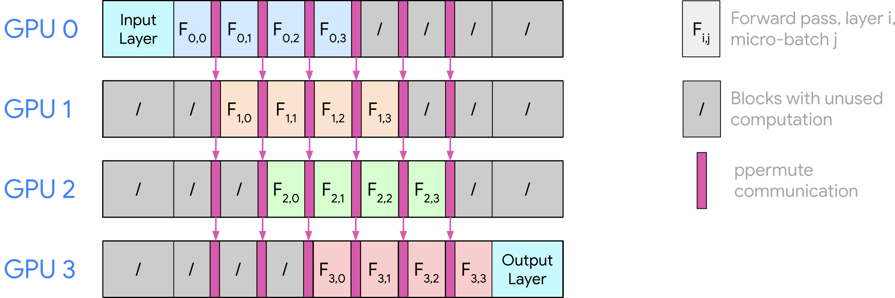

## PP (Pipeline Parallelism)

**Pipeline Parallelism (PP)** divides model layers across multiple ranks. The core purpose is similar to TP - reduce the portion of the model weights each rank has to hold. The difference is the axis it shards. While TP shards tensors inside each layer, PP shards the model by layer ranges.

PP is often used across nodes when one node is not enough to hold or serve a model efficiently. According to the vLLM documentation, pipeline parallelism can also be useful when the GPU count does not evenly divide the model size (for example, 5 GPUs). PP might also be better than TP when GPUs in the same node do not have fast interconnects such as NVLink, for example L4 or L40S GPUs.<sup><a href="#reference-1">[1]</a></sup>


<p align="center">
  
  <br />
  <sub>Figure 1. Pipeline parallelism splits consecutive layer ranges across four GPUs.<sup><a href="#reference-2">[2]</a></sup></sub>
</p>

As an illustrative example, a model with 80 transformer layers can be divided into four PP ranks, with each rank owning 20 complete layers.

For each forward pass, rank 0 runs the first layer range, sends the resulting intermediate hidden state to rank 1, and the same pattern continues until the last rank produces the final output.

### TP vs PP

How should we think about PP exactly? The cleanest way is to compare it with TP. Both TP and PP split one logical model replica across multiple ranks, but they split different dimensions of the computation. Because of that, they tend to hit different bottlenecks.

In terms of communication, TP communicates inside each transformer block. As we saw in the [TP note](tp.md), TP requires communication such as All-Reduce or All-Gather between devices inside each layer during inference.

PP, on the other hand, communicates at stage boundaries instead. After one stage finishes its local layers, it sends intermediate tensors such as `hidden_states` and sometimes `residual` to the next stage. In NVIDIA GPU setups with fast intra-node interconnects such as NVLink, TP is usually the first choice inside a node. PP becomes more attractive across nodes, or inside a node when the GPUs do not have fast peer-to-peer bandwidth.<sup><a href="#reference-1">[1]</a></sup>

The parallel work created is also different. TP makes multiple ranks cooperate on the same layer at the same time using collective communication methods such as All-Reduce or All-Gather. PP sends the intermediate state of the last local layer to the next rank through peer-to-peer (P2P) communication, so it usually needs less frequent synchronization than TP. However, while TP ranks can work on the same layer together, PP ranks may wait before receiving work or after handing work to the next stage. This idle time is called the _pipeline bubble_.

The KV-cache difference is especially important for inference. In TP, every layer still exists logically on every TP group, so KV-cache placement follows how attention heads are partitioned across TP ranks. In PP, a rank only owns partial layers, so it only needs KV cache for those local layers. For example, in an 80-layer model with `pp_size=4`, rank 0 stores KV cache for layers 0-19, rank 1 stores KV cache for layers 20-39, and so on. Thus, PP-related memory accounting often needs to know the local layer range. In fact I contributed to a PP cache sharding memory validation bug in vLLM a while ago.<sup><a href="#reference-5">[5]</a></sup>
 
### When do we use PP?

As mentioned above, PP becomes more attractive when the model is too large for one node. This is because, inside a node with fast interconnects, the underutilization from pipeline bubbles can be worse than TP's communication cost. So the usual rule of thumb is TP within a node and PP across nodes.

Now let's see how PP is implemented in vLLM.

## Case Study: Qwen3 PP in vLLM

If we run:

```python
vllm serve Qwen/Qwen3-8B --pipeline-parallel-size 4
```

then vLLM can split the 36 layers<sup><a href="#reference-3">[3]</a></sup> roughly as:

```text
PP rank 0 -> layers 0-8
PP rank 1 -> layers 9-17
PP rank 2 -> layers 18-26
PP rank 3 -> layers 27-35
```

Source: [`Qwen3Model`](https://github.com/vllm-project/vllm/blob/8c94938cfb92cc00b244ae4a933c5f60dbc1139f/vllm/model_executor/models/qwen3.py#L254-L281)

```python
self.start_layer, self.end_layer, self.layers = make_layers(
    config.num_hidden_layers,
    lambda prefix: Qwen3DecoderLayer(
        config=config,
        cache_config=cache_config,
        quant_config=quant_config,
        prefix=prefix,
    ),
    prefix=f"{prefix}.layers",
)
```

`make_layers` returns the local layer range for the current PP rank. It also fills non-local layers with `PPMissingLayer`, so the module list still has the same global layer indices.

Source: [`make_layers`](https://github.com/vllm-project/vllm/blob/8c94938cfb92cc00b244ae4a933c5f60dbc1139f/vllm/model_executor/models/utils.py#L632-L663)

```python
start_layer, end_layer = get_pp_indices(
    num_hidden_layers,
    get_pp_group().rank_in_group,
    get_pp_group().world_size,
)

modules = torch.nn.ModuleList(
    [PPMissingLayer() for _ in range(start_layer)]
    + get_offloader().wrap_modules(
        layer_fn(prefix=f"{prefix}.{idx}") for idx in range(start_layer, end_layer)
    )
    + [PPMissingLayer() for _ in range(end_layer, num_hidden_layers)]
)
```

`make_layers` gets that range from `get_pp_indices`. For Qwen3-8B with `num_hidden_layers = 36` and `pp_size = 4`, this gives 9 layers per rank. 

```text
partitions = [9, 9, 9, 9]
```

The split is even so there are no remaining layers to rebalance.

Source: [`get_pp_indices`](https://github.com/vllm-project/vllm/blob/8c94938cfb92cc00b244ae4a933c5f60dbc1139f/vllm/distributed/utils.py#L95-L140)

```python
layers_per_partition = num_hidden_layers // pp_size
partitions = [layers_per_partition for _ in range(pp_size)]

start_layer = sum(partitions[:pp_rank])
end_layer = start_layer + partitions[pp_rank]
```

If the layer count is not evenly divisible by `pp_size`, vLLM distributes the remaining layers across earlier non-last stages. The split can also be manually overridden with `VLLM_PP_LAYER_PARTITION`.<sup><a href="#reference-4">[4]</a></sup>

After initialization, each rank has its own `start_layer` and `end_layer`. During execution, the forward loop uses that range, so each rank only computes its local layers:

Source: [`Qwen3Model.forward`](https://github.com/vllm-project/vllm/blob/8c94938cfb92cc00b244ae4a933c5f60dbc1139f/vllm/model_executor/models/qwen3.py#L287-L326)

```python
for layer in self.layers[self.start_layer : self.end_layer]:
    hidden_states, residual = layer(
        positions,
        hidden_states,
        residual,
    )
```

To summarize, the first stage receives token embeddings and starts the decoder stack. Intermediate stages receive hidden states from the previous PP rank. The last stage applies the final norm and then the LM head before sampling.

With the 4-way Qwen3-8B split above, each rank stores layer weights and KV cache for only 9 local layers, while the whole PP group still represents full Qwen3-8B.

### References

<p id="reference-1">[1] vLLM Team. <a href="https://docs.vllm.ai/en/stable/serving/parallelism_scaling/">Parallelism and Scaling</a>.</p>
<p id="reference-2">[2] UvA Deep Learning Tutorials. <a href="https://uvadlc-notebooks.readthedocs.io/en/latest/tutorial_notebooks/scaling/JAX/pipeline_parallel_simple.html">Pipeline Parallelism</a>.</p>
<p id="reference-3">[3] Alibaba Cloud. <a href="https://huggingface.co/Qwen/Qwen3-8B/blob/main/config.json">Qwen3-8B config.json</a>.</p>
<p id="reference-4">[4] vLLM Team. <a href="https://github.com/vllm-project/vllm/blob/8c94938cfb92cc00b244ae4a933c5f60dbc1139f/vllm/distributed/utils.py#L95-L140">get_pp_indices</a>.</p>
<p id="reference-5">[5] vLLM Project. <a href="https://github.com/vllm-project/vllm/pull/33698">Fix PP cache sharding memory validation</a>.</p>
