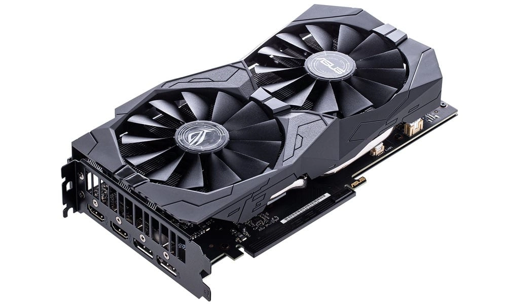
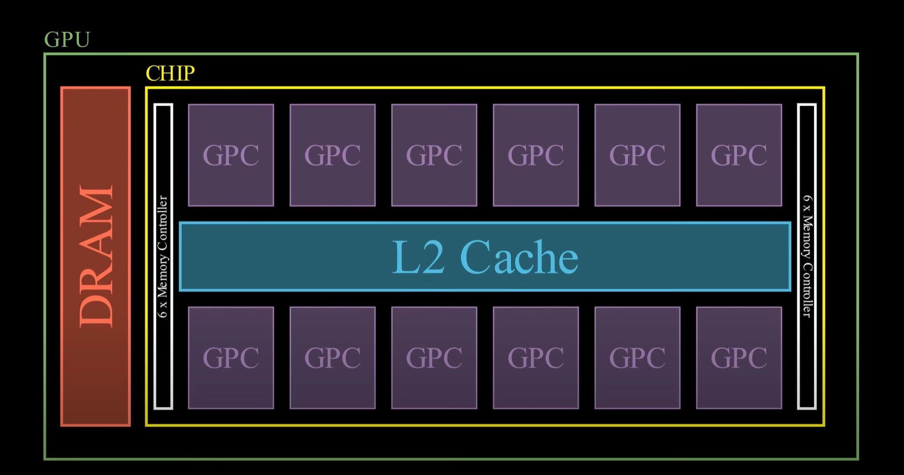
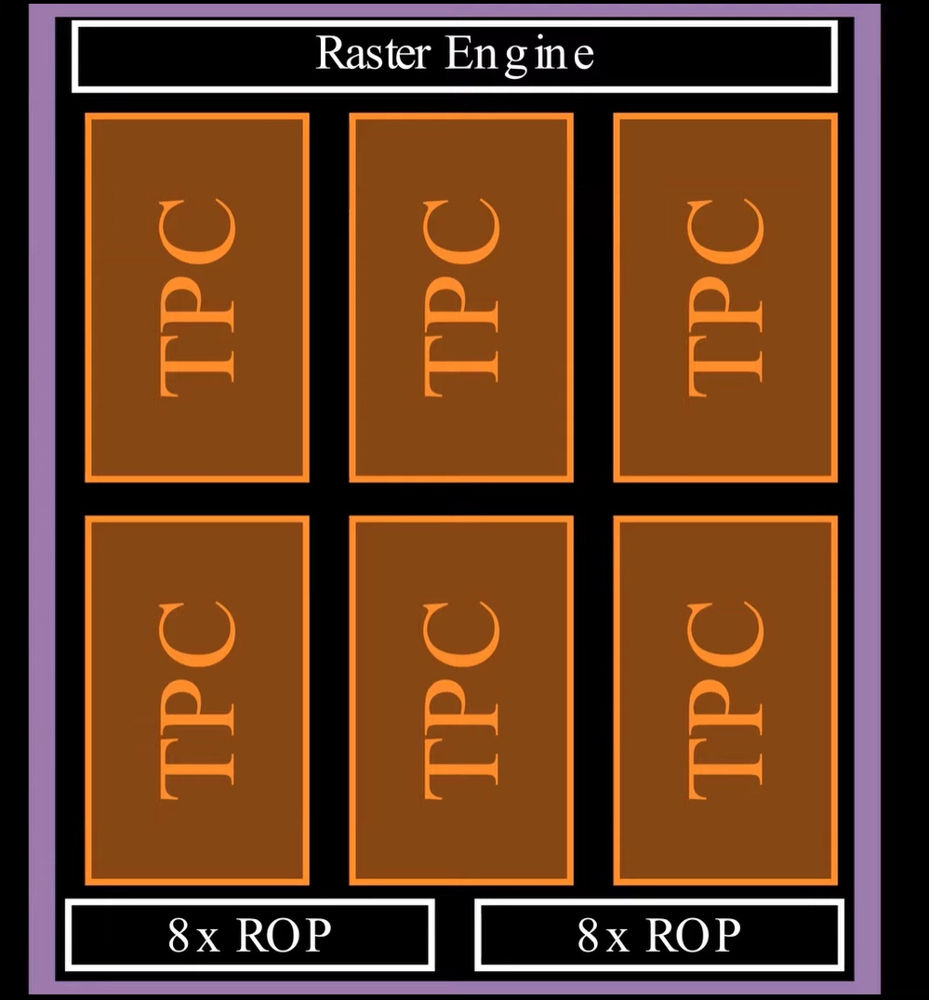
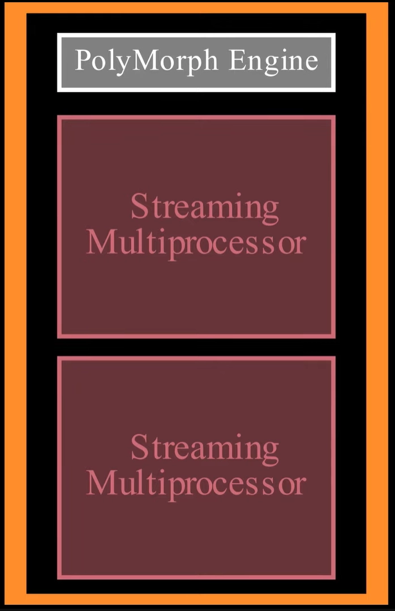
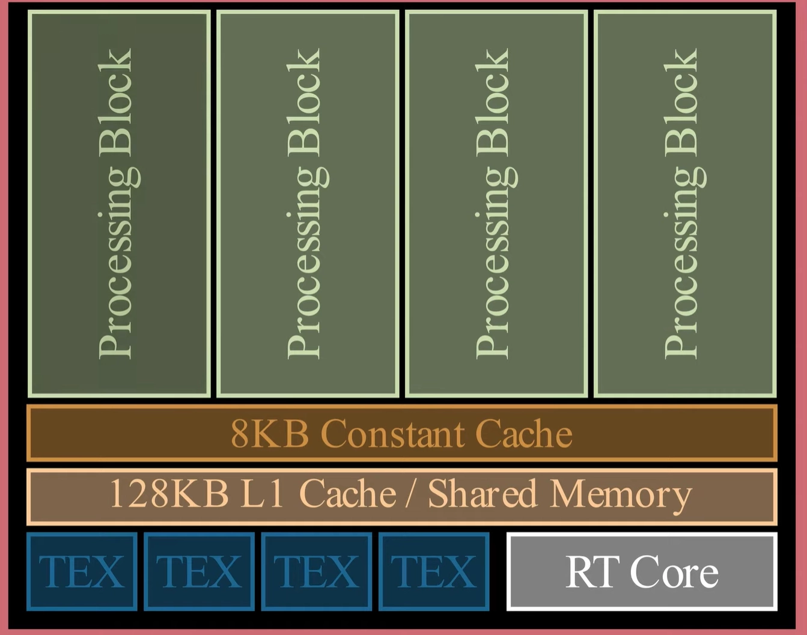
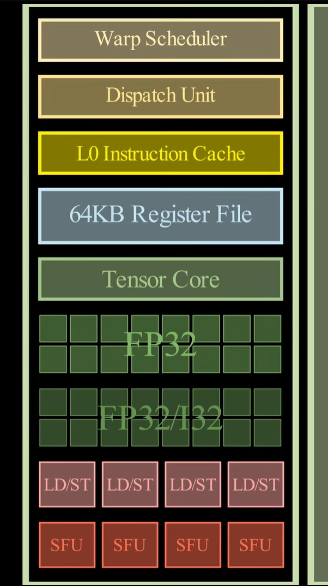
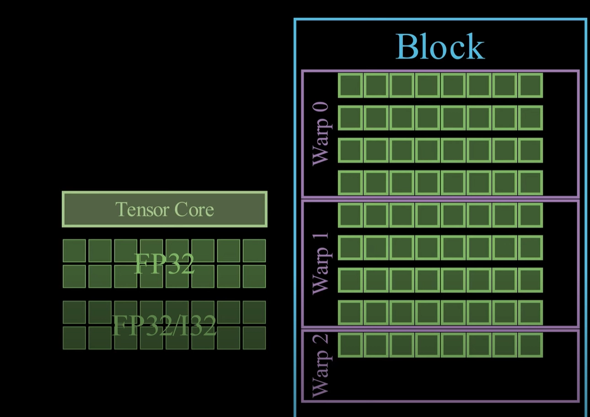

# NVIDIA GPU Architecture: From GPC to SM

This note is a guided map of a modern NVIDIA GPU, starting from the full chip and zooming down to the Streaming Multiprocessor (SM). The diagrams are based on Simon Oz's lecture on modern GPU architecture and NVIDIA's Ada/Ampere architecture material.<a href="#reference-1">[1]</a><a href="#reference-2">[2]</a><a href="#reference-3">[3]</a>

> [!NOTE]
>Treat the exact block counts as architecture-specific. NVIDIA changes the number of GPCs, TPCs, SMs, ROPs, cache sizes, and special-purpose units across generations and product SKUs. The useful mental model is the hierarchy:
>$$GPU \rightarrow GPC \rightarrow TPC \rightarrow SM \rightarrow processing\ blocks$$

## Full-chip view

  
   
  Figure 1. High-level NVIDIA GPU organization, with multiple Graphics Processing Clusters (GPCs) connected to shared memory, cache, and I/O systems.<a href="#reference-1">[1]</a>

At the highest level, an NVIDIA GPU is a collection of Graphics Processing Clusters (GPCs), memory controllers, an L2 cache, copy/display/media engines, and external DRAM. For CUDA programmers, the SMs are the most important compute units, but those SMs live inside this larger graphics-and-compute hierarchy.

  
   
  Figure 2. A second top-level view showing the relationship between GPCs, L2 cache, and off-chip memory.<a href="#reference-1">[1]</a>

A _cache_ is a smaller and faster memory structure that keeps recently or frequently used data closer to the compute units. On NVIDIA GPUs, L1/shared memory sits close to each SM, while L2 is shared more broadly across the chip before requests go out to DRAM.

## Graphics Processing Cluster (GPC)

  
   
  Figure 3. One GPC containing a raster engine, Texture Processing Clusters (TPCs), SMs, and ROP partitions.<a href="#reference-2">[2]</a>

A GPC is a large repeated region of the chip. In NVIDIA's Ada whitepaper, an Ada GPC contains a raster engine, 6 TPCs, 12 SMs, and 16 ROPs split into two ROP partitions.<a href="#reference-2">[2]</a> GPC groups together graphics pipeline hardware and multiple SMs.

Key pieces:
- **Raster engine:** graphics hardware that helps turn triangles into fragments/pixels.
- **TPCs:** mid-level clusters that contain SMs and texture/geometry-related hardware.
- **ROPs:** render output units used in the later stages of graphics rendering.

## Texture Processing Cluster (TPC)

  
   
  Figure 4. One TPC with a PolyMorph Engine and two SMs.<a href="#reference-2">[2]</a>

A TPC usually contains two SMs plus graphics-oriented hardware such as a PolyMorph Engine. The PolyMorph Engine is part of the graphics pipeline, but the two SMs are the part we care about most for CUDA and machine learning kernels.

$$1\ GPC \approx 6\ TPCs,\quad 1\ TPC \approx 2\ SMs$$

## Streaming Multiprocessor (SM)

  
   
  Figure 5. One SM with CUDA cores, Tensor Cores, RT Core, texture units, register file, L1/shared memory, schedulers, and load/store units.<a href="#reference-2">[2]</a><a href="#reference-3">[3]</a>

The SM is the central execution unit for CUDA programs. Thread blocks are assigned to SMs, and the SM schedules their warps onto execution units.

For an Ada/Ampere-style SM, the important pieces are:

- **CUDA cores:** scalar/vector arithmetic units used for ordinary FP32, INT32, and related operations.
- **Tensor Cores:** specialized matrix-multiply-and-accumulate units used heavily in deep learning.
- **RT Core:** ray-tracing hardware, mainly relevant to graphics workloads.
- **Texture units:** hardware for texture sampling and filtering.
- **Warp schedulers and dispatch units:** choose ready warps and issue work to execution units.
- **Register file:** very fast per-thread storage allocated by the compiler.
- **L1/shared memory:** a fast on-chip memory resource near the SM. On many NVIDIA architectures, L1 cache and shared memory share the same physical resource, with part of it reserved for shared memory depending on configuration.<a href="#reference-4">[4]</a>
- **Constant cache:** a small cache path optimized for read-only data, especially when many threads read the same address.

## Processing block inside an SM

  
   
  Figure 6. One processing block, or SM partition, containing a warp scheduler, dispatch logic, CUDA cores, Tensor Core, register file slice, LD/ST units, and SFUs.<a href="#reference-1">[1]</a>

One helpful way to read an SM diagram is to split it into several repeated processing blocks, sometimes described as SM partitions. Each partition has its own scheduler/dispatch path and a slice of the execution resources.

Typical ingredients:

- **Warp scheduler:** selects a ready warp.
- **Dispatch unit:** sends the warp's instruction to the right execution pipe.
- **CUDA cores:** perform general arithmetic.
- **Tensor Core:** performs matrix operations.
- **LD/ST units:** execute memory load/store operations.
- **SFUs:** special function units for operations such as transcendental math.
- **L0 instruction cache:** keeps instruction fetch close to the scheduler.
- **Register file slice:** stores per-thread registers for resident warps.

The ambiguous part is that diagrams are simplified. They are useful for intuition, but the real mapping from an instruction to a physical pipeline depends on the exact GPU generation, instruction type, scheduling state, and compiler output.

  
   
  Figure 7. A compact view of how execution, scheduling, cache, and memory structures fit together inside and around the SM.<a href="#reference-1">[1]</a>

## References

<ol>
  <li id="reference-1">Simon Oz, "Modern GPU Architecture." <a href="https://youtu.be/whPSD8sdx-0?feature=shared">Link</a></li>
  <li id="reference-2">NVIDIA, "NVIDIA Ada GPU Architecture." <a href="https://images.nvidia.com/aem-dam/Solutions/Data-Center/l4/nvidia-ada-gpu-architecture-whitepaper-V2.02.pdf?ncid=no-ncid">Link</a></li>
  <li id="reference-3">NVIDIA, "NVIDIA Ampere GA102 GPU Architecture." <a href="https://www.nvidia.com/content/PDF/nvidia-ampere-ga-102-gpu-architecture-whitepaper-v2.1.pdf">Link</a></li>
  <li id="reference-4">NVIDIA, "CUDA C++ Programming Guide: Advanced Kernel Programming." <a href="https://docs.nvidia.com/cuda/cuda-programming-guide/03-advanced/advanced-kernel-programming.html">Link</a></li>
</ol>
