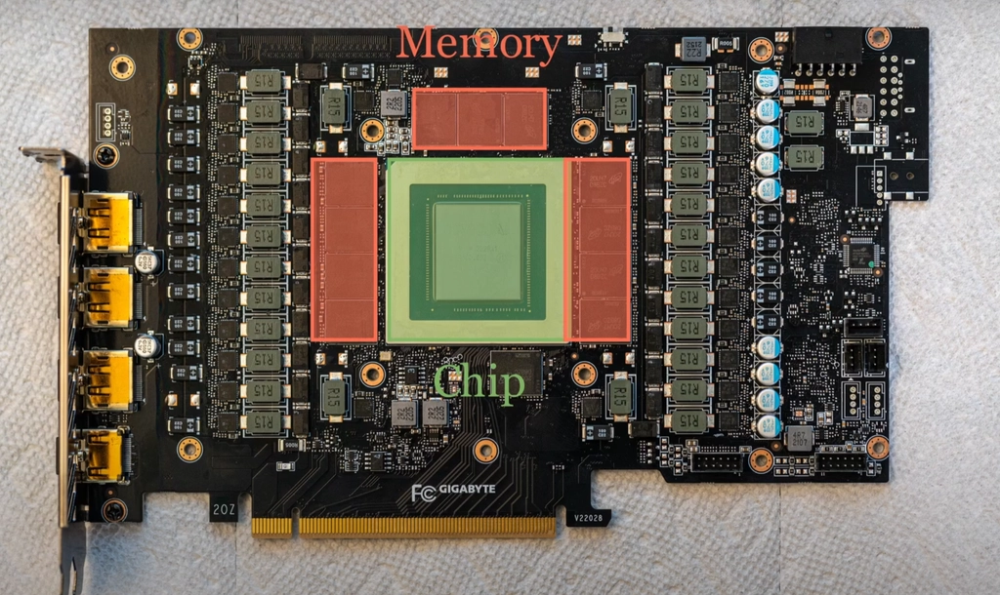
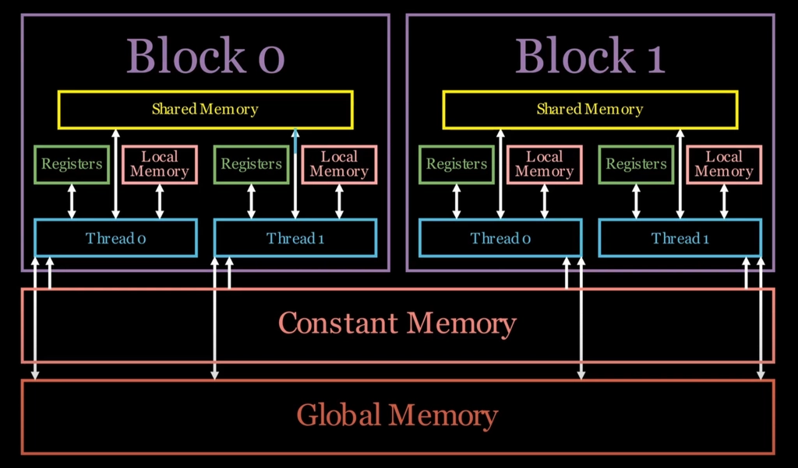
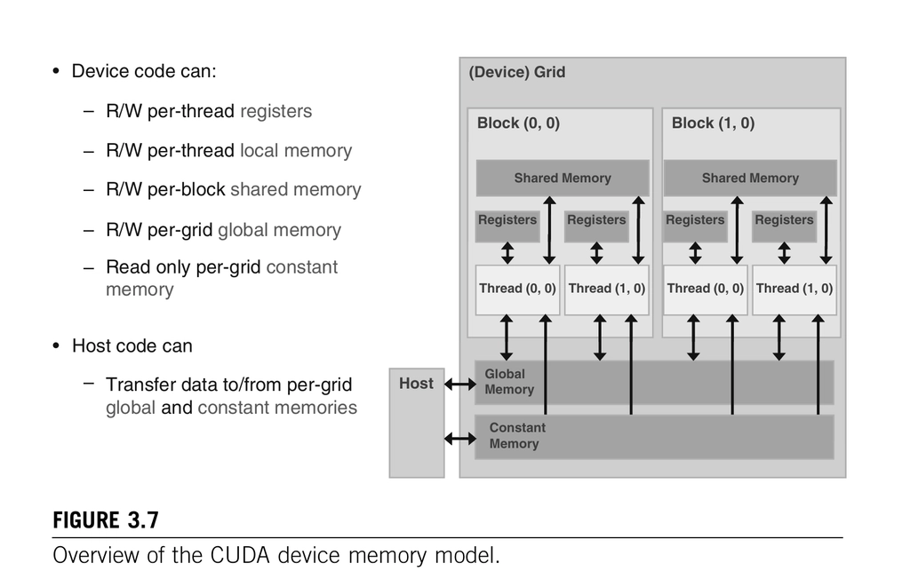
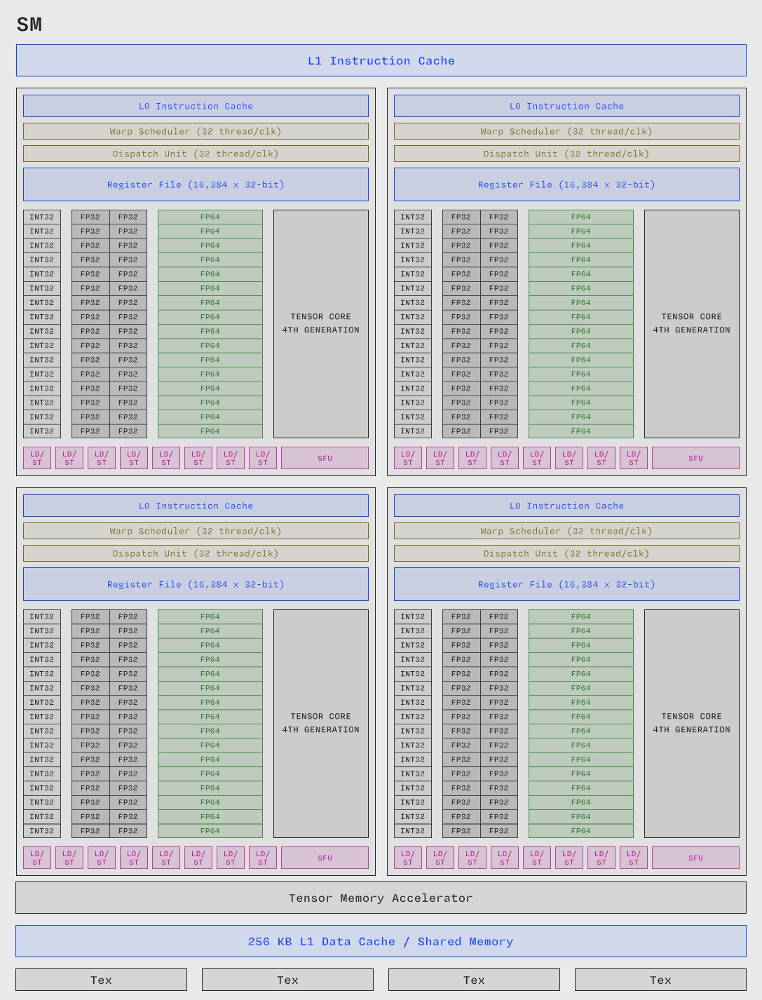

# GPU Memory Hierarchy in CUDA

GPU performance is often limited less by "how many cores exist" and more by how fast data can reach those cores. CUDA exposes several memory spaces, each with a different location, scope, lifetime, and performance profile.<a href="#reference-1">[1]</a>

This note focuses on the CUDA programmer's view: registers, shared memory, local memory, global memory, and constant memory.

## On-chip vs off-chip memory

  
   
  Figure 1. A simplified on-chip/off-chip memory hierarchy for GPU systems.

**On-chip memory** is physically inside the GPU chip. It is smaller and more expensive in area, but much faster to access. Registers, shared memory, and L1 cache are on-chip resources.

**Off-chip memory** is outside the GPU chip, usually in the GPU's device DRAM/HBM/GDDR memory package. It is much larger, but access latency is higher. Global memory and most local memory traffic live here, although they can be cached.

The basic engineering tradeoff is simple:

$$closer\ memory = lower\ latency + smaller\ capacity$$

That is why high-performance CUDA kernels try to reuse data in registers and shared memory before going back to global memory.

## CUDA memory spaces

  
   
  Figure 2. CUDA memory spaces organized by location, visibility, and programmer control.<a href="#reference-1">[1]</a>

tldr:
- Registers are private to one thread.
- Shared memory is visible to threads in one block.
- Global memory is visible across the grid and can be managed by the host.
- Constant memory is read-only from the device and useful for broadcast-style reads.
- Local memory is private to one thread but physically backed by device memory.

## 1. Registers

Registers are the closest memory resource to execution. In CUDA C/C++, ordinary automatic variables often live in registers when the compiler can keep them there.<a href="#reference-1">[1]</a>

- **Location:** on-chip register file in the SM.
- **Scope:** one thread.
- **Access:** read/write.
- **Lifetime:** one thread's execution.
- **Programmer control:** indirect; the compiler allocates registers.

Registers are fast, but not unlimited. If a kernel needs too many registers per thread, the compiler may spill values into local memory, which is much slower. High register use can also reduce occupancy because each resident thread block consumes part of the SM's register file.

At the PTX level, registers are represented by the `.reg` state space. PTX registers are not generally addressable like normal memory, which is one reason CUDA programmers cannot directly "take the address" of a register as if it were an array in global memory.<a href="#reference-2">[2]</a>

## 2. Shared memory

Shared memory is fast on-chip memory that all threads in the same thread block can access.<a href="#reference-1">[1]</a> It is one of the most important tools for CUDA performance because it lets a block explicitly stage and reuse data.

- **Location:** on-chip, near the SM.
- **Scope:** one thread block.
- **Access:** read/write.
- **Lifetime:** one thread block.
- **Declaration:** `__shared__` in a kernel, or dynamically via launch configuration.

On many NVIDIA architectures, shared memory and L1 cache use the same physical on-chip resource, often called the unified data cache. The portion reserved for shared memory can be configured per kernel on supported devices.<a href="#reference-3">[3]</a>

Shared memory is useful when many threads in a block need to reuse the same data. Common examples include tiled matrix multiplication, stencil kernels, reductions, and data-layout transformations before Tensor Core operations.

## 3. Local memory

Local memory is easy to misunderstand. The word "local" means **private to one thread**, not "physically close."

- **Location:** device memory, usually off-chip, cached through GPU caches.
- **Scope:** one thread.
- **Access:** read/write.
- **Lifetime:** one thread.
- **Programmer control:** mostly compiler-managed.

The compiler may use local memory for register spills, large per-thread arrays, or variables whose address must be taken. From a performance point of view, local memory should usually be treated like global-memory traffic with thread-private semantics.

## 4. Global memory

Global memory is the main device memory space, often informally called GPU VRAM.

- **Location:** off-chip device memory.
- **Scope:** visible to all threads in the grid and accessible through host/device APIs.
- **Access:** read/write.
- **Lifetime:** host-controlled; data persists across kernels until freed or overwritten.
- **Declaration/allocation:** `cudaMalloc()`, CUDA-managed allocations, or `__device__` globals.

Global memory is large, but high latency. CUDA performance often depends on making global-memory accesses coalesced, reducing unnecessary transfers, and reusing loaded data in registers or shared memory.

> [!NOTE]
> The word "global" in **global memory** is unrelated to the `__global__` keyword. In CUDA C/C++, `__global__` marks a function as a kernel callable from the host and executed on the device.

## 5. Constant memory

Constant memory is a read-only device memory space from the kernel's point of view. It is useful when many threads read the same values, especially when threads in a warp read the same address and the hardware can broadcast the value efficiently.<a href="#reference-1">[1]</a>

- **Location:** device memory, backed by an on-chip constant cache.
- **Scope:** visible to all threads in a grid.
- **Access:** read-only from device code.
- **Lifetime:** host-controlled.
- **Declaration:** `__constant__`, with host copies such as `cudaMemcpyToSymbol()`.

Constant memory is not a replacement for global memory. It is a specialized path for small read-only data with favorable access patterns.

## Comparison table

| Memory type | Physical location | Typical latency | Access | Scope | Lifetime |
|---|---|---:|---|---|---|
| Registers | On-chip | Lowest | Read/write | Thread | Thread |
| Shared memory | On-chip | Very low | Read/write | Block | Block |
| Local memory | Off-chip, cached | High | Read/write | Thread | Thread |
| Global memory | Off-chip, cached | High | Read/write | Grid/device | Host-controlled |
| Constant memory | Off-chip, cached | Low when broadcast/cached | Read-only on device | Grid/device | Host-controlled |

## Two useful mental models

  
   
  Figure 3. Memory hierarchy diagram from <em>Programming Massively Parallel Processors</em>.<a href="#reference-4">[4]</a>

First, memory is a hierarchy of capacity and latency. Registers and shared memory are precious because they are close to the SM. Global memory is plentiful, but every unnecessary trip to it costs time.

  
   
  Figure 4. CUDA memory hierarchy summary from Modal's GPU glossary.<a href="#reference-5">[5]</a>

Second, CUDA memory spaces are about **visibility** as much as speed. Registers are private to a thread. Shared memory is shared by a block. Global and constant memory are visible across the device. Local memory is thread-private but slow because of where it is physically stored.

## References

<ol>
  <li id="reference-1">NVIDIA, "CUDA C++ Programming Guide: Writing CUDA SIMT Kernels." <a href="https://docs.nvidia.com/cuda/cuda-programming-guide/02-basics/writing-cuda-kernels.html">Link</a></li>
  <li id="reference-2">NVIDIA, "Parallel Thread Execution ISA: Register State Space." <a href="https://docs.nvidia.com/cuda/parallel-thread-execution/#register-state-space">Link</a></li>
  <li id="reference-3">NVIDIA, "CUDA C++ Programming Guide: Advanced Kernel Programming." <a href="https://docs.nvidia.com/cuda/cuda-programming-guide/03-advanced/advanced-kernel-programming.html">Link</a></li>
  <li id="reference-4">Hwu, Kirk, and El Hajj, <em>Programming Massively Parallel Processors</em>. <a href="https://www.elsevier.com/books/programming-massively-parallel-processors/hwu/978-0-323-91231-0">Link</a></li>
  <li id="reference-5">Modal, "GPU glossary: Memory hierarchy." <a href="https://modal.com/gpu-glossary/device-software/memory-hierarchy">Link</a></li>
</ol>
