_This is **Part 1** of LLM Inference and Inference Optimization From First Principles. It covers the basic performance model behind LLM inference and may end up either as a standalone post or as part of a longer article._

## how LLM inference works

### what is LLM inference?

LLM inference simply means generating output tokens from input tokens (the _prompt_) using a trained model.

  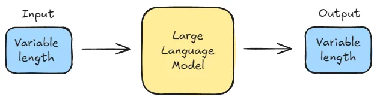
   
  Figure 1. LLM inference generates output tokens autoregressively from an input prompt.<a href="#reference-1">[1]</a>

### why LLM inference is becoming more and more important

Training is a large upfront expense. More realistically, it is a sequence of large expenses spread across multiple runs, experiments, and model iterations. But even so, training is still bounded in a way inference is not. A training run eventually ends. Once the weights are fixed and the model is deployed, that particular training bill stops growing.

Inference works differently. It is not a one-time expense but an operating cost that repeats every time someone uses the model. Every prompt has to be processed, every output token has to be generated, and every one of those requests consumes accelerator time. If nobody uses the model, the serving cost is close to zero. But if the model becomes widely useful, inference cost scales with that success.<a href="#reference-2">[2]</a>

That is what makes inference economics so important. A model can be expensive to train and still make sense if it is trained once and then reused many times. But a model that is expensive to serve becomes more costly with every additional user, with every longer context window, and with every generated token. At product scale, that recurring serving bill can become comparable to the original training cost or even exceed it.<a href="#reference-2">[2]</a>

This is why inference optimization matters so much. Once a model is in production, the central question is no longer just whether the model is good. It is whether the model can be served fast enough and cheaply enough for real usage to make economic sense.

> **The future is overwhelmingly inference.**<a href="#reference-3">[3]</a>

## what inference engine optimizes

An inference engine is usually trying to do two things at once:
1. lower the cost per generated token
2. reduce the latency of generation

On the cost side, the key question is how much it costs to generate each token. While serving has several cost components, GPU time (or more broadly accelerator time) is usually the dominant one. This article uses the NVIDIA H100 as the reference point because it is still the most common mental model for large-model serving.

This is effectively a GPU-cost-per-hour problem. Whether you buy GPUs or rent them from a cloud provider, the hourly bill is mostly fixed. What changes is how much useful generation you get from that fixed spend. An underutilized GPU costs as much as a busy one, which is why utilization matters so much.

Latency matters for a different reason. It directly affects user experience. For offline workloads such as large-scale summarization or synthetic-data generation, this matters less. But for interactive systems such as chat apps and coding agents, latency matters just as much.

The central distinction for reasoning about both cost and latency is the separation between prefill and decode.

### two phases in LLM inference: prefill and decode

Modern LLMs are typically built as decoder-only transformers<a href="#reference-4">[4]</a>. These models generate text autoregressively. Given a sequence of tokens, the model predicts the next token and so on.

Generation largely proceeds in two stages.

First, the model processes the entire prompt to produce the first output token. This stage is called prefill. After prefill, the model generates tokens one at a time, appending each new token to the sequence and feeding it back into the model. This iterative stage is called decode. So for any request, there is one prefill and multiple decode steps.

  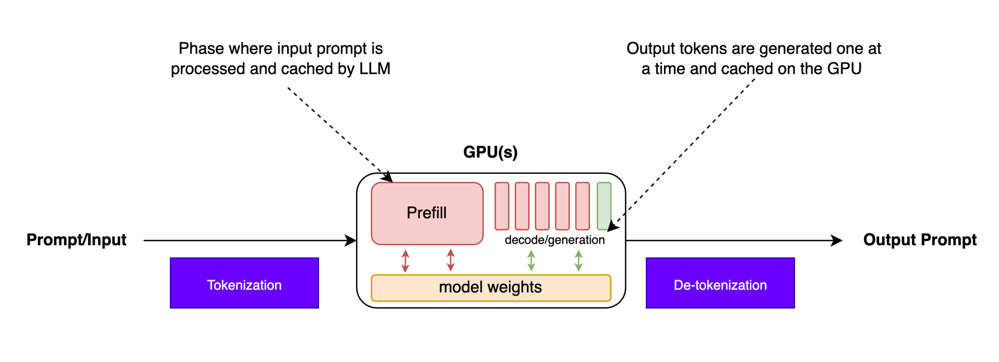
   
  Figure 2. One prefill pass processes the full prompt, followed by repeated decode steps that generate one token at a time.<a href="#reference-5">[5]</a>

This difference comes from the dependency structure.

During prefill, the whole prompt is already known. Within each transformer layer, the model can process all prompt tokens together under a causal mask, so computation can be parallelized across the sequence dimension. In fact, this token-parallel computation is one of the key advantages of the Transformer architecture.<a href="#reference-6">[6]</a>

During decode, each new token must be generated before the model can compute the next one. This is because token $t+1$ depends on the token generated at step $t$. As a result, generation becomes sequential across time. The model can still parallelize computation across layers, heads, and batch elements, but the sequence dimension can no longer be parallelized in the same way.

These two phases are crucial for understanding the GPU utilization problem and the performance model developed next.

## the GPU utilization problem

Modern GPUs such as the NVIDIA H100 are extremely capable. On paper, the H100 SXM offers about $3.35\,\text{TB/s}$ of HBM bandwidth and roughly $\sim 1000\,\text{TFLOP/s}$ dense BF16 peak. On paper that should make LLM inference very fast.

However, in practice, LLM inference often fails to use the GPU's full compute capacity. Even when running large models, the GPU spends much of its time waiting for data rather than doing arithmetic. This inefficient utilization raises the cost per generated token, which is exactly what we want to avoid.

To understand why this happens, we need a performance model that captures the relationship between compute work and memory movement. One of the most widely used models for this purpose is the roofline model.

### roofline model

At a high level, any computer program does some mix of two things:
1. moving bytes toward the compute unit
2. doing arithmetic on those bytes

From a performance standpoint, runtime often comes down to which of those two costs dominates.

  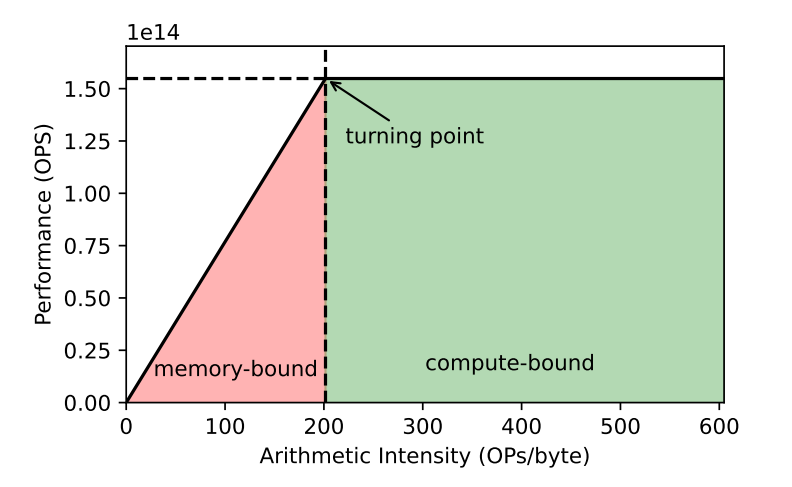
   
  Figure 3. The roofline model separates memory-bound and compute-bound regimes as arithmetic intensity increases.<a href="#reference-7">[7]</a>

The roofline model<a href="#reference-8">[8]</a> turns that intuition into a hardware limit using two quantities: peak compute throughput and peak memory bandwidth. Its x-axis is arithmetic intensity. Its y-axis is performance, usually measured in FLOP/s.

  
   
  Figure 4. A literal roof image to build intuition for why the roofline model has a sloped section and a flat ceiling.<a href="#reference-9">[9]</a>

Before the turning point where the line flattens, performance is limited by memory bandwidth. After that point, it is limited by compute throughput. The shape looks like a roof because modern chips can add arithmetic capacity more easily than memory bandwidth; it is much easier to add more math than to feed that math with data.

  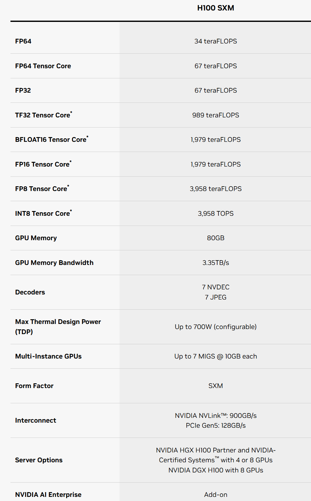
   
  Figure 5. NVIDIA H100 SXM model-card numbers highlighting the gap between dense BF16 compute throughput and HBM bandwidth; the * refers to sparsity-assisted peak throughput.

NVIDIA lists the H100 SXM at about $\sim 1{,}000\,\text{TFLOP/s}$ of BF16 Tensor Core throughput (without sparsity) and $3.35\,\text{TB/s}$ of memory bandwidth. In other words, the chip can do arithmetic far faster than it can pull bytes from memory. That gap has widened over time. This is the basic idea behind the _memory wall_: you need higher arithmetic intensity to reach the compute roof.

  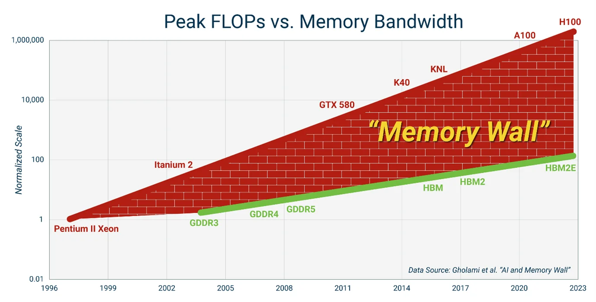
   
  Figure 6. The memory wall: compute throughput has scaled faster than memory bandwidth, making data movement the bottleneck more often.<a href="#reference-10">[10]</a>

  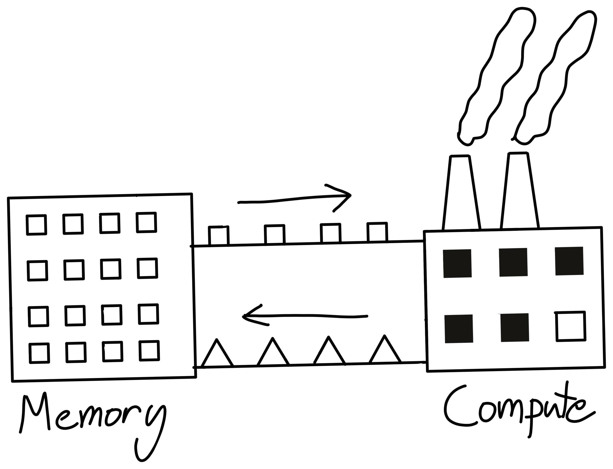
   
  Figure 7. A factory-and-supply-chain metaphor for compute vs. memory: fast machines are useless if the bridge delivering data is too narrow.<a href="#reference-11">[11]</a>

One way to picture this is to think of compute as a factory and memory bandwidth as the bridge delivering raw materials. The machines can run much faster than the bridge can deliver new material, and that mismatch is what the roofline model captures.

<table>
  <tr>
    <td><strong>Note</strong></td>
    <td>Here, "compute" means how many operations the compute unit can perform. In the context of AI workloads on GPUs, we usually measure it in FLOP/s (floating-point operations per second) or in FLOPs (total floating-point operations). "Memory," or more precisely memory bandwidth, is the speed at which data can be moved around. In LLM inference, that often means moving data from HBM into faster on-chip memory such as shared memory or registers.</td>
  </tr>
</table>

### arithmetic intensity

We have been referring to the x-axis without defining it precisely. That quantity is arithmetic intensity. It is the main lever systems people try to improve.

Arithmetic intensity is the ratio between compute work and memory traffic:

$$\text{Arithmetic Intensity} = \frac{\text{Operations}}{\text{Bytes Moved}}$$

If there are more operations done on the data than bytes moved, we get higher arithmetic intensity. Conversely, if we move lots of bytes but do little work on them, we end up with low arithmetic intensity.

For example, suppose two programs both load the same two numbers, $x$ and $y$, from memory.

- Program A computes only $x + y$. That is roughly one arithmetic operation on the same input bytes.
- Program B computes something like $(x + y \cdot y) / x + y$. That is several arithmetic operations on the same input bytes.

Both programs moved the same inputs, but Program B did more work on them before finishing. So Program B has higher arithmetic intensity. In AI workloads, those operations are usually floating-point operations, so we typically measure compute in FLOPs.

$$\text{Arithmetic Intensity} = \frac{\text{FLOPs}}{\text{Bytes Moved}}$$
### adding it all up

  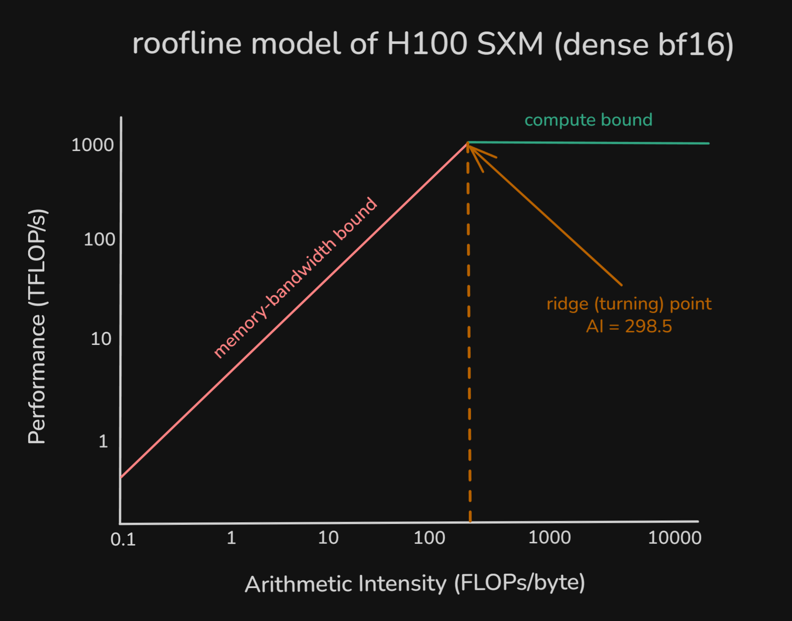
   
  Figure 8. Idealized H100 roofline showing the ridge point where performance transitions from bandwidth-limited to compute-limited.

<table>
  <tr>
    <td><strong>Note</strong></td>
    <td>Crossing the ridge point does not mean the workload will automatically run near peak compute throughput. It means memory bandwidth is less likely to be the main bottleneck, so compute-side limits become more important.</td>
  </tr>
</table>

When arithmetic intensity is low, performance sits on the bandwidth-limited slope. Only after each byte is reused enough times does the bottleneck shift to the compute units, at which point performance flattens at the compute ceiling.

> Since compute on modern hardware, including GPUs, is much faster than memory movement, **you will not reach peak performance unless your workload has high arithmetic intensity.**

In other words, a useful systems goal is to increase arithmetic intensity so the hardware spends more time doing math and less time waiting on bytes. That makes arithmetic intensity a useful lens for LLM inference.

## revisiting prefill vs decode through roofline analysis

The roofline model is a good way to think about the different characteristics of prefill and decode. Both phases run the same transformer layers with the same weights. What changes is the balance between compute and memory traffic, and that is what changes arithmetic intensity.

### during prefill phase

During prefill, the model processes the whole prompt at once. If the prompt length is $T$, each transformer layer runs over all $T$ tokens together.

The dominant operations are large batched matrix-matrix multiplications, so prefill usually keeps the compute units much busier than decode. Every prompt token activates the full attention and MLP stack.

On the memory side, the main terms are model-weight traffic, KV-cache writes, and temporary activations<a href="#reference-12">[12]</a>.

A $32\text{B}$-parameter model in bf16<a href="#reference-13">[13]</a>, for example, stores about $32\text{B} \times 2\ \text{bytes} = 64\,\text{GB}$ of weights. So we need to stream the whole model's parameters from HBM to the compute units.

There is also activation memory, which is the temporary tensors created during the forward pass. These are mainly hidden states, Q/K/V projections, attention outputs, and MLP intermediate tensors. It is hard to calculate the exact usage of this from first principles because it depends on multiple configurations (batch size, sequence length, kernels, and the runtime). In practice, people often use broad heuristics (e.g. $10\text{--}30\%$ of model weight<a href="#reference-14">[14]</a>) for capacity planning. We will talk more about that in the memory capacity section.

Prefill also writes something called KV cache. KV cache is the stored K and V values for each token at each transformer layer. We write it during prefill so that decode does not need to recompute the K and V values of older tokens.

KV-cache write does add memory traffic, but it is mostly a one-time write over the prompt. Also compared with the amount of batched compute happening during prefill, it is usually a much smaller term.

So prefill ends up with relatively high arithmetic intensity. Even though it needs to load model weights and write KV states for all tokens, it performs a large amount of computation over the entire prompt.

### during decode phase

Unlike prefill, decode processes one token at a time. The model still runs the same layer stack, but now the major projections and MLPs operate on something closer to `[1 × hidden]` than `[T × hidden]`, thanks to KV cache. This is much closer to matrix-vector multiplication, which is known to have low arithmetic intensity.

However, memory traffic does not shrink the same way. The GPU still needs to move the same model weights just like it did for prefill, but now those weights are loaded on every decode step.

Activation memory is smaller compared to prefill because only one new token is being processed at a time, though it is still not literally zero.

We also need to read the KV cache of all previous tokens in the sequence during every decode step. As the sequence grows, the KV read grows with it.

So while the compute per decode step is small, the bytes moved per step stay large and often get worse as context size grows. That is why decode ends up with lower arithmetic intensity and is much more likely to be memory-bound.

### putting it together

> During prefill, large batched GEMMs give the model many FLOPs for each byte it moves. During decode, the model processes only one token at a time, rereads the layer weights from HBM, and repeatedly reads the growing KV cache. That sharply lowers FLOPs per byte.

That is why prefill and decode land in different parts of the roofline model.

Now let’s go through a concrete example with Qwen3-32B on a single H100 SXM.

## example: Qwen3-32B on H100 SXM

To make the discussion concrete, consider serving a single request with Qwen3-32B on one NVIDIA H100 SXM. We assume `bf16` inference, $64$ transformer layers, hidden size $d = 5120$, MLP size $d_{ff} = 25600$, $64$ query heads, $8$ KV heads, head dimension $128$, and an H100 roofline of about $3.35\,\text{TB/s}$ HBM bandwidth and $\sim 1000\,\text{TFLOP/s}$ dense BF16 peak.

For prefill, the important qualitative result is that the workload lands on the compute-favored side of the roofline. Using the same Qwen3-32B assumptions as above, a $1000$-token prompt comes out to about $63.46\,\text{TFLOPs}$ of core transformer work and an arithmetic intensity of about $1012.6\ \text{FLOPs/byte}$, which is comfortably above the H100 ridge point of roughly $298.5\ \text{FLOPs/byte}$. The exact number will shift with accounting choices, but the conclusion is robust: prefill has enough batched matrix work to look compute-favored rather than bandwidth-limited.

  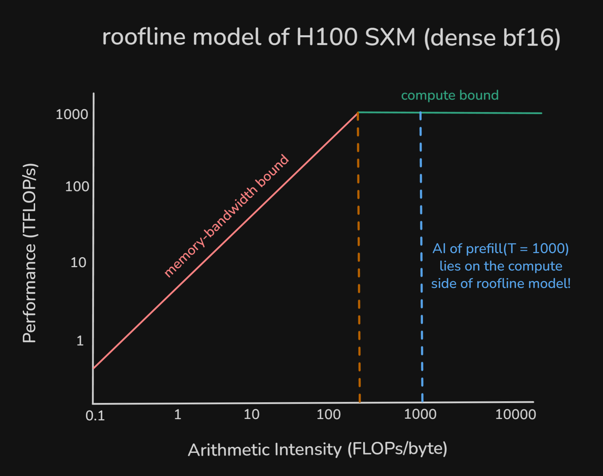
   
  Figure 9. Prefill-phase arithmetic intensity on H100, showing that the example workload lies on the compute-favored side of the roofline.

For decode, the picture flips. One decode step still streams essentially the same layer weights, but now it does only one token's worth of dense projection and MLP work while also rereading the growing KV cache. At context length $L = 1000$, the same first-order model gives an arithmetic intensity of about $1.03\ \text{FLOPs/byte}$, and even as $L$ grows very large the asymptote is only about $8\ \text{FLOPs/byte}$. So decode remains firmly memory-bound, and that qualitative conclusion is also robust to accounting detail.

  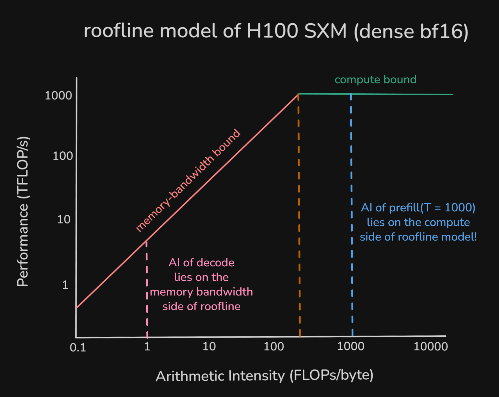
   
  Figure 10. Decode-phase arithmetic intensity on H100, illustrating why single-token decode remains far below the ridge point and stays memory-bound.

Appendix A provides the full derivation, including smaller per-layer operations such as RMSNorm, RoPE, softmax, residual adds, and gating terms. The appendix is still a first-order model rather than a runtime simulator, but it is the right place for the detailed FLOPs and bytes bookkeeping.

## performance metrics

So far, the discussion has focused on the internal structure of inference and the hardware limits that shape it. In practice, those effects show up through a smaller set of serving metrics.

### latency and throughput

**Latency** is the time between when a user's request is sent and when the generation finishes and is returned to the user. The most useful latency split is the one that mirrors the two inference phases: TTFT for prefill and TPOT for decode.

**TTFT** (Time-To-First-Token)

TTFT measures the time between receiving a user's request and generating the first output token, usually in seconds. It roughly captures the prefill-dominated part of latency, though in real systems it also includes queueing and runtime overhead. Lower TTFT means the stream starts sooner, which matters a lot in latency-sensitive applications.

**TPOT** (Time-Per-Output-Token)

TPOT measures the average latency between output tokens after the first one, and is often discussed as average ITL, or inter-token latency, during the decoding phase. It roughly tracks decode speed, though sampling and scheduler overhead also contribute. Lower TPOT means the request streams faster and also finishes sooner.

> **Latency ≈ TTFT + (TPOT × (output tokens - 1))**

This is still an approximation, because per-token latency is not perfectly constant in real systems.

**Throughput** is the number of tokens or requests the system can process per second. Higher throughput means the system handles larger workloads more efficiently.

The core metrics here are RPS, TPS, and goodput.

**RPS** (Requests-Per-Second)

RPS measures how many requests the model can successfully process per second.

**TPS** (Tokens-Per-Second)

TPS measures how many tokens the model can successfully process per second. RPS depends heavily on the shape of the workload, for example whether requests are short or long. TPS is often a more convenient unit, but it is still workload-dependent. Also, when people report TPS, it is worth checking whether they mean input tokens, output tokens, or both.

**Goodput**

Goodput measures the rate of requests or tokens that meet the target SLO, or service-level objective.

For example, suppose a system serves $100$ requests per second, but only $70$ of them satisfy your TTFT and TPOT targets. The raw throughput is $100\,\text{RPS}$, but the goodput under that SLO is $70\,\text{RPS}$.

Goodput differs from throughput because it includes latency-related constraints rather than just raw volume.

<table>
  <tr>
    <td><strong>Note</strong></td>
    <td>This article does not cover every metric in detail, for example TTLT, because the goal is to build a clear mental model for LLM engines and InferenceOps. The metrics above are enough for that purpose. For a broader survey of inference metrics, see this overview<a href="#reference-16">[16]</a>.</td>
  </tr>
</table>

This gives us the basic mapping. Prefill largely determines TTFT. Decode largely determines TPOT. Throughput depends on how efficiently the hardware is used across both phases. The next section turns from performance as a bandwidth problem to a different serving constraint: memory capacity.

## how much memory is needed to decode?

So far, the discussion has treated memory mainly as a bandwidth problem: how many bytes must move through HBM during a forward pass. This section switches to a different question. It is about memory capacity, or how many bytes must fit in VRAM at all.

This distinction matters.

<table>
  <tr>
    <td><strong>Note</strong></td>
    <td>In the roofline discussion above, weights were mostly a <strong>traffic</strong> question. Here they are a <strong>capacity</strong> question: how many bytes must live in VRAM at all?</td>
  </tr>
</table>

A simple way to see that distinction is to visualize one decode request on an H100 SXM with $80\,\text{GB}$ of VRAM.

  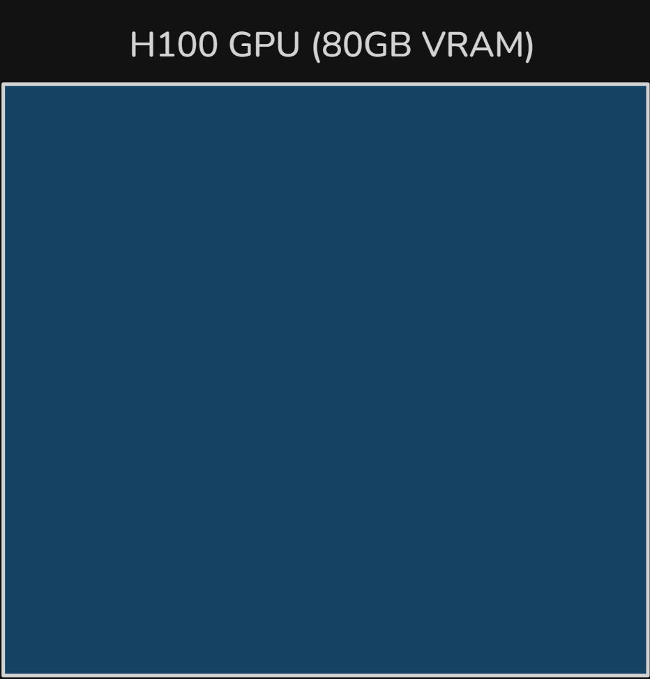
   
  Figure 11. An empty H100 GPU memory budget with 80 GB of VRAM before allocating model weights, KV cache, or activations.

During inference, model weights must stay resident in VRAM, while activations and KV cache add extra pressure on top of that base footprint.

  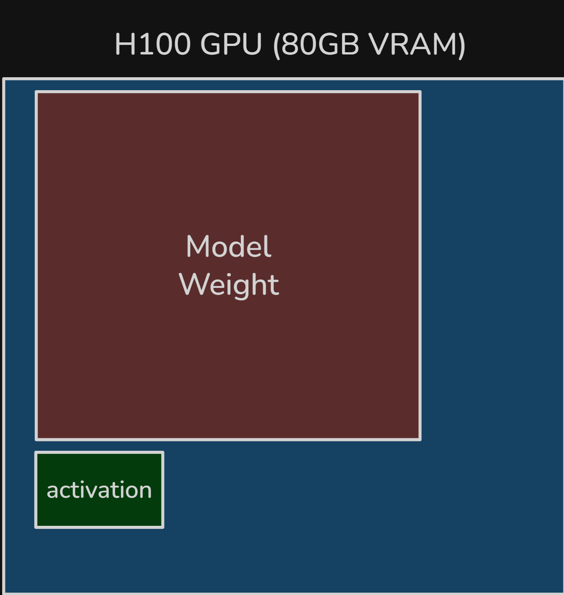
   
  Figure 12. After loading the model, GPU memory is already mostly occupied by resident weights, with only a small activation footprint shown separately.

While we can use various dtypes for model weights, `bf16` is still a common baseline. At a rough back-of-the-envelope level, a $32\text{B}$-parameter model in `bf16` needs about $32\text{B} \times 2\ \text{bytes} = 64\,\text{GB}$ of raw weight storage. In this section, treat memory sizes as rough decimal GB estimates rather than binary GiB accounting.

  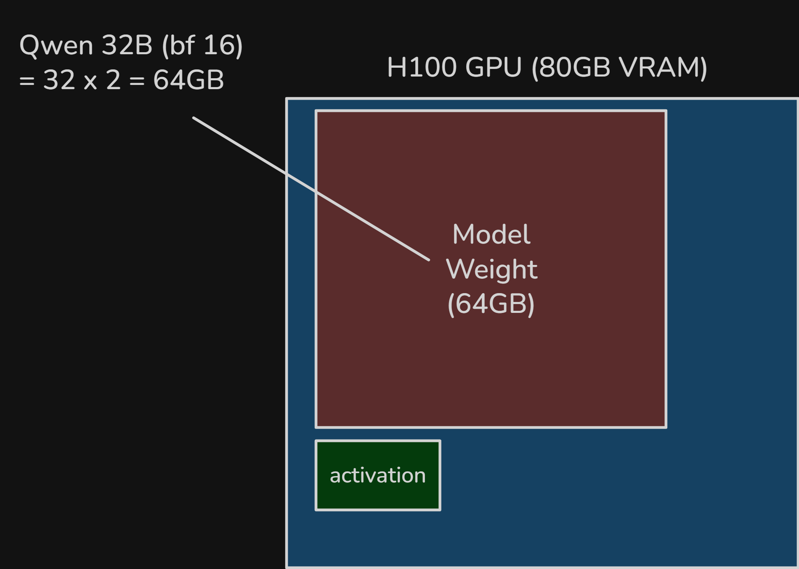
   
  Figure 13. For Qwen3-32B in bf16, model weights alone take roughly 64 GB, illustrating why weight residency dominates VRAM capacity.

Activation memory is harder to estimate from first principles because it depends on batch size, sequence length, kernels, and runtime behavior. In practice, rough heuristics such as $10\text{--}30\%$ of model weight are sometimes used for planning, though simple decode usually has a much smaller live activation footprint.

  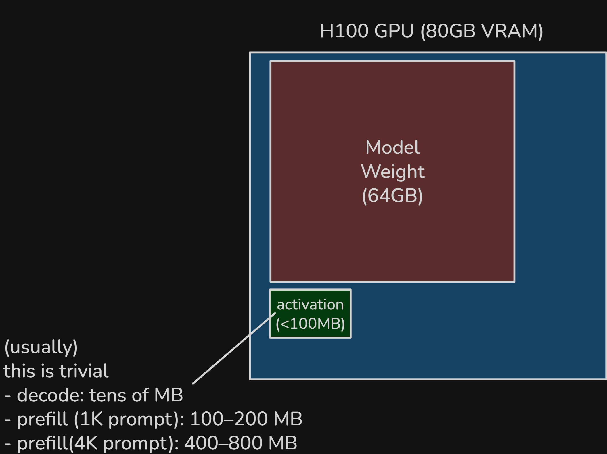
   
  Figure 14. Activation memory is typically much smaller than model weights in decode, though it grows with larger prefills and larger batches.

After the model is loaded, most of the $80\,\text{GB}$ budget is already occupied. The remaining headroom is used for KV cache, activation/workspace buffers, and runtime overhead, and the usable amount is smaller than the naive $80\,\text{GB} - 64\,\text{GB}$ because CUDA and the serving stack also consume memory.

  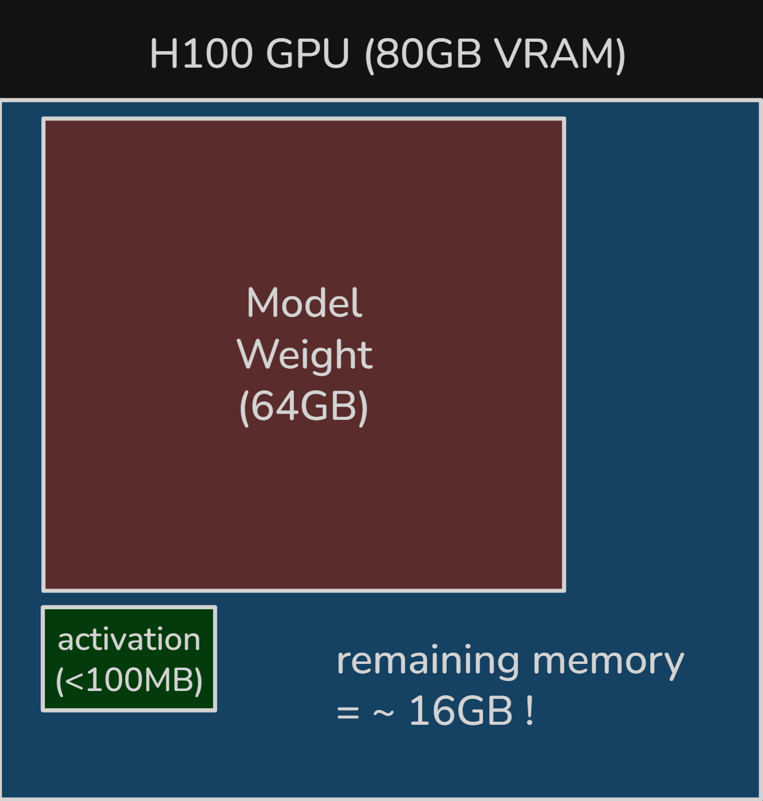
   
  Figure 15. Remaining VRAM headroom after loading about 64 GB of model weights: roughly 16 GB for KV cache, activations, workspace buffers, and runtime overhead.

### serving one request

Consider one request in its decode phase with a KV cache of $2{,}048$ tokens. At that point, GPU memory already contains the KV cache of the prefilled prompt plus the tokens decoded so far.

  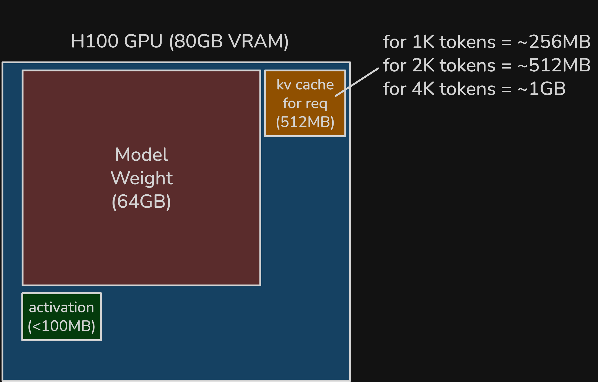
   
  Figure 16. Memory layout for a single decode request, with one request's KV cache added beside the model weights and example KV sizes shown for different context lengths.

Recalling how we calculate KV cache, Qwen3-32B uses GQA, so the KV width is $8 \times 128 = 1024$.

For $2{,}048$ tokens of KV cache, the total becomes

$$
2 \;(\text{for K and V})
\times 64 \;(\text{layers})
\times 1024 \;(\text{KV width})
\times 2 \;(\text{bytes for bf16})
\times 2{,}048 \;(\text{token length})
= 536{,}870{,}912 \text{ bytes}
\approx 0.54 \text{ GB}.
$$

At around a $2\text{K}$ context, the memory story is still dominated by model weights, not KV cache.

### why batching requests makes each token generation cheaper

A single decode request generates only one token per step and does not fully use the remaining memory headroom. That is what batching exploits.

  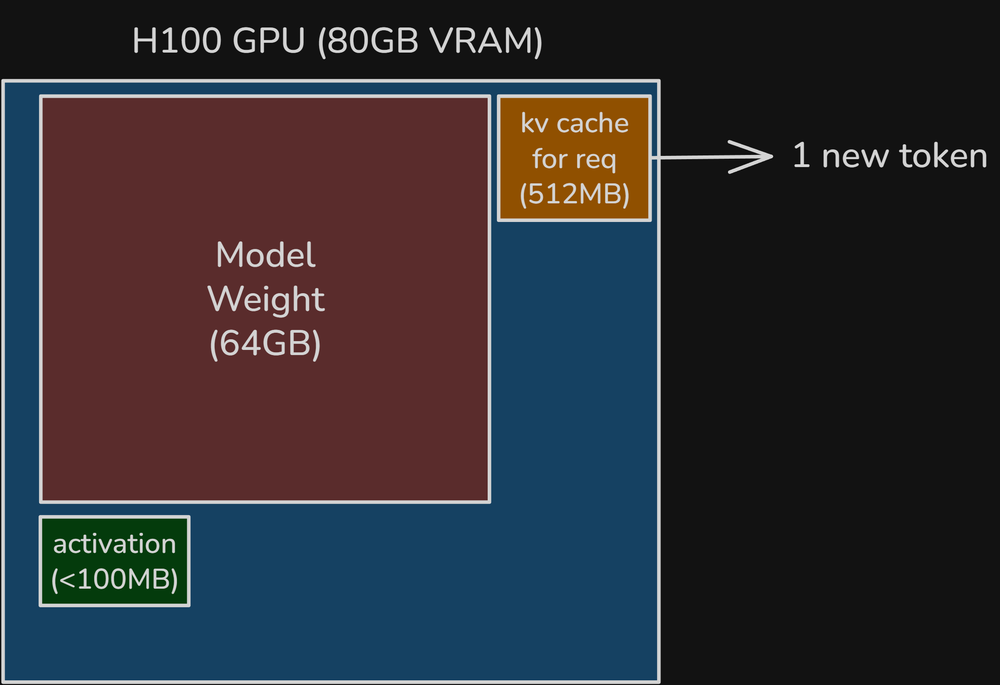
   
  Figure 17. With only one active request, each decode step still produces just one new token, leaving substantial VRAM headroom underutilized.

If multiple requests are active, the remaining VRAM can hold additional KV cache and activation/workspace state, allowing more requests to run together on the same GPU. Figure 18 shows four requests for illustration, but in practice the batch is limited by available VRAM and latency targets.

  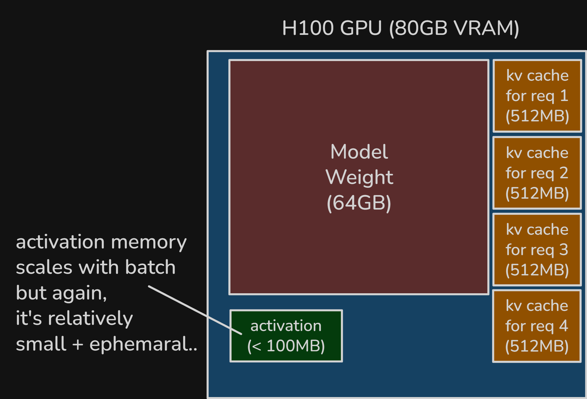
   
  Figure 18. Example batched serving layout with four requests, each carrying roughly a 2K-token KV cache, while activation memory still remains relatively small and ephemeral.

Activation memory grows with the amount of work in the current forward pass, so it increases with sequence length and batch size. In some cases its share rises, but in many practical cases model weights and KV cache still dominate long-lived memory use. Unlike KV cache, activation memory is not accumulated across decode steps; it is only alive for that forward pass.

  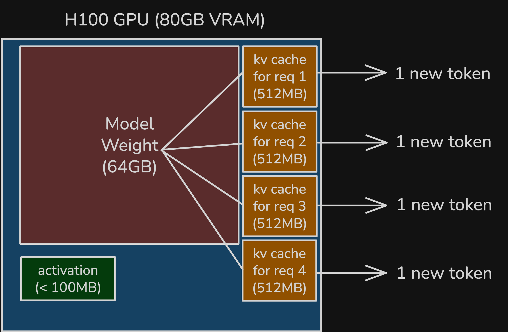
   
  Figure 19. Batched decode turns one forward pass into four output tokens, improving weight reuse and throughput across simultaneously served requests.

This makes token generation cheaper because one batched decode step can generate one token for each active request, amortizing heavy model-weight traffic across more useful work. Intuitively, the workload becomes less matrix-vector-like and more matrix-matrix-like.

We will look at more advanced inference optimization techniques in Part 2.

## summary

The most important takeaways are:

- LLM inference has two distinct phases: prefill and decode.
- Prefill processes the full prompt in parallel, so it usually has much higher arithmetic intensity.
- Decode generates one token at a time, so it is much more likely to be memory-bandwidth-bound.
- The roofline model is a useful way to reason about why these two phases behave so differently on modern GPUs.
- In serving, model weights dominate both bandwidth traffic and VRAM capacity, which is why weight reuse matters so much.
- Batching improves throughput because one forward pass can serve multiple requests and amortize weight movement across more useful work.

Taken together, the core serving problem is simple. Prefill is mainly a compute problem. Decode is mainly a memory problem. Good inference systems are built around that split. Part 2 builds on that foundation and moves into the more advanced optimization techniques that modern inference engines use in practice.

## appendix a. Qwen3-32B on H100 SXM accounting

This appendix collects the detailed first-order accounting that the main text intentionally skips. The goal is still not a cycle-accurate runtime model. Instead, the point is to keep the dominant matrix terms, add the smaller per-layer terms that were omitted in the body, and check that they do not change the main roofline conclusion.

Throughout Appendix A, use the Qwen3-32B configuration from the example. To stay consistent with the main text, memory summaries below use rough decimal GB rather than binary GiB.

- $64$ transformer layers
- hidden size $d = 5120$
- MLP size $d_{ff} = 25600$
- $64$ query heads
- $8$ KV heads
- head dimension $128$
- query width $d_q = 64 \times 128 = 8192$
- KV width $d_{kv} = 8 \times 128 = 1024$
- vocabulary size $151{,}936$
- `bf16` $= 2$ bytes per element

### per-layer operations

At a high level, one transformer block does:

input  
$\to$ RMSNorm  
$\to$ $Q, K, V$ projections  
$\to$ RoPE  
$\to$ attention scores  
$\to$ softmax  
$\to$ attention-weighted value matmul  
$\to$ output projection  
$\to$ residual add  
$\to$ RMSNorm  
$\to$ gated MLP  
$\to$ residual add

The dominant FLOPs still come from the dense projections and the attention matmuls, but for completeness we can add smaller terms as well. For a sequence length $S$ inside one layer:

- first RMSNorm: approximately $4Sd$
- $Q$ projection: $2Sd d_q$
- $K$ projection: $2Sd d_{kv}$
- $V$ projection: $2Sd d_{kv}$
- RoPE on $Q$ and $K$: approximately $3S(d_q + d_{kv})$
- attention score matmul: depends on prefill vs decode
- softmax: approximately $5$ FLOPs per attention score element
- attention-weighted value matmul: depends on prefill vs decode
- output projection: $2Sd_q d$
- first residual add: approximately $Sd$
- second RMSNorm: approximately $4Sd$
- MLP gate projection: $2Sd d_{ff}$
- MLP up projection: $2Sd d_{ff}$
- gating elementwise op: approximately $6Sd_{ff}$
- MLP down projection: $2Sd_{ff} d$
- second residual add: approximately $Sd$

These constant factors for RMSNorm, RoPE, softmax, and gating are only approximate. That is fine for the purpose here because they are much smaller than the dense matmul terms.

<table>
  <tr>
    <td><strong>Note</strong></td>
    <td>A matrix multiply of an m x k matrix with a k x n matrix costs about 2mkn FLOPs, which is the rule used throughout this appendix.</td>
  </tr>
</table>

Qwen3-32B also uses GQA (grouped-query attention)<a href="#reference-15">[15]</a>, so the query side and KV side are intentionally asymmetric:

- $Q$: $[S \times 5120] \cdot [5120 \times 8192]$
- $K$: $[S \times 5120] \cdot [5120 \times 1024]$
- $V$: $[S \times 5120] \cdot [5120 \times 1024]$
- $O$: $[S \times 8192] \cdot [8192 \times 5120]$

That asymmetry reduces both compute and KV-cache size on the KV side.

### prefill FLOPs

During prefill, the model processes a prompt of length $T$ in one pass.

For one layer, the projection terms are:

$$
F_Q = 2T \cdot 5120 \cdot 8192 = 83{,}886{,}080\,T
$$

$$
F_K = 2T \cdot 5120 \cdot 1024 = 10{,}485{,}760\,T
$$

$$
F_V = 2T \cdot 5120 \cdot 1024 = 10{,}485{,}760\,T
$$

$$
F_O = 2T \cdot 8192 \cdot 5120 = 83{,}886{,}080\,T
$$

So the total attention-projection FLOPs per layer are:

$$
F_{\text{attn proj}}(T) = 188{,}743{,}680\,T
$$

The gated MLP contributes:

$$
F_{\text{MLP}}(T)
= 2T(5120 \cdot 25600 + 5120 \cdot 25600 + 25600 \cdot 5120)
= 786{,}432{,}000\,T
$$

The causal attention matmuls contribute:

$$
F_{QK^\top}(T) = 64 \cdot 2 \cdot 128 \cdot \frac{T(T+1)}{2} = 8192\,T(T+1)
$$

$$
F_{\text{attn} \times V}(T) = 8192\,T(T+1)
$$

$$
F_{\text{attn matmuls}}(T) = 16{,}384\,T(T+1)
$$

Now add the smaller per-layer terms:

$$
F_{\text{RMSNorms}}(T) \approx 8Td = 40{,}960\,T
$$

$$
F_{\text{RoPE}}(T) \approx 3T(d_q + d_{kv}) = 27{,}648\,T
$$

$$
F_{\text{softmax}}(T) \approx 5 \cdot 64 \cdot \frac{T(T+1)}{2} = 160\,T(T+1)
$$

$$
F_{\text{residual adds}}(T) \approx 2Td = 10{,}240\,T
$$

$$
F_{\text{gating}}(T) \approx 6Td_{ff} = 153{,}600\,T
$$

So a more complete per-layer prefill total is:

$$
F_{\text{layer, prefill}}(T)
\approx
975{,}408{,}128\,T + 16{,}544\,T(T+1)
$$

Across all $64$ layers:

$$
F_{\text{model, prefill}}(T)
\approx
64 \cdot F_{\text{layer, prefill}}(T)
= 62{,}426{,}120{,}192\,T + 1{,}058{,}816\,T(T+1)
$$

At $T = 1000$:

$$
F_{\text{model, prefill}}(1000)
\approx
63{,}485{,}995{,}008{,}000
$$

So even after adding the smaller terms, prefill is still about $63.49\,\text{TFLOPs}$ for a $1000$-token prompt, which is only slightly above the dominant-terms-only estimate.

### bytes moved during prefill

For a roofline-style estimate, the main memory terms during prefill are:

- model-weight traffic
- KV-cache write
- an optional activation/workspace term that is explicitly approximate

The dominant repeated weights per layer are the four attention projections plus the three MLP projections:

$$
5120 \cdot 8192 + 5120 \cdot 1024 + 5120 \cdot 1024 + 8192 \cdot 5120
= 94{,}371{,}840
$$

$$
5120 \cdot 25600 + 5120 \cdot 25600 + 25600 \cdot 5120
= 393{,}216{,}000
$$

So the dominant repeated block weights total:

$$
487{,}587{,}840 \text{ parameters per layer}
$$

Across $64$ layers, that is:

$$
31{,}205{,}621{,}760 \text{ parameters}
$$

In bf16:

$$
M_{\text{weights}} \approx 62{,}411{,}243{,}520 \text{ bytes} \approx 62.41 \text{ GB}
$$

The smaller block parameters, such as the two RMSNorm weight vectors per layer, are tiny by comparison:

$$
64 \cdot 2 \cdot 5120 \cdot 2 = 1{,}310{,}720 \text{ bytes}
$$

so they do not materially change the memory picture.

For KV-cache write, each new token stores one $K$ vector and one $V$ vector of width $1024$ at each of the $64$ layers:

$$
M_{\text{KV write per token}}
= 2 \cdot 64 \cdot 1024 \cdot 2
= 262{,}144 \text{ bytes}
\approx 0.000262 \text{ GB}
$$

So for a prompt of length $T$:

$$
M_{\text{KV write}}(T) \approx 0.000262 \text{ GB} \cdot T
$$

An optional activation/workspace term is harder to derive cleanly from the architecture alone because it depends on kernel fusion, tiling, scheduler behavior, and whether intermediates spill to HBM. For a first-order model, it is best left as an explicitly approximate additive term:

$$
M_{\text{act/ws, prefill}}(T) \approx \delta_{\text{prefill}}(T)
$$

where $\delta_{\text{prefill}}(T)$ is implementation-dependent and is usually smaller than the dominant model-weight traffic in this simplified roofline view.

Putting those together:

$$
M_{\text{prefill}}(T)
\approx
62.41 \text{ GB} + 0.000262 \text{ GB} \cdot T + \delta_{\text{prefill}}(T)
$$

### prefill arithmetic intensity

Ignoring the optional activation/workspace term for the moment, the more complete prefill arithmetic-intensity expression is:

$$
AI_{\text{prefill}}(T)
\approx
\frac{62{,}426{,}120{,}192\,T + 1{,}058{,}816\,T(T+1)}
{62{,}411{,}243{,}520 + 262{,}144\,T}
\quad \text{FLOPs/byte}
$$

At $T = 1000$:

$$
AI_{\text{prefill}}(1000) \approx 1012.9 \ \text{FLOPs/byte}
$$

Even after including the smaller per-layer terms, prefill stays comfortably on the compute-favored side of the H100 roofline.

### decode FLOPs

During decode, we generate one new token while attending over an existing context of length $L$.

For one layer, the projection and MLP terms are just the prefill formulas evaluated at one token:

$$
F_{\text{attn proj, decode}} = 188{,}743{,}680
$$

$$
F_{\text{MLP, decode}} = 786{,}432{,}000
$$

The two attention matmuls scale linearly with context length:

$$
F_{QK^\top,\text{decode}}(L) = 64 \cdot 2 \cdot 128 \cdot L = 16{,}384\,L
$$

$$
F_{\text{attn} \times V,\text{decode}}(L) = 16{,}384\,L
$$

$$
F_{\text{attn matmuls, decode}}(L) = 32{,}768\,L
$$

Now add the smaller per-layer terms for one token:

$$
F_{\text{RMSNorms, decode}} \approx 40{,}960
$$

$$
F_{\text{RoPE, decode}} \approx 27{,}648
$$

$$
F_{\text{softmax, decode}}(L) \approx 5 \cdot 64 \cdot L = 320\,L
$$

$$
F_{\text{residual adds, decode}} \approx 10{,}240
$$

$$
F_{\text{gating, decode}} \approx 153{,}600
$$

So a more complete per-layer decode total is:

$$
F_{\text{layer, decode}}(L)
\approx
975{,}408{,}128 + 33{,}088\,L
$$

Across all $64$ layers:

$$
F_{\text{model, decode}}(L)
\approx
62{,}426{,}120{,}192 + 2{,}117{,}632\,L
$$

At $L = 1000$:

$$
F_{\text{model, decode}}(1000)
\approx
62{,}428{,}237{,}824
$$

The decode FLOP count hardly changes when we add the smaller ops, because the dense projections and MLP still dominate the arithmetic.

As a separate end-of-model term, the final logits projection for one token would be:

$$
F_{\text{lm head}} \approx 2 \cdot 5120 \cdot 151{,}936 = 1{,}555{,}824{,}640
$$

That term can be significant, but it should be tracked separately because it is not part of the repeated transformer-block total.

### bytes moved during decode

During decode, the main memory terms are:

- model-weight traffic
- KV-cache read
- KV-cache write
- an optional activation/workspace term

The weight term is still approximately:

$$
M_{\text{weights}} \approx 62.41 \text{ GB}
$$

KV-cache read scales with the existing context length:

$$
M_{\text{KV read}}(L) \approx 0.000262 \text{ GB} \cdot L
$$

And each decode step also writes the new token's KV entry:

$$
M_{\text{KV write}} \approx 0.000262 \text{ GB}
$$

As in prefill, there is also some activation and workspace traffic, but it is implementation-dependent and much harder to pin down from first principles:

$$
M_{\text{act/ws, decode}}(L) \approx \delta_{\text{decode}}(L)
$$

So the decode-step memory traffic is:

$$
M_{\text{decode}}(L)
\approx
62.41 \text{ GB} + 0.000262 \text{ GB} \cdot L + 0.000262 \text{ GB} + \delta_{\text{decode}}(L)
$$

As a separate end-of-model term, the lm-head weights are also sizable:

$$
M_{\text{lm head}} \approx 151{,}936 \cdot 5120 \cdot 2 = 1{,}555{,}824{,}640 \text{ bytes} \approx 1.56 \text{ GB}
$$

Again, it is clearer to keep that separate from the repeated transformer-block traffic.

### decode arithmetic intensity

Ignoring the optional activation/workspace term for the moment, the more complete decode arithmetic-intensity expression is:

$$
AI_{\text{decode}}(L)
\approx
\frac{62{,}426{,}120{,}192 + 2{,}117{,}632\,L}
{62{,}411{,}243{,}520 + 262{,}144\,L + 262{,}144}
\quad \text{FLOPs/byte}
$$

At $L = 1000$:

$$
AI_{\text{decode}}(1000) \approx 1.03 \ \text{FLOPs/byte}
$$

And as $L$ becomes very large:

$$
AI_{\text{decode}}(L) \to \frac{2{,}117{,}632}{262{,}144} \approx 8.08 \ \text{FLOPs/byte}
$$

Those numbers are only slightly different from the dominant-terms-only version. That is the main reason the body of the article can stay result-focused: once you include RMSNorm, RoPE, softmax, residual adds, and gating terms, the qualitative conclusion does not change. Decode stays firmly memory-bound.

## references

This post was heavily inspired by [LLM Inference Economics From First Principles](https://www.tensoreconomics.com/p/llm-inference-economics-from-first) from Tensor Economics. I found its framing especially useful, and this article is my own attempt to reorganize and explain the ideas in my own way.

<ol>
  <li id="reference-1">Daily Dose of Data, "Regular ML Inference vs. LLM Inference" - used for the opening Figure 1 visual. <a href="https://blog.dailydoseofds.com/p/regular-ml-inference-vs-llm-inference">Link</a></li>
  <li id="reference-2">OpenAI, "AI and efficiency" - especially useful for the point that inference costs scale with usage and can dominate total costs in successful deployed systems. <a href="https://openai.com/index/ai-and-efficiency/">Link</a></li>
  <li id="reference-3">Elon Musk, "The future is overwhelmingly inference." - the short quote used in the motivation section. <a href="https://x.com/elonmusk/status/2029372889959706901">Link</a></li>
  <li id="reference-4">Cameron R. Wolfe, "Decoder-Only Transformers: The Workhorse of Generative LLMs" - a good background explainer for decoder-only transformers. <a href="https://cameronrwolfe.substack.com/p/decoder-only-transformers-the-workhorse">Link</a></li>
  <li id="reference-5">Mark Moyou / NVIDIA, "Mastering LLM Inference" - used for the prefill/decode figure. <a href="https://file.notion.so/f/f/bea58367-f949-4c4b-b461-492356378a41/dfb74196-771c-43fa-a1a5-13660d43512a/mark-moyou-nvidia-mastering-llm-inference.pdf?table=block&id=a9061206-58b4-4698-9516-34c4ad9380f1&spaceId=bea58367-f949-4c4b-b461-492356378a41&expirationTimestamp=1773345600000&signature=BFFye7bXp3tBlCdlzG2z_ycDOLXvc0DBPtgnNwkKY2U&downloadName=mark-moyou-nvidia-mastering-llm-inference.pdf">Link</a></li>
  <li id="reference-6">Vaswani et al., "Attention Is All You Need" - the original Transformer paper, mainly for the causal-mask and parallelism discussion. <a href="https://arxiv.org/abs/1706.03762">Link</a></li>
  <li id="reference-7">Roofline-model figure source - where Figure 3 came from. <a href="https://arxiv.org/pdf/2402.16363">Link</a></li>
  <li id="reference-8">Wikipedia, "Roofline model" - a lightweight reference for the roofline concept itself. <a href="https://en.wikipedia.org/wiki/Roofline_model">Link</a></li>
  <li id="reference-9">Pexels, "Orange and Gray Painted Roof Under Cloudy Sky" - used for the literal roof image. <a href="https://www.pexels.com/photo/orange-and-gray-painted-roof-under-cloudy-347152/">Link</a></li>
  <li id="reference-10">Astera Labs, "Breaking Through the Memory Wall" - useful background and the visual source for the memory-wall section. <a href="https://www.asteralabs.com/breaking-through-the-memory-wall/">Link</a></li>
  <li id="reference-11">Horace He, "Brrr... Intro" - source for the compute-vs.-memory factory metaphor figure. <a href="https://horace.io/brrr_intro.html">Link</a></li>
  <li id="reference-12">vLLM Omni documentation, "GPU Memory Utilization" - helpful for thinking about GPU memory terms during serving. <a href="https://docs.vllm.ai/projects/vllm-omni/en/latest/configuration/gpu_memory_utilization/">Link</a></li>
  <li id="reference-13">Google Cloud, "BFloat16: The secret to high performance on Cloud TPUs" - background for the bf16 assumptions used in the examples. <a href="https://cloud.google.com/blog/products/ai-machine-learning/bfloat16-the-secret-to-high-performance-on-cloud-tpus?hl=en">Link</a></li>
  <li id="reference-14">vLLM Omni documentation, "Activation Memory" - the source behind the rough activation-memory heuristic. <a href="https://docs.vllm.ai/projects/vllm-omni/en/latest/configuration/gpu_memory_utilization/#activation-memory">Link</a></li>
  <li id="reference-15">IBM, "What is Grouped-Query Attention?" - a readable explainer for GQA. <a href="https://www.ibm.com/think/topics/grouped-query-attention">Link</a></li>
  <li id="reference-16">BentoML, "LLM Inference Metrics" - a good follow-up for a broader survey of serving metrics. <a href="https://bentoml.com/llm/inference-optimization/llm-inference-metrics">Link</a></li>
</ol>
