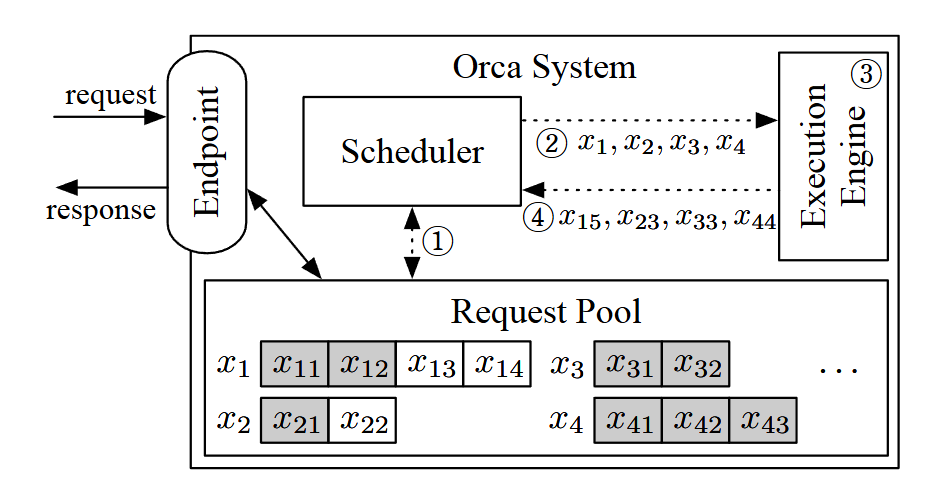

**Orca** is the paper that made iteration-level scheduling and selective batching. The implementation is very systems-heavy (13k+ lines of C++/CUDA code) but the core claim/contribution is simple: **how we schedule requests matters a lot**.

## tldr;

LLM serving is not just a kernel optimization problem but also a scheduling problem. If we schedule at token-iteration granularity and batch only where batching actually helps, we can improve utilization without paying the full latency cost of static batching.

Below are the notes I kept while reading it.

## Introduction

> Existing inference systems, including both the serving system layer and the execution engine layer, have limitations in handling requests for Transformer-based generative models. Since these models are trained to generate a next token in an autoregressive manner, one should run the model as many times as the number of tokens to generate.

Here "run the model" just means a forward pass through the weights.

During prefill, the model processes the whole prompt in one pass and builds the KV cache. After that, we decode one token at a time.

In ORCA's terminology, prefill maps to the _initiation_ phase, and decode maps to the _increment_ phase.

## Batching is key to high throughput

> Among the features and optimizations provided by serving systems, batching is a key to achieve high accelerator utilization when using accelerators like GPUs. When we run the execution engine with batching enabled, the input tensors from multiple requests coalesce into a single, large input tensor before being fed to the first operation of the model. Since the accelerators prefer large input tensors over small ones to better exploit the vast amount of parallel computation units, the engine's throughput is highly dependent on the batch size, i.e., the number of inference requests the engine processes together. Reusing the model parameters loaded from off-chip memory is another merit in batched execution, especially when the model involves memory-intensive operations.

Batching is one of the most intuitive to achieve better throughput. A larger batch keeps the GPU busier and it lets the system **reuse model weights** across more work, which improves arithmetic intensity.

## Challenges and proposed solutions

### Challenge 1: Early-finished and late-joining requests

> One major limitation of existing systems is that the serving system and the execution engine interact with each other only when (1) the serving system schedules the next batch on an idle engine; or (2) the engine finishes processing the current batch. In other words, these systems are designed to schedule executions at request granularity; the engine maintains a batch of requests fixed until all requests in the batch finish.

Note: _granularity_ here simply refers to the unit of execution.

Before ORCA, many inference engines effectively worked at request granularity rather than iteration granularity. This is known as static batching. The fundamental problem with static batching is that requests that finish early still need to wait for the one that takes the longest. This leads to low GPU utilization.

Specifically:
1. On the engine side, early-finished requests sit idle which reduces throughput.
2. On the user side, requests that could have finished early are delayed which increases latency.
3. Requests waiting to be scheduled also have to wait for the current long-running request to finish.

When execution is fixed at request granularity, the whole batch is gated by the slowest request.

## Solution 1: Iteration-level scheduling

> To address the above limitations, we propose to schedule executions at the granularity of iteration. At high level, the scheduler repeats the following procedure: (1) selects requests to run next; (2) invokes the engine to execute one iteration for the selected requests; and (3) receives execution results for the scheduled iteration.

> Unlike the method shown in Figure 2 that should run multiple iterations on a scheduled batch until finish of all requests within the batch, ORCA's scheduler can change which requests are going to be processed at every iteration.

This is the main idea in the paper.

ORCA lowers the scheduling granularity to the iteration level. In decode, the natural unit is one forward pass that produces one token. So instead of choosing a batch and iterate until every request finishes, the scheduler picks requests for one iteration, runs that iteration, and then decides again. Requests that finish can leave right away. Then new requests can enter on the next step.

> The endpoint puts newly arrived requests in the _request pool_, a component that manages all requests in the system during their lifetime. The pool is monitored by the scheduler, which is responsible for: selecting a set of requests from the pool, scheduling the execution engine to run an iteration of the model on the set, receiving execution results (i.e., output tokens) from the engine, and updating the pool by appending each output token to the corresponding request.

To support iteration-level scheduling, ORCA introduces a _request pool_ that keeps track of all in-flight requests and their state. The pool stores those requests, while the scheduler decides which ones to run next and updates their state after each iteration.

### Challenge 2: Batching an arbitrary set of requests

> Unfortunately, there is no guarantee that even for a pair of requests (xi, x j), for the next iteration, their executions can be merged and replaced with a batched version. There are three cases for a pair of requests where the next iteration cannot be batched together: (1) both requests are in the initiation phase and each has different number of input tokens (e.g., x3 and x4 in Figure 4); (2) both are in the increment phase and each is processing a token at different index from each other (x1 and x2); or (3) each request is in the different phase: initiation or increment (x1 and x3).

While batching sounds simple, batching iteration-level scheduling turns out to be challenging. The paper points out three cases where this breaks down.

> In the first case, the two requests cannot be processed in a batch because the "length" dimension of their input tensors, which is the number of input tokens, are not equal. The requests in the second case have difference in the tensor shape of Attention keys and values because each processes token at different index, as shown in Figure 1c. For the third case, we cannot batch the iterations of different phases because they take different number of tokens as input; an iteration of the initiation phase processes all input tokens in parallel for efficiency, while in the increment phase each iteration takes a single token as its input (we assume the use of fairseq-style incremental decoding)

case 1. all requests are in prefill but their prompt lengths differ.

case 2. all requests are in decode but they are at different token positions. That means their KV cache shapes differ.

case 3. some requests are in prefill while others are already in decode.

Case 1 and case 2 are not impossible in some absolute sense. You can still batch them with padding and masking. The problem is that this burns memory and wastes GPU cycles. Case 3 is more fundamental because prefill and decode are genuinely different workloads: while prefill is dominated by larger matrix-matrix work, decode leans much more on KV-cache reads and smaller matrix-vector style computation.

### Solution 2: Selective batching

> Interestingly, not all operations are incompatible with such irregularly shaped tensors. Operations such as non-Attention matrix multiplication and layer normalization can be made to work with irregularly shaped tensors by flattening the tensors.

The mismatches above hurt most in attention, mainly because attention depends on sequence-aligned KV state(depends on the length of sequence). Non-attention operations are easier to flatten and combine so ORCA batches those parts and treats attention more carefully.

More concretely, attention is sensitive to per-request sequence length, position, and KV-cache shape. On the other hand, layer norm, residual add, and feed-forward layers are much easier to apply to flattened token representations.

Thus selective batching works as follows:
1. Keep per-request structure where attention needs it.
2. Flatten or merge compatible token representations after attention.
3. Run the non-attention parts in batch.

## Scheduling algorithm in detail

The ORCA scheduler uses an iteration-level FCFS policy, so earlier requests are generally served first. Still, because the scheduler makes a decision every iteration, a later request theoretically can finish earlier if it needs fewer decode steps.

ORCA also uses a `max batch size` parameter (which was introduced in earlier inference frameworks/engines as well). This caps how many requests can be scheduled together at once. Larger batches usually help throughput but they can push latency up too, so the scheduler still needs a bound.

The scheduling algorithm is as follows:

1. The scheduler selects a batch of requests, up to `max_bs`, from the request pool.
2. The `Select` function (line 17) sorts requests by arrival time and checks whether there is enough KV-cache space to admit a new request (`n_rsrv + req.max_tokens`). If there is enough space, the request is added. Otherwise `Select` stops. This avoids overcommitting memory. (This also reveals one of ORCA's limits: the scheduler reserves `max_tokens` worth of space per request up front, which can cause substantial memory fragmentation. This problem is later address with PagedAttention.)
3. The selected requests are then scheduled iteratively.
4. When a request finishes, its reserved memory is freed.
