# Sarathi Serve

## TL;DR

> To explain Sarathi-Serve in one sentence, it introduces a way to overcome _generation stalls_ from decode requests by implementing chunked prefill and stall-free batching.
>
> We will talk more about what this means later.
>
> While the field seems to favor optimizing prefill and decode separately (P/D disaggregation), the ideas introduced in this paper<a href="#reference-1">[1]</a> are still widely used in industry standard inference engines such as vLLM or SGLang (especially for single node cases).

## Background

For the background, I will mainly talk about four takeaways, following the paper's narrative.

I will not talk about batching, since I've already explained it in my previous notes.<a href="#reference-11">[11]</a><a href="#reference-12">[12]</a>

One thing to note is that batching works well especially on decode requests rather than prefill requests. This is because if the input tokens are big enough, just one prefill request can saturate the GPU and make it compute-bound. Since it's already compute-bound, there is no merit in adding batches.

On the other hand, decode is usually memory-bound so it linearly increases when batched together. Again I talked about this in Introduction to LLM Inference Part 1.<a href="#reference-12">[12]</a> so I will not repeat myself.

The figure in the paper shows this:

  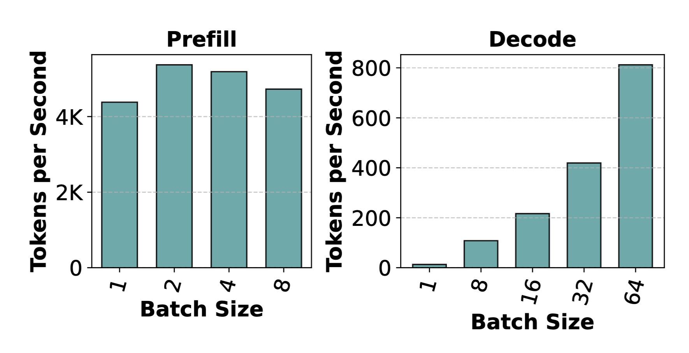
   
  Figure 1. Batching improves decode throughput much more than prefill throughput.<a href="#reference-1">[1]</a>

So the first takeaway is:

### Takeaway 1

> The two phases of LLM inference, prefill and decode, demonstrate contrasting behaviors wherein batching boosts decode phase throughput immensely but has little effect on prefill throughput.

Now let's talk about how to measure the total execution time in LLM inference. Not only LLM inference, but if it's a program that does something repetitively, it's either bound by time computing the data or time loading and saving the memory of the data.

We can express in terms of T = max(T_math, T_mem)

How can we ignore the non-dominant time cost? We will look into this with a simple example borrowing Horace He's aesthetic image<a href="#reference-2">[2]</a>:

  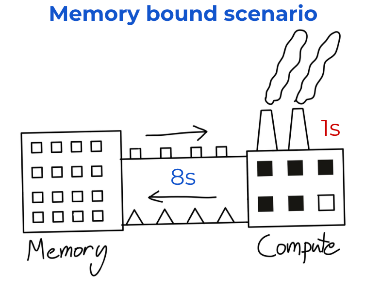
   
  Figure 2. A memory-bound workload where memory transfer dominates compute for a single request.<a href="#reference-2">[2]</a>

Suppose a memory-bound scenario (which resembles a decode scenario), with low arithmetic intensity.<a href="#reference-12">[12]</a> Time computing the data only takes one second while retrieving and rewriting the data takes 8 seconds.

If we are doing only one workload on such a program, the total time would take 1 + 8 = 9 seconds.

However, suppose we have more than 1,000+ workloads repeating the same thing.

  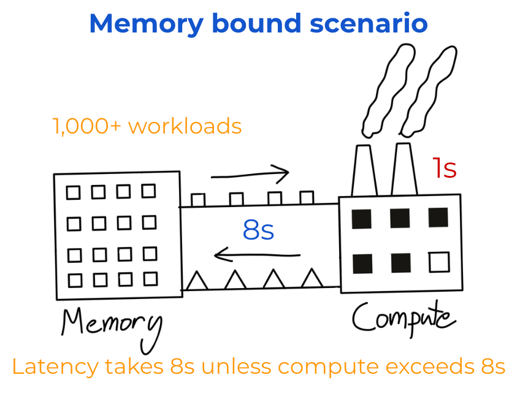
   
  Figure 3. Repeated memory-bound workloads hide compute time and remain dominated by memory access.<a href="#reference-2">[2]</a>

When the first batch of data goes in, compute is done after a second, and then **it stays idle** for 7 seconds until the next batch of data comes in. So if multiple workloads are continuously executed, the 1s cost of compute gets hidden and the system is bound by the dominant time (in this case, T_mem) until T_math exceeds 8 seconds. 

This is why T can be expressed as max(T_mem, T_math).

This also means that theoretically, there is no additional cost of the lower cost to increase until it reaches the dominant cost.

### Takeaway 2

> So the second takeaway we have is:
>
> Decode batches operate in a memory-bound regime leaving compute underutilized.
>
> This implies that more tokens can be processed along with a decode batch without significantly increasing its latency.

Now we will review on the earlier inference engines which are FasterTransformer, Orca, and vLLM (v0). We will first compare FasterTransformer and vLLM v0 and then talk about Orca.

  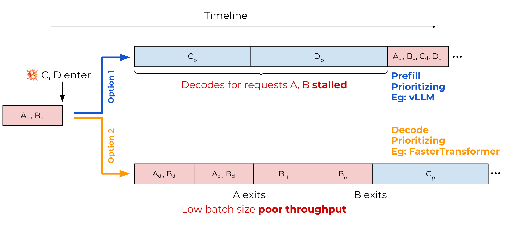
   
  Figure 4. vLLM v0 and FasterTransformer compared as prefill-prioritizing and decode-prioritizing schedulers.<a href="#reference-3">[3]</a>

vLLM v0 (Option 1 in the image above) is _prefill-prioritizing_ and eagerly admits prefills before resuming ongoing decodes. As seen in the image, even if a new request comes in, it prioritizes the new request's prefill over the earlier requests' decode steps. This leads to high throughput because we can batch more decode steps after every request is in decode phase, but leads to higher TPOT.

In the image, A and B need to _wait_ for C_p and D_p to finish processing. This is called _generation stalls_ which I mentioned above the [tl;dr](#tldr).

  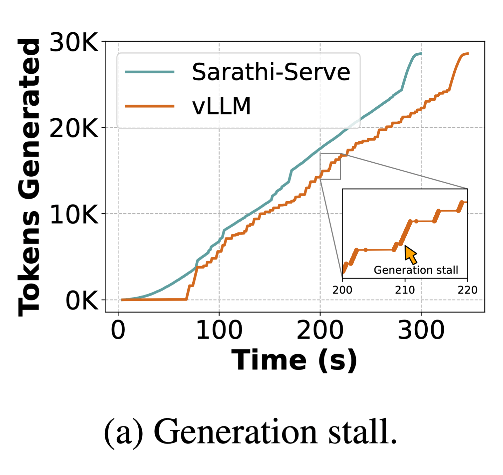
   
  Figure 5. In vLLM, decode steps stall when newly arrived prefill requests are prioritized.<a href="#reference-1">[1]</a>

FasterTransformer (Option 2) used static batching, which takes a request batch, runs prefill and decode steps on it until all the requests are finished processing, then executes the next request batch in the same manner.

This can be called _decode-prioritizing_ system, since it prioritizes decode steps instead of adding new prefills to increase throughput. This leads to so low TPOT but overall throughput is low.

Orca **was** the only engine back then that supported mixed(hybrid) batching at that time (early 2024).

Orca introduced selective batching which batches all non-attention operations and only runs attention per request (since attention should be applied per request). For an in-depth explanation, check out Improving LLM Inference with Continuous Batching: Orca through tinyorca.<a href="#reference-11">[11]</a>

However, Orca's Hybrid batching didn't turn out to be **optimal** because it increased latency which often exceeded SLO.

### What is SLO?

SLO stands for Service Level Objective which refers to a target performance level for a particular metric. This sets a standard for what’s considered acceptable service that doesn't harm user experience.<a href="#reference-4">[4]</a>

Usually in the context of LLM inference, this boils down to metrics such as TPOT, TTFT etc. Throughout this post, let's assume TPOT must be <10ms.

  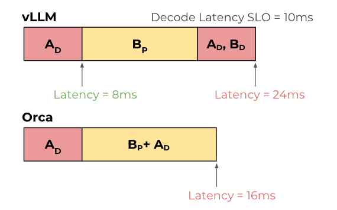
   
  Figure 6. Both vLLM and Orca exceed the decode latency SLO under mixed batching.<a href="#reference-3">[3]</a>

Above is an image of both vLLM and Orca which both do not satisfy the latency SLO (10ms). We already saw why this happens in vLLM (it prioritizes prefill request first). But you can see that Orca's hybrid batching increases latency in a fairly subtle manner.

### The effect of mixed batching

Hybrid batching works as follows:

1. Run token-wise operations (LayerNorm, QKV projection, MLP) on a flattened batch: `[sum_i S_i, hidden]`
2. Split into per-request tensors when execution reaches the attention path, where request `i` is `[S_i, hidden]`
3. **Run the request-local attention path independently per request.**
4. Re-flatten the outputs into a single token stream.
5. Continue with token-wise operations and repeat for the next layer.

In a hybrid iteration, decode-side attention work may finish earlier than the larger prefill-side attention work, but decode requests still wait for the completion of the entire hybrid iteration before their next token can be returned.<a href="#reference-5">[5]</a><a href="#reference-6">[6]</a>

Although prefill remains the dominant part of the hybrid iteration, the latency can slightly exceed that of a standalone prefill (as seen in the image above; 8ms vs 9ms) because the batch also includes decode-side work and incurs additional hybrid-batching overhead, such as batch formation and split/merge-related<a href="#reference-7">[7]</a> execution overhead.

So the step time for hybrid batching comes from $T_{\text{hybrid}} \approx T_{\text{batched non-attention}} + T_{\text{attention related operation for requests}} + T_{\text{overhead}}$.

Note: The attention-related term is not directly observable as a single per-request quantity; it emerges from the combined execution of the hybrid batch.

### Takeaway 3

> The third takeaway the authors mentioned is that the interleaving of prefills and decodes involves a trade-off between throughput and latency for current LLM inference schedulers.
>
> State-of-the-art systems (like vLLM v0) use prefill-prioritizing schedules which enhanced throughput but also had side effect notably generation stalls.
>
> Another takeaway I want to explicitly mention (while already explained implicitly) is that not all step sizes are the same. Decode steps finish much more quickly, prefill steps take longer, and a hybrid batch of them takes even longer than that due to overhead.

### Pipeline Parallelism

Pipeline parallelism(PP) is a method where we shard the model weight vertically, which divides it into groups of layers. For example, if we use four GPUs for PP with a model that has 80 layers, each model will take 20 layers (e.g., device 0 gets layer 0-19, device 1 gets layer 20-39, ...) Unlike training, we don't need a backward pass for inference, so it's an even better fit for inference than training.

So if we apply this to a forward pass scenario, GPU 0 processes the first 20 layers and sends data to GPU 1 and GPU 1 processes the next 20 layers, and so on.

  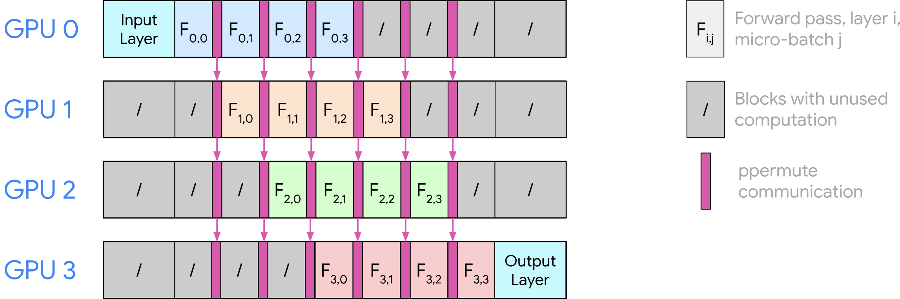
   
  Figure 7. Pipeline parallelism splits layers across devices so one micro-batch flows stage by stage.<a href="#reference-8">[8]</a>

For more in-depth explanation on PP, I recommend these two articles.<a href="#reference-9">[9]</a><a href="#reference-10">[10]</a>

### Pipeline Bubbles

  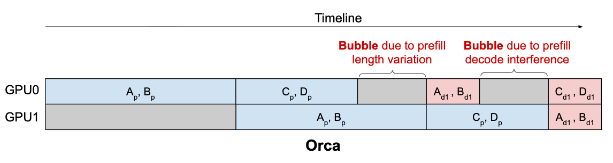
   
  Figure 8. Uneven iteration times create pipeline bubbles where some devices wait idly.<a href="#reference-1">[1]</a>

Another problem found when using multiple GPUs in Orca is that pipeline bubbles happen.

In [Takeaway 3](#takeaway-3) I have already mentioned that step size is not the same. Since the size of each step has high variance, performance is bound to the longest processing time for GPU at the moment.

For example in the image above, GPU0 processes C and D's prefill and is done while GPU1 is processing A and B's (whose inputs are longer) prefill, which needs more time to process. GPU0 needs to wait until GPU1 is finished and then can pass it. This gets even worse when GPU1 is processing prefill while GPU0 is finished processing decode (which ends earlier).

### Takeaway 4

> Again, step sizes are NOT the same. This can lead to large variance in compute time of LLM iterations, depending on composition of prefill- and decode-tokens in the batch. This introduces  significant bubbles when using pipeline-parallelism.

## Sarathi-Serve

If we add up all the insights from the four takeaways (especially takeaway 2), we can think of making hybrid batching "smarter", by carefully adding prefill computation. This will only introduce none or marginal cost while increasing throughput.

In order to do this, Sarathi-Serve introduces chunked prefill and Stall free batching with token budget.

### Chunked Prefill

Chunked prefill is a technique used in stall-free batching which is a concept to allow "partial" prefill. Before this paper was introduced, prefill was processed atomically; either all or none.

  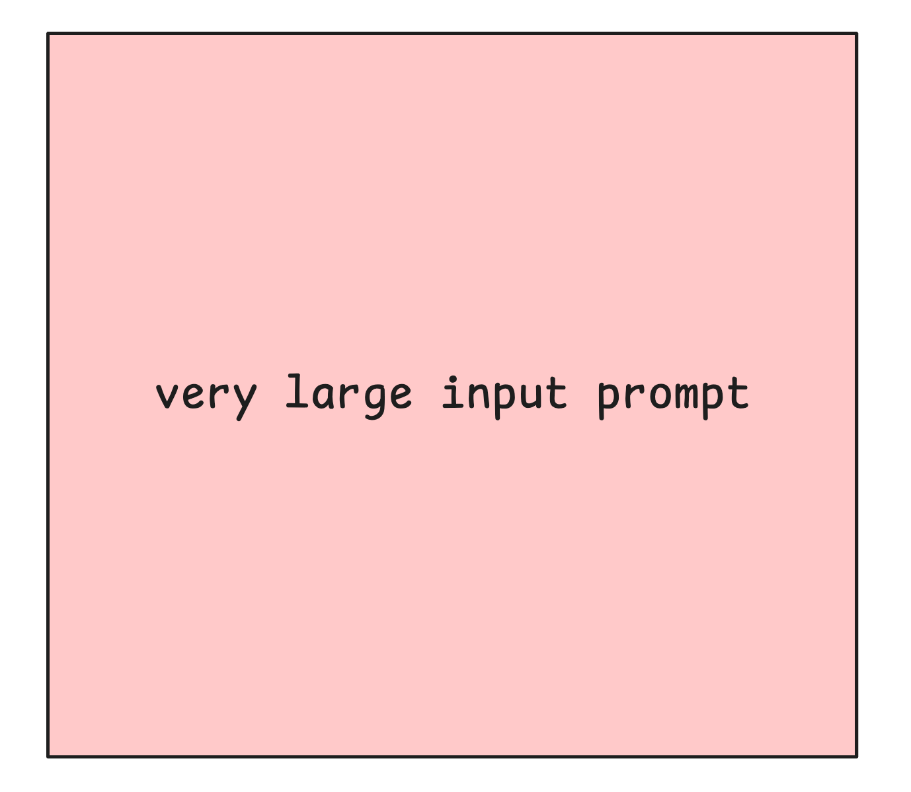
   
  Figure 9. Before chunked prefill, a prefill request is handled atomically in one large step.

By using chunked prefill, it allows us to process part of it per step. This allows flexibility in how much we are going to process in one step. We will talk more about this in Stall free batching.

  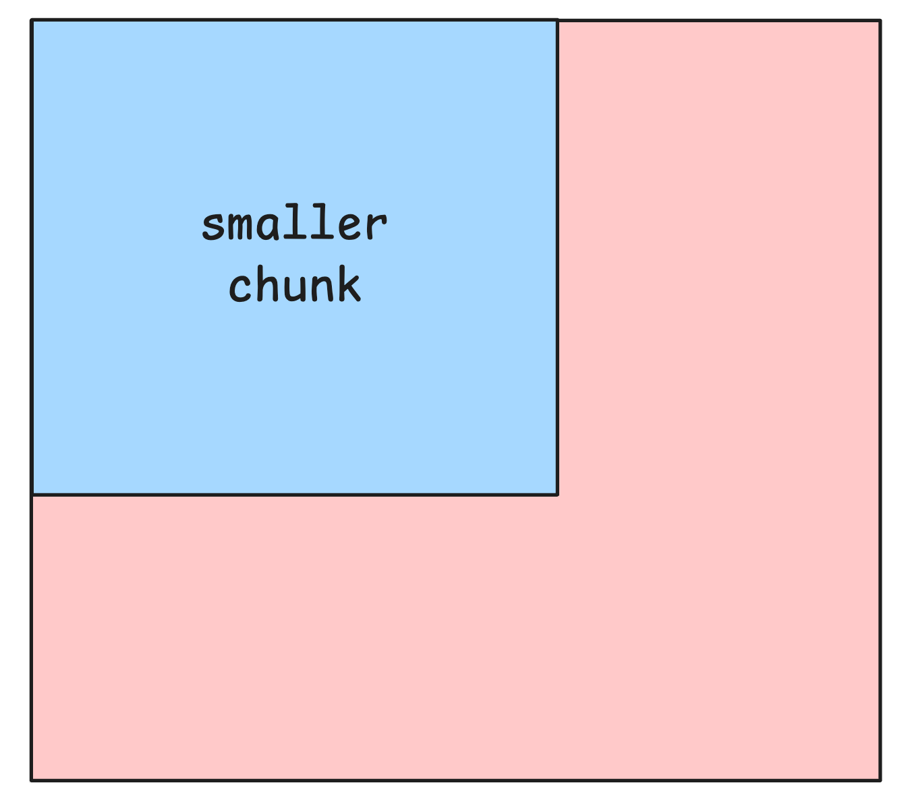
   
  Figure 10. Chunked prefill breaks a long prefill into smaller pieces that can be scheduled across steps.

### Overhead

Chunked prefill introduces additional overhead compared to standard prefill. In a regular prefill, all input tokens are processed in a single pass, so there is no need to revisit previously computed KV states.

With chunked prefill, however, the prefill phase is split across multiple iterations. Each new chunk must attend to tokens from earlier chunks, which requires repeatedly reading the previously computed KV cache during attention.

This results in extra memory reads due to KV cache re-access. 

  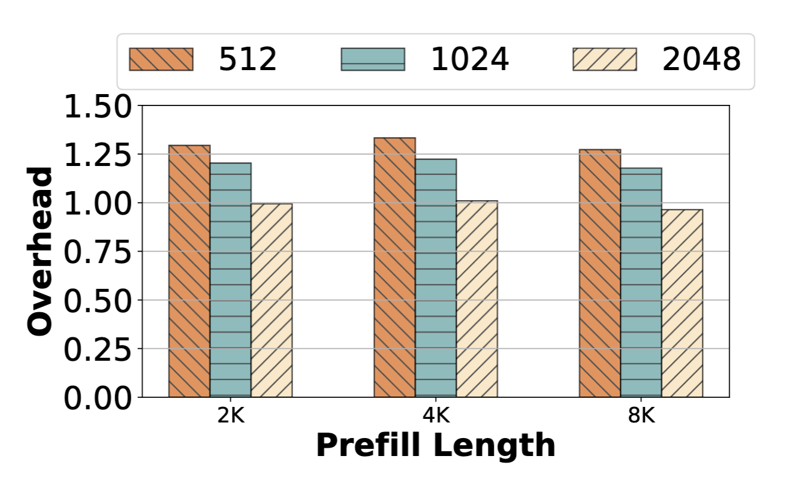
   
  Figure 11. The overhead of chunked prefill stays modest and falls as chunk size grows.<a href="#reference-1">[1]</a>

In practice, this overhead remains modest because prefill is largely compute-bound so the additional KV reads have limited impact on overall runtime. According to the ablation study section, the overhead is at most around ~25% for small chunk sizes and becomes negligible for larger chunks.

### Stall Free Batching

This is the scheduling algorithm introduced in Sarathi-Serve:

  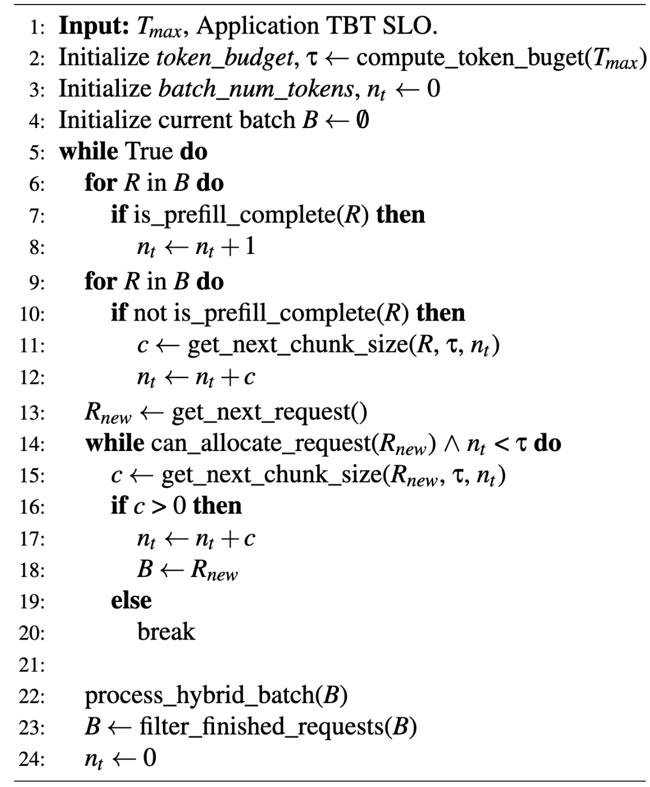
   
  Figure 12. Sarathi-Serve's stall-free batching algorithm uses a fixed token budget for each step.<a href="#reference-1">[1]</a>

If we break down the algorithm, stall-free batching works as follows:

1. **Initialize a token budget.**

   _Token budget_ is the fundamental knob used in Sarathi-Serve which determines how many tokens to allow for the step. This is static throughout the serving. We will talk more about considerations and tradeoffs due to the amount of token budget we set.

2. **Also initialize batch number of tokens.**

   This is used to check whether the current batch exceeded the token budget.

3. **For each step:**

   1. Prefer decode requests first.
   2. Update the batch number of tokens and the remaining token budget.
   3. Check whether there is a partially processed prefill request with tokens remaining.

      If yes:

      - Set the chunk size to `min(remaining budget, remaining prefill length)`.
      - If the remaining budget is `0`, end this step.
      - Otherwise, continue to the next sub-step.

   4. Update the batch number of tokens and the remaining token budget again.
   5. Get the next request and repeat the same logic until the token budget for this step is exhausted.

4. **Process hybrid batching of all the requests selected in step 3.**

To consolidate the understanding, I will walk through an illustrated example that hopefully makes the scheduling process more intuitive. 

### Stall Free Batching w/ Illustrated Example

Suppose we have a token budget of 100.

With 4 requests R1~R4 in their decode phase, one chunked request (from an earlier step) R5(30 tokens), and two prefill requests R6(80 tokens) and R7(150 tokens):

  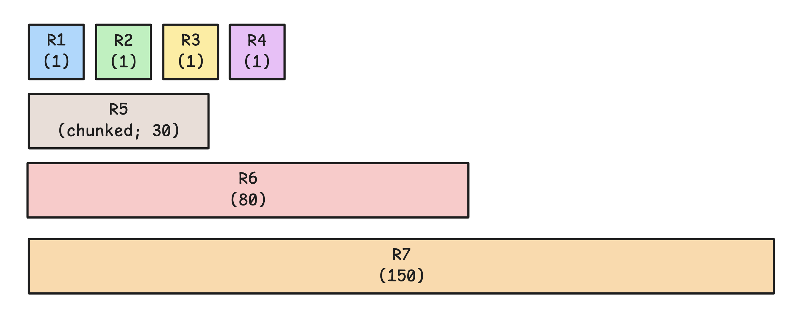
   
  Figure 13. The initial state before scheduling begins under a token budget of 100.

Batch_num_tokens is initialized to 0 for each step.

  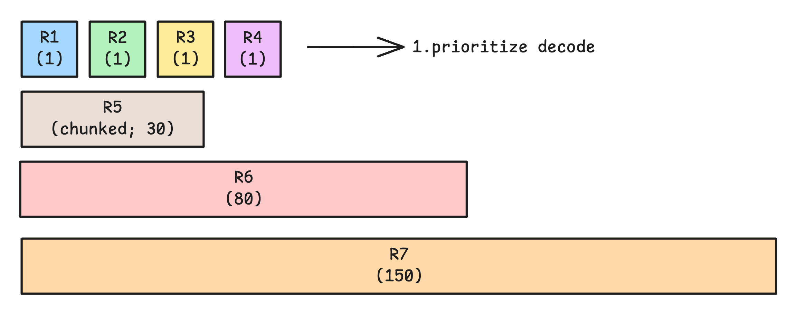
   
  Figure 14. The scheduler first admits all decode requests in the current iteration.

First, we need to process all four decode requests so we schedule them. batch_num_tokens becomes 4.

  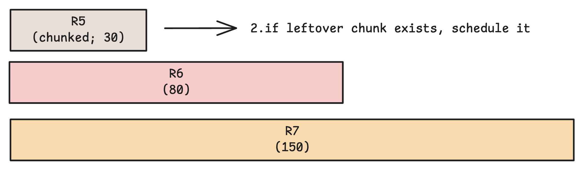
   
  Figure 15. The remaining chunked prefill request is added next within the unused token budget.

Since batch_num_tokens(4) didn't reach the token budget(100), we continue. 

We prioritize the chunked request, which is R5 in this case. min(remaining_budget, R5) = 30 so we schedule it to process the whole leftover prefill request. batch_num_tokens is updated to 34.

  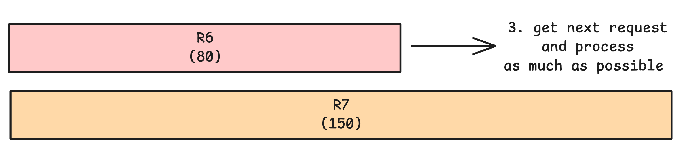
   
  Figure 16. The next prefill request is chunked so only the portion that fits the budget is scheduled.

The next request (in FCFS order) is R6 so we also determine how much we can schedule. It turns out min(remaining_budget, R6) = 66 so we chunk R6 and only schedule the first 66 tokens of it.

  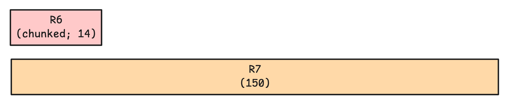
   
  Figure 17. The unscheduled remainder is carried over to the next iteration.

The remainder stays pending for future iterations.

So R1 ~ (chunked) R6 are scheduled for this step and processed in hybrid batch.

  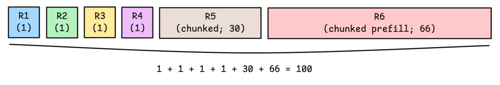
   
  Figure 18. The final hybrid batch combines decode tokens with chunked prefill under one token budget.

For this iteration, the step latency can be approximated as $T_{\text{hybrid}} \approx T_{\text{batched non-attention}} + T_{\text{attention related operation for requests}} + T_{\text{overhead}}$

## How Sarathi-Serve solves the problem

Stall free batching is indeed using the hybrid batching technique introduced from Orca, but what differs is that instead of using the number of requests as an upper bound, it uses token budget.

Before Sarathi-Serve, batched tokens per step had high variance because for some steps, long prefills are batched together and for other steps most of them are decodes. Also, input lengths in requests differ, so some batched prefill takes a very long time.

  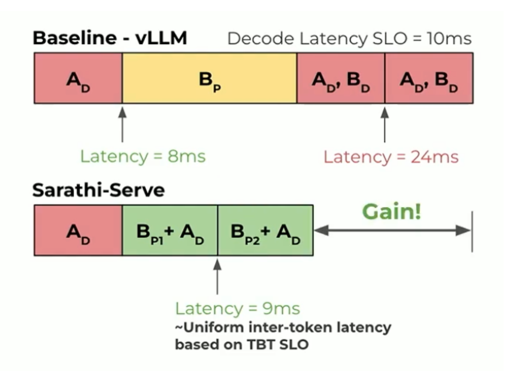
   
  Figure 19. Without a token budget, per-step work varies widely depending on the batch mix.<a href="#reference-3">[3]</a>

By capping token budget, we can control and estimate worst-case step latency much better, since it is bounded by a batch whose total tokens ≈ token budget. Token budget is usually capped to match the SLO requirement (e.g., < 10ms) so we can batch more prefill tokens while adding minimal latency to decode steps batched together.

  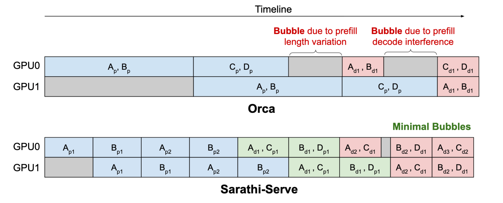
   
  Figure 20. A token budget bounds step latency and reduces variance across iterations.<a href="#reference-1">[1]</a>

Also, since each step is capped to the token budget, variance becomes much lower, minimizing the pipeline bubbles.

### Considerations(Tradeoffs) on determining token budget

Choosing the token budget is a tradeoff between latency, efficiency, and hardware behavior.

1. TBT(TPOT) SLO (primary constraint)

   Since the point of having a token budget is to satisfy the decode SLOs, the budget must be small enough to avoid exceeding the minimum requirement. If too many prefill tokens are included, decode iterations get delayed, causing generation stalls.

2. **Tile Quantization**  

   GPU kernels operate on fixed tile sizes (e.g., 16×16, 32×32). Misaligned chunk sizes can lead to wasted computation. For example, a chunk size of 257 can increase prefill time by ~32% due to poor tiling efficiency. (tbh I don't know how they manage to make this efficient because of my understanding, token budget only caps the upper bound)

3. **Pipeline Bubbles**  

   Larger chunks increase variation in iteration time, which leads to pipeline bubbles in pipeline-parallel setups. Smaller, more uniform chunks help maintain balanced execution across stages.

## Notes on evaluation

  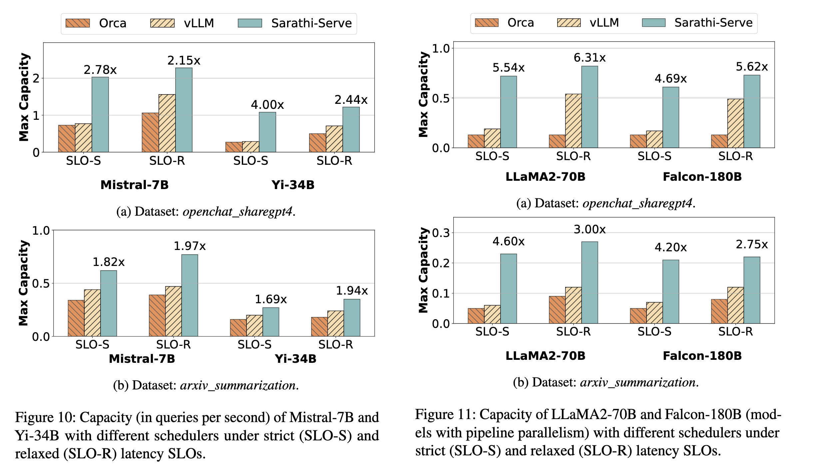
   
  Figure 21. Under SLO-constrained serving, Sarathi-Serve improves serving capacity across models and setups.<a href="#reference-1">[1]</a>

As a result of what we've talked about so far, Sarathi-Serve consistently improves serving capacity across models, with gains of up to 2.6× ~ 5.6× depending on the model/parallelism, under realistic workloads.

Unlike other benchmarks from previous papers, Sarathi-Serve especially used the throughput gain **under SLOs** which was interesting.

## References
<ol>
  <li id="reference-1">Agrawal et al., "Taming Throughput-Latency Tradeoff in LLM Inference with Sarathi-Serve." <a href="https://arxiv.org/pdf/2403.02310">Link</a></li>
  <li id="reference-2">He, "Making Deep Learning Go Brrrr From First Principles." <a href="https://horace.io/brrr_intro.html">Link</a></li>
  <li id="reference-3">Agrawal, "Sarathi-Serve" OSDI '24 Slides. <a href="https://www.usenix.org/system/files/osdi24_slides-agrawal.pdf">Link</a></li>
  <li id="reference-4">BentoML, "LLM Inference Metrics." <a href="https://bentoml.com/llm/inference-optimization/llm-inference-metrics">Link</a></li>
  <li id="reference-5">Choi et al., "Splitwise: Efficient Generative LLM Inference Using Phase Splitting." <a href="https://dl.acm.org/doi/full/10.1145/3712285.3759823">Link</a></li>
  <li id="reference-6">Agrawal et al., "Taming Throughput-Latency Tradeoff in LLM Inference with Sarathi-Serve." <a href="https://arxiv.org/pdf/2403.02310">Link</a></li>
  <li id="reference-7">Yu et al., "Orca: A Distributed Serving System for Transformer-Based Generative Models." <a href="https://www.usenix.org/system/files/osdi22-yu.pdf">Link</a></li>
  <li id="reference-8">UvA DL Notebooks, "Pipeline Parallelism." <a href="https://uvadlc-notebooks.readthedocs.io/en/latest/tutorial_notebooks/scaling/JAX/pipeline_parallel_simple.html">Link</a></li>
  <li id="reference-9">Weng, "How to Train Really Large Models on Many GPUs." <a href="https://lilianweng.github.io/posts/2021-09-25-train-large/#pipeline-parallelism">Link</a></li>
  <li id="reference-10">Rao, "Distributed and Efficient Finetuning." <a href="https://sumanthrh.com/post/distributed-and-efficient-finetuning/">Link</a></li>
  <li id="reference-11">"Improving LLM Inference with Continuous Batching: Orca through tinyorca." <a href="./tinyorca.md">Link</a></li>
  <li id="reference-12">"Introduction to LLM Inference Part 1." <a href="./llm-inference-intro-p1.md">Link</a></li>
</ol>
