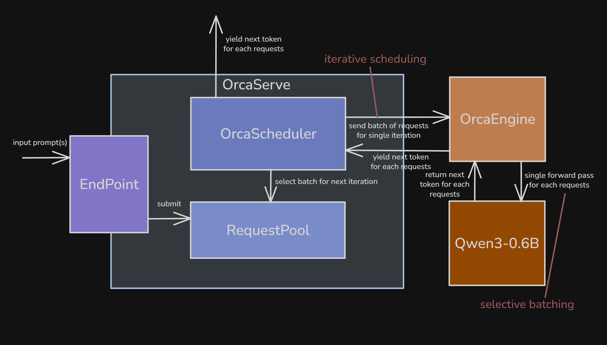
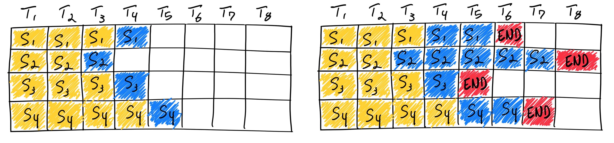
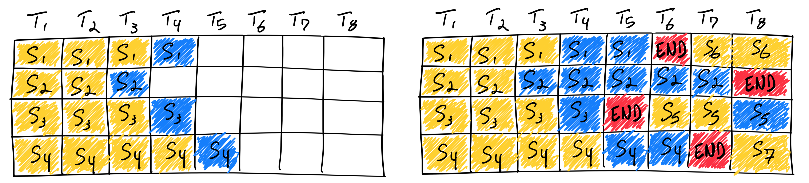
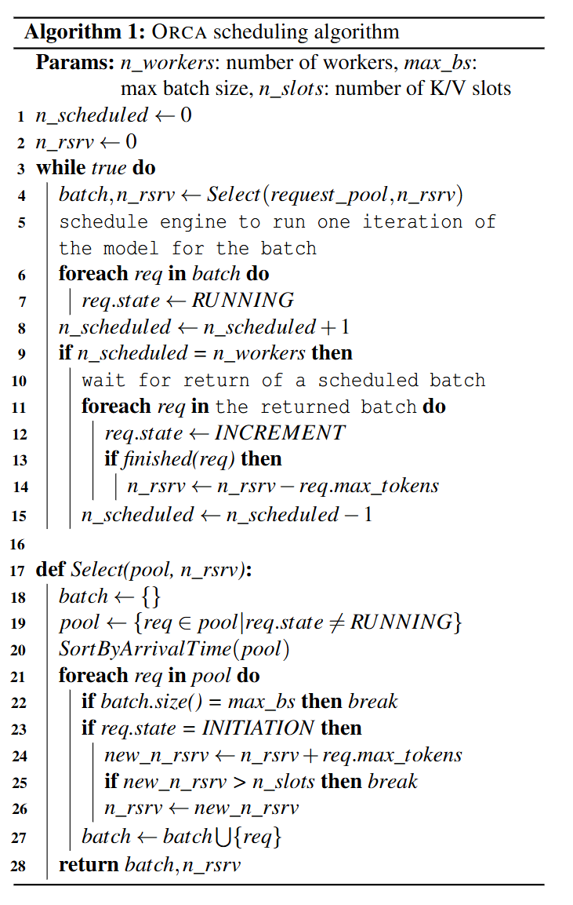
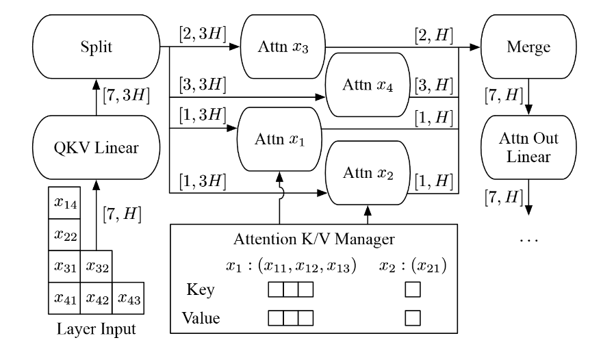
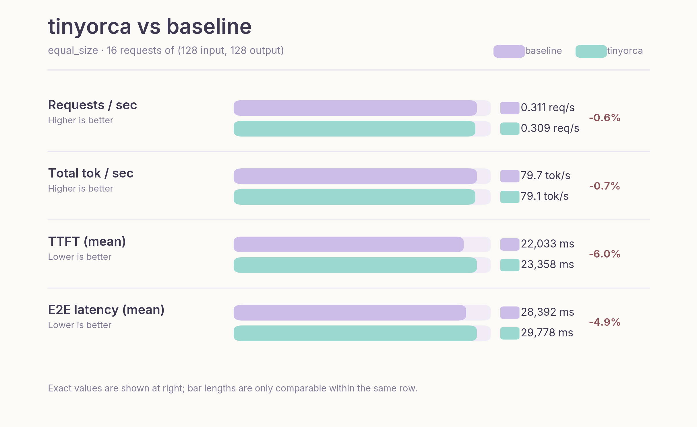
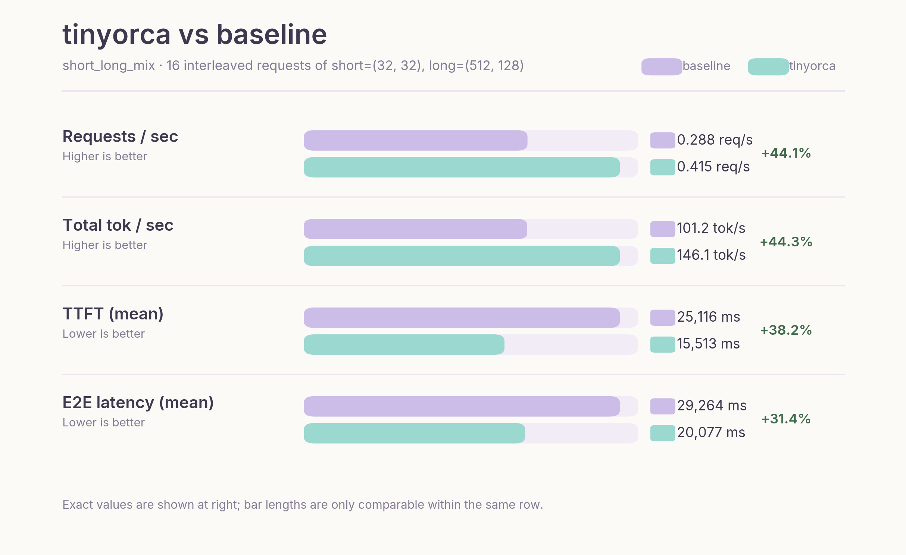
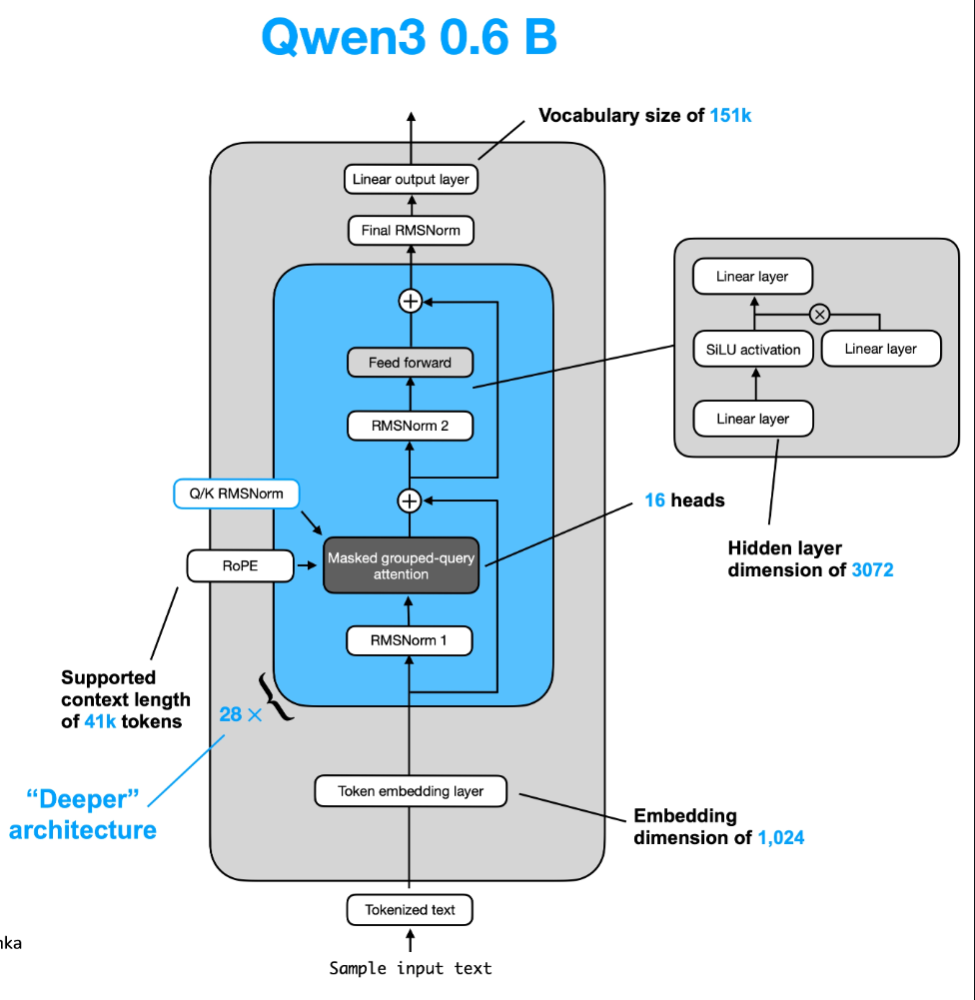

# Understanding Orca through tinyorca

## TL;DR

This article explains Orca<sup><a href="#reference-1">[1]</a></sup> through a minimal implementation, **[tinyorca](https://github.com/junuxyz/tinyorca)**. Rather than covering the full distributed serving system, we focus on the two core ideas introduced in the paper: iteration-level scheduling and selective batching.

Iteration-level scheduling allows the engine to admit a new request as soon as another completes, while selective batching enables requests at different stages to be processed together. Before diving into these concepts, we briefly outline the architecture of tinyorca and the lifecycle of a request.

## Architecture Overview

<p align="center">
  
  <br />
  <sub>Figure 1. High-level architecture of `tinyorca`, showing the endpoint, request pool, scheduler, and engine.<sup><a href="#reference-2">[2]</a></sup></sub>
</p>


**[`OrcaServe`](https://github.com/junuxyz/tinyorca/blob/main/tinyorca/core/serve.py)** works as the orchestrator layer composed of four submodules:
- **`Endpoint`**: tokenizes prompt text, builds a `Request`, and enqueues it into the `RequestPool`.
- **`RequestPool`**: stores all active (non-finished) requests.
- **`OrcaScheduler`**: handles batch selection and admission control (control plane).
- **`OrcaEngine`**: executes the model step, manages KV cache state, and generates tokens (execution plane).

## Request Lifecycle

A request goes through the following lifecycle:

```
WAITING -> INITIATION (prefill) -> INCREMENT (decode) -> FINISHED
```

Each state represents:
- **`WAITING`**: the request is in the pool but not yet selected. It may remain here for multiple iterations if batch slots or KV budget are exhausted.
- **`INITIATION`** (prefill): the request has been admitted and is scheduled for its first engine step.
- **`INCREMENT`** (decode): the request has completed at least one step and can be scheduled again in subsequent iterations.
- **`FINISHED`**: the request has reached EOS or `max_new_tokens`, and is removed while its resources are released.

A request starts in `WAITING`, remains in the `RequestPool` until admitted, and then progresses through the lifecycle as follows:

1. `Endpoint` tokenizes the input and pushes a new `Request` into the `RequestPool` (`WAITING`).
2. The scheduler admits it via `select()`, transitioning it to `INITIATION`.
3. On its first iteration, `run_iter()` sees empty `output_ids` and performs prefill on the full prompt, after which the request moves to `INCREMENT`.
4. On subsequent iterations, `run_iter()` performs one decode step using only the last generated token.
5. Once finished, the scheduler removes the request and frees its reserved resources.

With these in mind, we now focus on the two main ideas from the paper. The first is iteration-level scheduling, which changes when the scheduler can reconsider the active set of requests.

## Deep dive into Iterative Scheduling

### Batching is the key to high throughput.

Batching is one of the most important strategies for achieving high accelerator utilization on GPUs. When batching is enabled, inputs from multiple requests are coalesced into a single larger tensor before being fed into the model. GPUs favor large tensors over many small ones, and batching improves weight reuse by amortizing parameter reads across more computation.

If you want more background on why batching makes each token cheaper to generate, I covered that in [Introduction to LLM Inference Part 1](./llm-inference-intro-p1.md#why-batching-requests-makes-each-token-generation-cheaper).

### Early-finished and late-joining requests

Older systems (e.g., FasterTransformer) did support batching, but in a naive way. The serving system and execution engine only interacted at two points:
1. when the serving system scheduled a new batch on an idle engine
2. when the engine finished processing the current batch

In other words, scheduling happened at the granularity of requests rather than iterations (steps). Here, _granularity_ just means the unit at which scheduling decisions are made.

This is known as _static batching_: once a batch is formed, it remains fixed until all requests in the batch complete. Early-finished requests leave idle slots (see the empty slots in the figure below, or in tinyorca’s [demo](https://github.com/junuxyz/tinyorca/tree/main)), while queued requests cannot join until the longest-running request finishes.<sup><a href="#reference-3">[3]</a></sup>

As a result, throughput drops and latency increases for both completed and waiting requests.

<p align="center">
  
  <br />
  <sub>Figure 2. Under static batching, early-finished requests leave idle slots until the longest request in the batch completes.<sup><a href="#reference-3">[3]</a></sup></sub>
</p>

### Solution: Iteration-level scheduling

Orca lowers the scheduling granularity to the iteration level.

In the decode phase, the natural unit is one forward pass that produces one token. So instead of choosing a batch and keeping it fixed until every request finishes, the scheduler picks requests for one iteration, runs that iteration, and then decides again. Based on the figure, each column ($T_n$) corresponds to one iteration.


<p align="center">
  
  <br />
  <sub>Figure 3. Iteration-level scheduling lets finished requests leave immediately and admits new work in the next iteration.<sup><a href="#reference-3">[3]</a></sup></sub>
</p>

This way, finished requests can leave immediately, and new requests can be admitted in the next iteration.

### Scheduling Algorithm

Let's look at the exact scheduling algorithm in detail:

<p align="center">
  
  <br />
  <sub>Figure 4. Orca's scheduling algorithm, including FCFS admission and KV-slot reservation logic.<sup><a href="#reference-1">[1]</a></sup></sub>
</p>

At a high level, the algorithm does four things:

1. The scheduler selects a batch of requests, up to `max_bs`, from the request pool.
2. The `Select` function (line 17) sorts requests by arrival time and admits them only if there is enough KV-cache space. Specifically, a request is added if `n_slots >= n_rsrv + req.max_tokens`; otherwise, selection stops to avoid overcommitting memory. Note that KV reservation increases only when admitting new INITIATION (prefill) requests, while decode steps reuse already reserved KV cache slots.
3. The selected requests are then scheduled iteratively.
4. When a request finishes, its reserved memory is freed.

The next section shows how `tinyorca` implements this.

### How Iterative Scheduling is implemented in tinyorca

```python
class OrcaScheduler:
    def __init__(self, engine, request_pool, max_batch_size, n_slots=None):
        self.engine = engine
        self.request_pool = request_pool
        self.max_batch_size = max_batch_size

        if n_slots is None:
            max_new_tokens = engine.config.sampling.max_new_tokens
            n_slots = engine.estimate_n_slots(max_batch_size, max_new_tokens)

        self.n_slots = n_slots
        self.n_rsrv = 0
```

The scheduler has two key limits:
- `max_batch_size`: maximum number of requests in one iteration. This is the primary constraint.
- `n_slots`: total KV slot budget.
`n_slots` is fixed automatically when the scheduler is created. In the normal runtime path, the scheduler asks the engine to estimate it (this is inspired by nano-vllm's KV-cache allocation logic<sup><a href="#reference-5">[5]</a></sup>) from the active device once and then treats it as a hard ceiling. This path currently supports only CUDA.

For each `WAITING` request that is newly admitted, the scheduler reserves:
```python
request.max_tokens
```

Here, `request.max_tokens` is the request-level upper bound defined in code as `len(request.prompt_ids) + request.sampling.max_new_tokens`. While this reservation is quite conservative (which is later fixed by PagedAttention<sup><a href="#reference-6">[6]</a></sup>), it ensures that the scheduler reserves enough KV slots for the full prompt + the maximum possible decode length up front.

The selection policy in code is:

```python
def select(self) -> list[Request]:
    batch = []
    for request in self.request_pool.arrival_ordered_requests():
        if len(batch) == self.max_batch_size:
            break
        if request.state is RequestState.WAITING:
            if request.max_tokens > self.n_slots:
                raise ValueError(...)
            new_n_rsrv = self.n_rsrv + request.max_tokens
            if new_n_rsrv > self.n_slots:
                break
            self.n_rsrv = new_n_rsrv
            request.initiate()
        batch.append(request)
    return batch
```

`select()` does five things:
1. scans requests in FCFS arrival order
2. stops once `max_batch_size` is reached
3. reserves KV only when admitting `WAITING` requests for the first time
4. promotes newly admitted requests from `WAITING` to `INITIATION`
5. preserves FCFS admission order: if the next `WAITING` request would exceed `n_slots`, selection stops for that iteration

One consequence of this policy is _head-of-line blocking_. `select()` scans requests in arrival order, and when the first newly admitted `WAITING` request does not fit in the remaining KV budget, it stops scanning for that iteration instead of skipping that request and checking later ones. That means a large older request can block smaller newer requests that would otherwise fit. This behavior is intentional here: it preserves FCFS fairness and keeps tinyorca aligned with Orca's scheduling policy.

**Upper bound**

While `max_batch_size` is the primary bound, admission of a new `WAITING` request stops when `n_rsrv + request.max_tokens > n_slots`.

**The outer scheduling loop**

```python
def schedule(self) -> Iterator[RequestToken]:
    while self.request_pool.has_requests():
        batch = self.select()
        if not batch:
            break
        token_events = self.engine.run_iter(batch)
        for token_event in token_events:
            request = token_event.request
            if request.state is RequestState.FINISHED:
                self.request_pool.remove(request)
                self.n_rsrv -= request.max_tokens
            else:
                request.increment()
            yield token_event
```

In this loop, `run_iter(batch)` executes exactly one iteration of the model for the selected batch.
- Finished requests are removed immediately, and their reserved budget is returned to `n_rsrv`.
- Non-finished requests are advanced via `increment()`, so on the next iteration they re-enter the scheduler as decode requests.

Because the loop yields one `RequestToken` per token event, streaming is naturally aligned with the iteration boundary.

Now we can move to Orca’s second key idea: selective batching.

## Deep dive into Selective Batching

<p align="center">
  
  <br />
  <sub>Figure 5. Orca's selective batching idea: keep token-wise work batched, but split into per-request attention paths only where request-local context matters.<sup><a href="#reference-1">[1]</a></sup></sub>
</p>

### Why batching an arbitrary set of requests is hard

At a high level, iteration-level scheduling sounds simple: pick several requests, run one step, then repeat.  
The real difficulty is that requests selected in the same iteration usually do not have the same shape. Their prompt lengths may differ, their decode positions may differ, or some may be in prefill while others are already in decode.

This was less problematic in request-level scheduling because requests grouped together were usually at the same stage of execution. For example, they might all be in prefill, or all be processing the same decode step.

The Orca paper highlights three failure modes for naive batching:

> case 1. all requests are in prefill but their prompt lengths differ.

This is the easiest case but it is still inefficient. A dense batch usually assumes one common sequence length so shorter prompts must be padded to match the longest prompt in the batch.

> case 2. all requests are in decode but they are at different token positions.

This case is harder. Even if each request contributes only one decode token in this iteration, each one attends over a different amount of prior context. In other words, their effective KV cache lengths differ.

A naive implementation could pad all requests to the longest cache length in the batch but this would waste both memory bandwidth and computation because shorter requests would still carry padded context they do not actually need.

> case 3. some requests are in prefill while others are already in decode.

This is the hardest case. Prefill processes many tokens at once and looks more like large matrix-matrix computation. Decode processes one new token against an existing KV cache and is much more memory-bound, with matrix-vector-like behavior. Because prefill and decode have very different shapes and bottlenecks, padding alone does not batch them efficiently.

Orca’s answer to this problem is selective batching.

### How Selective Batching solves this

Researchers observed that most operations in a Transformer layer are token-wise. In particular, LayerNorm, QKV projections, and MLP are applied independently to each token, so they can run on a flattened stream of tokens regardless of request boundaries.

The boundary appears at attention. Once attention begins, the computation depends on each request's own KV cache, sequence length, and positions. In practice, the request-local partition includes RoPE application, KV-cache update, mask handling, and the attention kernel itself.

To handle this, Orca introduces selective batching:
- Run token-wise operations (LayerNorm, QKV projection, MLP) on a flattened batch: `[sum_i S_i, hidden]`
- Split into per-request tensors when execution reaches the attention path, where request `i` is `[S_i, hidden]`
- **Run the request-local attention path independently per request.**
- Re-flatten the outputs into a single token stream.
- Continue with token-wise operations and repeat for the next layer.

### How selective batching is implemented in tinyorca

If request selection and KV admission control belong to the scheduler (control plane), then executing one iteration step belongs to the engine and model (execution plane). In tinyorca, `OrcaEngine` builds the flat mixed batch for the iteration, and `Qwen3SelectiveModel` keeps token-wise work batched until attention, where execution becomes request-local.

### OrcaEngine

```python
flat_batch = self.build_flat_batch(requests)
```

**`build_flat_batch`**

```python
def build_flat_batch(self, requests: list[Request]) -> FlatBatch:
    input_token_ids = []
    spans = []
    position_ids = []
    cache_position = []

    flat_start = 0
    for request in requests:
        if not request.output_ids:
            step_token_ids = request.prompt_ids
            processed_tokens = 0
        else:
            step_token_ids = (request.output_ids[-1],)
            processed_tokens = len(request.prompt_ids) + len(request.output_ids) - 1

        step_len = len(step_token_ids)
        spans.append(RequestSpan(request.request_id, flat_start, flat_start + step_len))

        request_position_ids = torch.arange(processed_tokens, processed_tokens + step_len)
        position_ids.append(request_position_ids)
        cache_position.append(request_position_ids)

        input_token_ids.extend(step_token_ids)
        flat_start += step_len
```

Engine first turns heterogeneous requests into one step token stream of shape `[sum_S]`, which is then embedded into `[sum_S, hidden]`. If `output_ids` is empty, it feeds the full `prompt_ids`; otherwise it feeds only the last generated token. Instead of building one padded `[B, longest_S]` tensor, it records just enough metadata to recover request-local attention inputs later: `RequestSpan`, `position_ids`, and `cache_position`. It also lazily creates one Hugging Face `DynamicCache` per request the first time that request is seen.

The engine then feeds the flat batch into the Qwen3 model and selects one token per request:

```python
output_hidden_states = self.model(
    hidden_states=flat_batch.hidden_states,
    spans=flat_batch.spans,
    position_ids=flat_batch.position_ids,
    cache_position=flat_batch.cache_position,
    request_caches=self.request_caches,
)

last_hidden_states = torch.stack(
    [output_hidden_states[span.end - 1] for span in flat_batch.spans]
)
next_token_ids = torch.argmax(self.hf_model.lm_head(last_hidden_states), dim=-1)
```

The model returns one flat hidden state tensor. The engine takes the last hidden state for each request span, applies `lm_head`, and greedily picks the next token with `argmax`.

### Qwen3 Attention Internals

Now we will look at how selective batching appears in the model. Before entering the layer loop, the model reconstructs the request-local inputs needed by the attention path for this engine step:

```python
request_hidden_states = split_hidden_states(hidden_states, spans)

for req_hidden, span, req_position_ids, req_cache_position in zip(
    request_hidden_states,
    spans,
    position_ids,
    cache_position,
    strict=True,
):
    req_position_ids = req_position_ids.unsqueeze(0)
    position_embeddings.append(self.model.model.rotary_emb(req_hidden, req_position_ids))
    attention_masks.append(
        create_causal_mask(
            config=self.model.config,
            inputs_embeds=req_hidden,
            attention_mask=None,
            cache_position=req_cache_position,
            past_key_values=request_caches[span.request_id],
            position_ids=req_position_ids,
        )
    )
```

`split_hidden_states` uses `RequestSpan` to recover each request's view from the flat `[sum_S, hidden]` tensor. The model then builds the request-local `position_embeddings` and `attention_mask` needed for that step.

Next, inside each transformer layer, the model keeps the token-wise projection work batched for as long as possible:

```python
for layer in self.layers:
    residual = hidden_states
    hidden_states = layer.input_layernorm(hidden_states)

    request_qkv_slices = prepare_attention_inputs(layer.self_attn, hidden_states, spans)
    request_outputs = []
```

`prepare_attention_inputs` still runs a large batched chunk of the attention block on the flattened token stream: `q_proj`, `k_proj`, `v_proj`, `q_norm`, and `k_norm`. Only after that does it slice projected Q/K/V back into per-request tensors:

```python
    for (req_query_states, req_key_states, req_value_states), span, req_position_embeddings, req_cache_position, attention_mask in zip(
        request_qkv_slices,
        spans,
        position_embeddings,
        cache_position,
        attention_masks,
        strict=True,
    ):
        attn_out = run_request_attention(
            layer.self_attn,
            query_states=req_query_states,
            key_states=req_key_states,
            value_states=req_value_states,
            position_embeddings=req_position_embeddings,
            cache_position=req_cache_position,
            attention_mask=attention_mask,
            request_cache=request_caches[span.request_id],
        )
        request_outputs.append(attn_out)
```

After attention, the per-request outputs are merged back into the flat stream, and the rest of the layer continues as usual:

```python
    attn_output = merge_request_outputs(
        spans=spans,
        request_outputs=request_outputs,
        n_tokens=hidden_states.shape[0],
        hidden_size=layer.self_attn.o_proj.in_features,
        dtype=hidden_states.dtype,
        device=hidden_states.device,
    )
    attn_output = layer.self_attn.o_proj(attn_output)
    hidden_states = residual + attn_output

    residual = hidden_states
    hidden_states = layer.post_attention_layernorm(hidden_states)
    hidden_states = layer.mlp(hidden_states)
    hidden_states = residual + hidden_states
```

So within each layer, tinyorca stays flat through the token-wise work, splits only for the request-local attention path, then merges back into the flat stream for `o_proj`, residuals, norms, and MLP. This is what lets it mix prefill and decode in one iteration without forcing every request into one padded shape.

## Limitation of tinyorca

`tinyorca` is a teaching implementation, not a faithful performance reproduction of the Orca paper. Here, selective batching is expressed in Python on top of Hugging Face Qwen3 internals.

On the other hand, in the original paper, Orca was implemented as a distributed serving system with custom execution kernels, an attention KV manager, pipelined workers, and model parallelism across large GPT models.

Despite the limitation, we can still observe the advantages of iterative scheduling in the benchmark section below.

## Benchmark

> **Caveat**: These numbers were collected on my laptop GPU (RTX 3050 Ti), which is convenient for iteration but not ideal for benchmarking. Treat them as illustrative prototype measurements rather than rigorous system-level results.

This benchmark uses two synthetic workloads:
1. `equal_size`: 16 requests of `(128, 128)`. This is the control case. Iterative scheduling does not help much here because requests in the batch start and finish at roughly the same time. The token lengths are also intentionally modest because I am working with less than 4 GB of VRAM.
2. `short_long_mix`: 16 requests interleaving short `(32, 32)` and long `(512, 128)` requests. This is the positive case for Orca-style scheduling because short requests can finish early and new work can join on the next iteration.

In this setup, `bench.py` runs both workloads with `max_batch_size = 2`:

```bash
python -m bench
```

Below I summarize the key benchmark numbers instead of pasting the full terminal output (check Appendix C for raw terminal log).

### Workload 1 (equal size) Results

<p align="center">
  
  <br />
  <sub>Figure 6. Benchmark comparison on the `equal_size` workload, where request lengths are uniform and iterative scheduling brings little benefit.</sub>
</p>


On the equal-size workload, tinyorca is slightly worse than the baseline on every core metric. Throughput is nearly identical, and the remaining difference likely reflects prototype overhead in the Python execution path rather than any scheduling effect. This overhead likely comes from the split/merge steps and the sequential handling of attention.


### Workload 2 (short–long mix) Results

<p align="center">
  
  <br />
  <sub>Figure 7. Benchmark comparison on the `short_long_mix` workload, where Orca-style iteration-level scheduling improves throughput and latency.</sub>
</p>

This is the workload where iterative scheduling provides clear benefits. Under static batching, shorter requests are effectively blocked by longer ones, delaying both completion and batch turnover.

In contrast, Orca admits new requests as soon as slots free up, improving system utilization (see the [demo](https://github.com/junuxyz/tinyorca) section).

As a result, throughput is `44.33%` higher, TTFT is `38.24%` lower, and end-to-end latency is `31.39%` lower than the baseline. TPOT is slightly worse, which is expected given the Python-level per-request attention path.

Overall, the impact of scheduling depends on variance of requests in a batch. When requests are similar in length, scheduling has limited effect. However, under mixed workloads, iterative scheduling translates directly into higher throughput and lower latency.

## Conclusion

The key takeaway from Orca is a shift in perspective: efficient LLM serving is not just about faster kernels, but about controlling when work is scheduled.

For the implementation described in this post, see the tinyorca codebase: https://github.com/junuxyz/tinyorca


## Appendix A. Qwen3 Architecture

The figure below provides a high-level view of the Qwen3 decoder block used as the model background for this note.

<p align="center">
  
  <br />
  <sub>Figure A1. High-level Qwen3 decoder architecture used as background for the selective batching walkthrough.<sup><a href="#reference-4">[4]</a></sup></sub>
</p>


## Appendix B. Single iteration of Selective Batching in Qwen3 0.6B in tinyorca

### TL;DR

Select requests (prefill + decode tokens can be processed together in one iteration) -> flatten tokens into $[N, H]$ -> run token-wise ops (e.g., $Q, K, V$ projections) in batch -> split by request at attention -> run per-request attention with KV cache -> merge back to $[N, H]$ -> continue token-wise ops in batch

### What happens in one iteration

Let us fix one concrete iteration following the intuition of Figures 4 and 5 from the Orca paper.

<p align="center">
  
  <br />
  <sub>Figure B1. A single-iteration view of Orca selective batching, where prefill and decode tokens share the flat token stream but split at attention.<sup><a href="#reference-1">[1]</a></sup></sub>
</p>

Assume the scheduler selects these four requests:

- $x_1$: already in decode, so it contributes 1 token
- $x_2$: also in decode, so it contributes 1 token
- $x_3$: newly admitted, so it is in prefill with 2 input tokens
- $x_4$: also newly admitted, so it is in prefill with 3 input tokens

So this iteration processes a total of

$$
1 + 1 + 2 + 3 = 7
$$

tokens. Orca first treats them not as four separate requests, but as one flat token batch. In the figure, that is the $[7, H]$ tensor.

### Step 1. Select requests and flatten them into one batch.

Because Orca uses iteration-level scheduling, the scheduler only decides which requests run in this iteration. That is why decode requests and prefill requests can coexist in the same step.

If hidden size is $H$, the request-local inputs look like:

- $x_1$: $[1, H]$
- $x_2$: $[1, H]$
- $x_3$: $[2, H]$
- $x_4$: $[3, H]$

The engine concatenates them into:

$$
X \in \mathbb{R}^{7 \times H}
$$

While request ownership is tracked separately through metadata in `RequestSpan`, we keep the batch flat for parallel processing.

### Step 2. Run the token-wise Qwen3 work in batch.

On the flat tensor, Qwen3 can still execute the token-wise prefix of the decoder layer in one pass:

RMSNorm:
$$
X' = \mathrm{RMSNorm}(X)
$$

Q, K, V projection:
$$
Q = q\_proj(X'), \quad K = k\_proj(X'), \quad V = v\_proj(X')
$$

Q, K norm (Qwen3 doesn't normalize V):
$$
\hat{Q} = q\_norm(Q), \quad \hat{K} = k\_norm(K)
$$

This works because these operations are token-wise. At this point, the model does not need to track which request each token came from. It only operates on each token’s hidden state (e.g., matrix multiplications, bias addition, normalization).

### Step 3. Split at the attention boundary.

Right before attention, request identity becomes necessary. Each request now runs attention against its own context. A token from $x_1$ must attend only to the context of $x_1$, never to tokens from $x_2$, $x_3$, or $x_4$.

So Orca reconstructs per-request shards from the flat batch using `RequestSpan` metadata:

- $x_1$: $[1, H]$
- $x_2$: $[1, H]$
- $x_3$: $[2, H]$
- $x_4$: $[3, H]$

This boundary is the core of selective batching: everything before attention stays flat, and attention becomes request-aware.

### Step 4. Run request-local attention with the KV manager.

Each request now runs attention against its own context:

$$
O_i = \mathrm{Attention}(Q_i,\ K_i^{\text{past+cur}},\ V_i^{\text{past+cur}})
$$

For decode requests, the KV manager provides past cached keys and values from earlier iterations. For prefill requests, attention is computed over the current prompt chunk under a causal mask.

In Qwen3 terms, this request-local phase includes 1) RoPE, 2) causal mask construction, 3) KV-cache update, and 4) the attention backend itself.

Logically this is per-request attention, but Orca's implementation does not need to launch a completely separate naive kernel per request. The paper describes fusing split attention work across requests at the CUDA thread-block level to reduce launch overhead.

In tinyorca, we implement this part sequentially. This is still reasonable since most of the compute is typically dominated by the MLP rather than attention.

### Step 5. Merge the attention outputs back into one flat tensor.

After attention, the outputs again have request-local shapes:

- $x_1$: $[1, H]$
- $x_2$: $[1, H]$
- $x_3$: $[2, H]$
- $x_4$: $[3, H]$

Requests are concatenated back into:

$$
O \in \mathbb{R}^{7 \times H}
$$

This corresponds to the merge step in the paper.

### Step 6. Finish the rest of the Qwen3 layer in batch.

Once attention is done, execution becomes token-wise again, so the rest of the decoder block runs on the flat tensor:

$$
Y = o\_proj(O), \quad Z = Y + X
$$

$$
Z' = \mathrm{RMSNorm}(Z)
$$

$$
U = \mathrm{act}(gate\_proj(Z')) \odot up\_proj(Z')
$$

$$
M = down\_proj(U), \quad \mathrm{Out} = M + Z
$$

As mentioned above, these operations act on each token’s hidden state rather than on request-level structure. The rest of the Qwen3 layer therefore remains a standard batched computation over flat token rows.

### Step 7. Return one result per request to the scheduler.

At the end of the forward pass, the engine reads the last hidden state of each request span and applies the LM head to produce one token per request. Finished requests leave immediately. Unfinished ones remain in the pool and may be selected again in the next iteration. This is where iteration-level scheduling and selective batching meet: the scheduler can choose a different heterogeneous set every iteration because the engine knows how to flatten the batch, split only around attention, and merge it back.

## Appendix C. Baseline Logs

### tinyorca benchmark logs

```bash
❯ python -m bench
Loading weights: 100%|██████████████████████████████████████| 311/311 [00:00<00:00, 2749.62it/s]
Estimated n_slots from GPU memory: n_slots=8905
kv_slot_bytes=114688
activation_peak_bytes=11669504
Qwen/Qwen3-0.6B
cuda / bfloat16
workload: equal_size (16 requests of (128, 128))

field             value
----------------  ------
requests          16
warmup            2
batch             2
elapsed_s         51.774
requests_per_s    0.309
input_tok_per_s   39.556
output_tok_per_s  39.556
total_tok_per_s   79.113
input_tokens      2048
output_tokens     2048
total_tokens      4096

latency_ms  mean      p50       p95       p99
----------  --------  --------  --------  --------
ttft        23357.92  23489.30  45399.30  45399.42
tpot        50.55     49.32     63.01     63.01
e2e         29778.13  29569.38  51771.08  51771.20

================================================================================

Loading weights: 100%|██████████████████████████████████████| 311/311 [00:00<00:00, 2402.74it/s]
Estimated n_slots from GPU memory: n_slots=8910
kv_slot_bytes=114688
activation_peak_bytes=11014144
Qwen/Qwen3-0.6B
cuda / bfloat16
workload: short_long_mix (16 interleaved requests of short=(32, 32), long=(512, 128))

field             value
----------------  -------
requests          16
warmup            2
batch             2
elapsed_s         38.551
requests_per_s    0.415
input_tok_per_s   112.890
output_tok_per_s  33.203
total_tok_per_s   146.093
input_tokens      4352
output_tokens     1280
total_tokens      5632

latency_ms  mean      p50       p95       p99
----------  --------  --------  --------  --------
ttft        15512.64  15639.37  30676.13  31764.27
tpot        57.81     57.17     63.22     63.90
e2e         20077.29  20010.05  36350.92  38108.27
```

### baseline engine benchmark logs

```bash
❯ python -m labs.bench.bench
Loading weights: 100%|██████████████████████████████████████| 311/311 [00:00<00:00, 2668.98it/s]
Qwen/Qwen3-0.6B
cuda / bfloat16
workload: equal_size (16 requests of (128, 128))

field             value
----------------  ------
requests          16
warmup            2
batch             2
elapsed_s         51.418
requests_per_s    0.311
input_tok_per_s   39.830
output_tok_per_s  39.830
total_tok_per_s   79.660
input_tokens      2048
output_tokens     2048
total_tokens      4096

latency_ms  mean      p50       p95       p99
----------  --------  --------  --------  --------
ttft        22032.85  21204.76  45518.30  45518.42
tpot        50.07     48.00     59.67     59.67
e2e         28392.27  28457.94  51418.10  51418.22

================================================================================

Loading weights: 100%|██████████████████████████████████████| 311/311 [00:00<00:00, 2654.40it/s]
Qwen/Qwen3-0.6B
cuda / bfloat16
workload: short_long_mix (16 interleaved requests of short=(32, 32), long=(512, 128))

field             value
----------------  -------
requests          16
warmup            2
batch             2
elapsed_s         55.639
requests_per_s    0.288
input_tok_per_s   78.218
output_tok_per_s  23.005
total_tok_per_s   101.224
input_tokens      4352
output_tokens     1280
total_tokens      5632

latency_ms  mean      p50       p95       p99
----------  --------  --------  --------  --------
ttft        25116.07  24171.71  49407.28  49407.73
tpot        53.46     48.89     70.27     75.41
e2e         29264.44  28238.54  52093.83  54929.88
```


## References
<ol>
  <li id="reference-1">Yu et al., "Orca: A Distributed Serving System for Transformer-Based Generative Models." <a href="https://www.usenix.org/system/files/osdi22-yu.pdf">Link</a></li>
  <li id="reference-2">`tinyorca` repository. <a href="https://github.com/junuxyz/tinyorca">Link</a></li>
  <li id="reference-3">Anyscale, "Continuous batching for LLM inference." <a href="https://www.anyscale.com/blog/continuous-batching-llm-inference">Link</a></li>
  <li id="reference-4">Sebastian Raschka, "LLMs-from-scratch: Qwen3 README." <a href="https://github.com/rasbt/LLMs-from-scratch/blob/main/ch05/11_qwen3/README.md">Link</a></li>
  <li id="reference-5">nano-vllm, `model_runner.py`. <a href="https://github.com/GeeeekExplorer/nano-vllm/blob/2f214426530e2841e7d24c73ee0dfa914d62df56/nanovllm/engine/model_runner.py#L91-L118">Link</a></li>
  <li id="reference-6">PagedAttention note in this repository. <a href="https://github.com/junuxyz/mlsys-notes/blob/main/notes/pagedattention.md">Link</a></li>
</ol>
