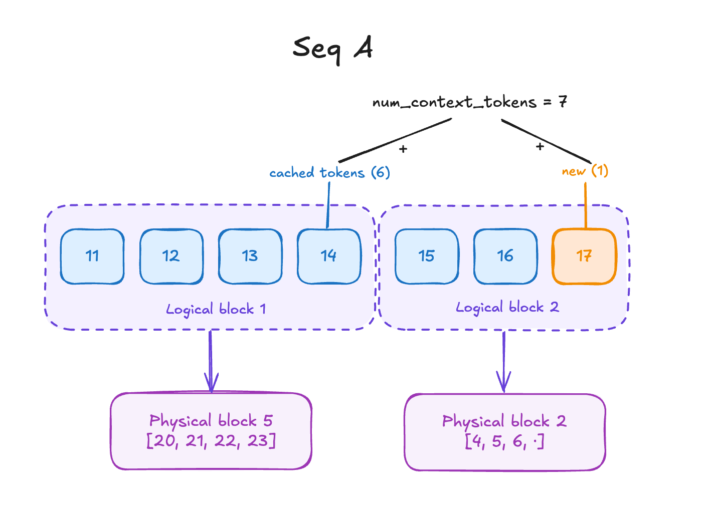
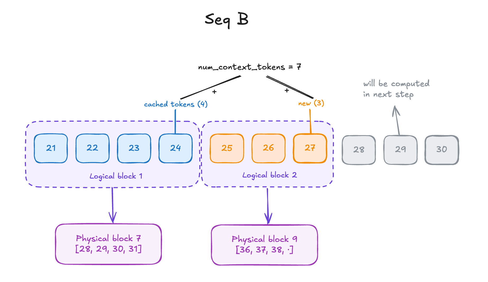
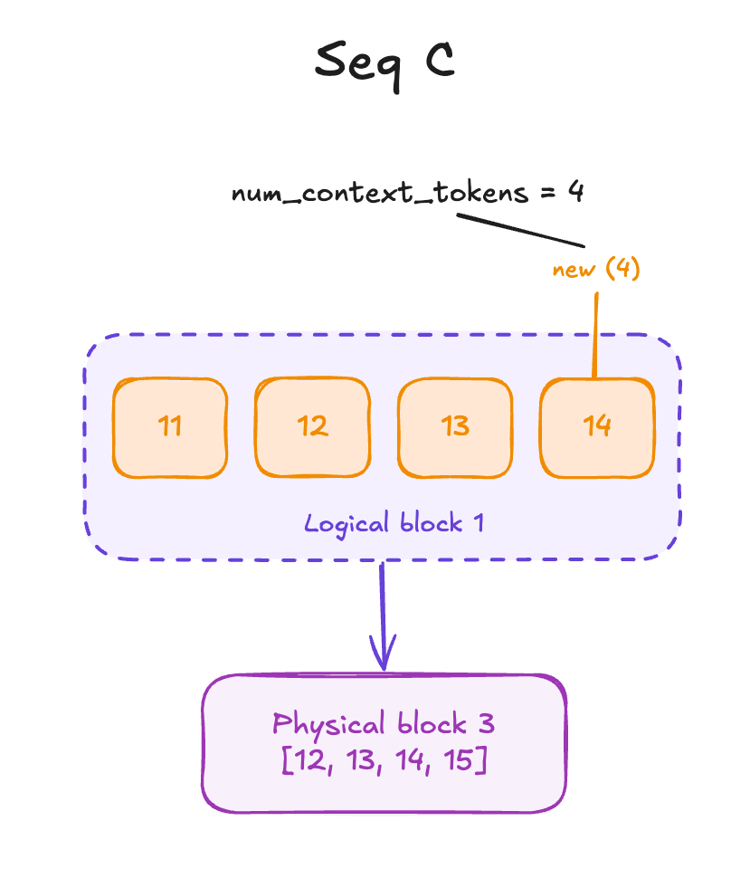
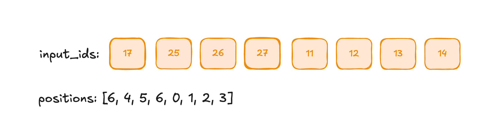
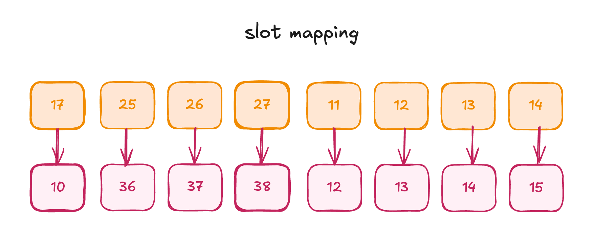
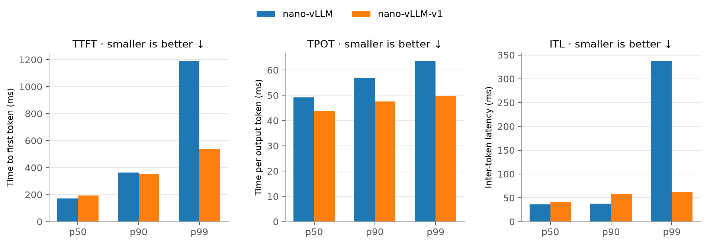
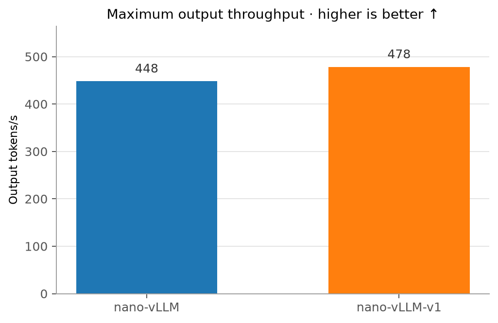

# Inside nano-vLLM v1

In this note, we will go over how the following work in vLLM:

1. chunked prefill
2. mixed batch scheduling

We will do so by going through the [nano-vllm-v1](https://github.com/slwang-ustc/nano-vllm-v1) implementation by https://github.com/slwang-ustc.

>[!note]
> Chunked prefill has also been applied to nano-vllm since April 2026.

Since most changes are contained in the Scheduler, Block Manager, and Model Runner, it will be pretty easy to understand the difference if you're already familiar with the V0 architecture.

## Chunked Prefill Recap

I have already explained the paper that introduced _Chunked Prefill_, so I am only going to write a TLDR on what it is before we dive into the code. For people who want to understand more about it, check my note on [Sarathi-Serve](https://github.com/junuxyz/mlsys-notes/blob/main/notes/sarathi-serve.md); the [**illustrated walkthrough**](https://github.com/junuxyz/mlsys-notes/blob/main/notes/sarathi-serve.md#stall-free-batching-w-illustrated-example) in particular will help you understand how this works.

**TLDR of Chunked Prefill**

**Chunked Prefill** is a technique proposed in Sarathi-Serve where, instead of scheduling a prefill request at once, we set a token budget and may chunk part of the prefill request if it doesn't fit into the token budget.

For a minimal example, say the token budget is 100 tokens, there are 5 running requests in decode, and a prefill request with a length of 1,000 tokens is waiting.

Now how do we schedule this?

We first prioritize the 5 tokens in their decoding stage. The token budget becomes 100 - 5 = 95. We have 95 additional tokens to append, so instead of appending all the tokens in the prefill request, we chunk the first 95 tokens and run the iteration. The prefill request has 905 tokens left, and the rest will be scheduled (chunked again) in later steps.

**Why do we do this?**

If we prioritize decode, prefill requests get stalled and TTFT (Time-To-First-Token) increases. Also, batching only decode requests will underutilize the GPU's compute. If we prioritize prefill, decode requests get stalled and TPOT (Time-Per-Output-Token) increases. Even worse, the worst 5% case (p95) or 1% case (p99) becomes so significantly high that users experience massive stalls where token streaming stops in the middle of generation for a long time (10s–30s).

The takeaway is that prioritizing either one (prefill or decode) results in suboptimal throughput or increased latency. In order to avoid this and schedule even more cleverly, we set a token budget, which softly guarantees the avoidance of significant latency (SLO constraints) while utilizing the GPU better than a decode-first approach.

Now let's look at how this idea is implemented in nano-vllm-v1.

## Code Walkthrough

```python
@dataclass
class Config:
    # ...
    chunked_prefill: bool = False
```

In `Config`, which is the global configuration shared among all the submodules in the vLLM engine, `chunked_prefill` is added as a boolean flag that you can either enable or disable.

### Engine's step function

```python
def step(self):
	seqs = self.scheduler.schedule()
	token_ids, seq_need_compute_logits = self.model_runner.call("run", seqs)
	self.scheduler.postprocess(seqs, token_ids, seq_need_compute_logits)
	outputs = [(seq.seq_id, seq.completion_token_ids) for seq in seqs if seq.is_finished]
	num_total_tokens = sum(len(seq) for seq in seqs if seq.is_finished)
	return outputs, num_total_tokens
```

LLMEngine's `step` function works as follows:
1. schedules sequences (prefill and decode requests **can be mixed**; more explained in the second section)
2. model runner runs the forward pass
3. scheduler updates the batch information using postprocess

How does the scheduler in step 1 work?
### v1 scheduler

In the original nano-vllm scheduler, it processed all given prefill requests first, then processed decode requests, and didn't allow mixed batching. Let's look at how V1 works.

**TLDR on how V1 scheduler works:**
1. check the running queue first: requests that have started processing and have passed through at least one (chunked) prefill pass, consisting of either sequences undergoing chunked prefill or decode requests
2. schedule tokens while considering chunked prefill, if enabled, and check the prefix cache as well
3. whenever a new sequence is scheduled to run in that step, reduce the token budget, which is the maximum number of tokens that can be batched in that step
4. if the scheduler has not finished scheduling all the sequences in the running queue but no free blocks remain, preempt sequences

Below is the full code for the schedule function:

```python
def schedule(self) -> tuple[list[Sequence], bool]:
	scheduled_seqs = []
	scheduled_running_seqs = []
	scheduled_new_reqs = []
	preempted_seqs = []
	token_budget = self.max_num_batched_tokens

	# schedule from the running queue
	req_index = 0
	while req_index < len(self.running) and token_budget > 0:
		seq = self.running[req_index]
		num_new_tokens = len(seq) - seq.num_cached_tokens
		if self.enable_chunked:
			num_new_tokens = min(num_new_tokens, token_budget)
		num_new_tokens = min(
			num_new_tokens, self.max_model_len - 1 - seq.num_cached_tokens
		)
		assert num_new_tokens > 0
		while True:
			if self.block_manager.can_append(seq, num_new_tokens):
				seq.num_new_tokens = num_new_tokens
				self.block_manager.may_append(seq)
				break
			preempted_seq = self.running.pop()
			self.preempt(preempted_seq)
			preempted_seqs.append(preempted_seq)
			if len(self.running) == req_index:
				break
		if len(self.running) == req_index:
			break
		scheduled_running_seqs.append(seq)
		token_budget -= seq.num_new_tokens
		req_index += 1
	
	# schedule from the waiting queue
	if not preempted_seqs:
		while self.waiting and token_budget > 0 and len(self.running) < self.max_num_seqs:
			seq = self.waiting[0]
			assert not seq.block_table
			num_new_computed_tokens_in_used, num_new_computed_tokens_in_free, num_new_tokens = \
				self.block_manager.get_token_layout(seq)
			if self.enable_chunked:
				num_new_tokens = min(num_new_tokens, token_budget)
			assert num_new_tokens > 0
			if num_new_tokens > token_budget or \
				not self.block_manager.can_allocate(num_new_computed_tokens_in_free + num_new_tokens):
				break
			seq.num_new_tokens = num_new_tokens
			self.block_manager.allocate(seq)
			assert seq.num_cached_tokens == num_new_computed_tokens_in_free + \
				num_new_computed_tokens_in_used
			token_budget -= num_new_tokens
			seq.status = SequenceStatus.RUNNING
			self.waiting.popleft()
			self.running.append(seq)
			scheduled_new_reqs.append(seq)
	
	scheduled_seqs = scheduled_running_seqs + scheduled_new_reqs
	assert scheduled_seqs
	return scheduled_seqs
```

Let's understand it by chunks each.

```python
def schedule(self) -> tuple[list[Sequence], bool]:
	scheduled_seqs = []
	scheduled_running_seqs = []
	scheduled_new_reqs = []
	preempted_seqs = []
	token_budget = self.max_num_batched_tokens
```

- `scheduled_seqs` is the list of all sequences scheduled for this step's forward pass.
- `scheduled_running_seqs` is the list of sequences in the running queue scheduled for this step's forward pass.
- `scheduled_new_reqs` is the list of sequences in the waiting queue that are newly appended to the running queue and this step's forward pass. We can only try to schedule sequences from the waiting queue if we have a "token budget" left even after scheduling all the sequences in the running queue.
- `preempted_seqs` is the list of sequences that get preempted due to a lack of KV Cache memory. While this is a list type, it is only used as a flag indicating whether to try appending sequences from waiting requests.
- `token_budget` is the limit on the number of tokens we can append/batch in this step.


```python
	# schedule from the running queue
	req_index = 0
	while req_index < len(self.running) and token_budget > 0:
		seq = self.running[req_index]
		num_new_tokens = len(seq) - seq.num_cached_tokens
		if self.enable_chunked:
			num_new_tokens = min(num_new_tokens, token_budget)
		num_new_tokens = min(
			num_new_tokens, self.max_model_len - 1 - seq.num_cached_tokens
		)
		assert num_new_tokens > 0
```

While we haven't run all the requests in the running queue AND there is a token budget left, `num_new_tokens`, which represents the new tokens that will be appended to the batch, is the total number of tokens in that sequence minus the cached tokens.

> [!NOTE]  
> I've noticed the while loop (`while ... token_budget > 0:`) terminates as soon as the token budget reaches zero, even if it has not examined every request in the running queue. This behavior is also explicitly acknowledged in a comment in [vLLM’s scheduler source code](https://github.com/vllm-project/vllm/blob/318b527cc2d1f672683407be05ea26a2cf1f3ea6/vllm/v1/core/sched/scheduler.py#L1058-L1065).
> 
> Consequently, a request in the decode stage may, in principle, remain unscheduled for a step if earlier chunked-prefill requests exhaust the token budget. For example, assume a token budget of 4 and the running queue `[P1, D1, P2, D2]`, where `P` is an in-progress chunked prefill and `D` is a decode request. If the scheduler assigns 2 tokens to `P1`, 1 to `D1`, and the remaining 1 to `P2`, the budget reaches zero (4-2-1-1) before `D2` is examined. Thus, `D2` cannot be scheduled in that step. I am pretty sure this (very niche case) doesn't become an actual problem for tail latency (e.g. p99), though.

Here, _"cached token"_ refers not only to the prefix cache blocks but also to previous KV Cache tokens generated in earlier steps. So, for a prefill request, `num_cached_tokens` would be prefix-cached tokens, and for a decode sequence, it would be the prefill tokens of that sequence + its previous decode steps.

If `enable_chunked` is True, `num_new_tokens` is capped at `min(num_new_tokens, token_budget)`, since we cannot exceed the token budget as explained above.

Finally, there is the `max_model_len` limit, which is the maximum number of tokens a sequence can have. When limiting in terms of `max_model_len`, we subtract `1 + seq.num_cached_tokens`: 1 for sampling the last token and `seq.num_cached_tokens` because `max_model_len` should include cached tokens as well.

After this process, we can get the exact number of tokens to append from that specific sequence (recall that we are still in the while loop:
```python
while req_index < len(self.running) and token_budget > 0:
	seq = self.running[req_index]
	# ...
```
)

```python
			while True:
                if self.block_manager.can_append(seq, num_new_tokens):
                    seq.num_new_tokens = num_new_tokens
                    self.block_manager.may_append(seq)
                    break
```

The Scheduler asks the Block Manager if it can append the `num_new_tokens` of that sequence (`can_append`) before actually appending blocks (`may_append`).

**can append**

```python
    def can_append(self, seq: Sequence, num_new_tokens: int) -> bool:
        """
        Only for seq in the running queue.
        """
        last_computed_block_capacity = self.block_size - (seq.num_cached_tokens % self.block_size)
        if last_computed_block_capacity == self.block_size:
            last_computed_block_capacity = 0
        if (num_new_tokens - last_computed_block_capacity + self.block_size - 1) // self.block_size \
            <= len(self.free_block_ids):
            return True
        return False
```

The last computed block capacity is the leftover unused memory space in the last block. The Block Manager checks how many new blocks are needed, considering the last computed block capacity (`num_new_tokens - last_computed_block_capacity + self.block_size - 1) // self.block_size`), and checks that this does not exceed the number of free blocks we have. For example, if there is only one new token to append for the sequence, the block size is 4, and only 3 slots were used before:

```
(1 - (4-3) + 4 -1) // 4 = 3 // 4 = 0.
```
	
If it can append the blocks, it actually appends them with `may_append`.

**may append**

```python
    def may_append(self, seq: Sequence):
        """
        Only for seq in the running queue.
        """
        for i in range(
            seq.num_cached_blocks * self.block_size, 
            seq.num_context_tokens,
            self.block_size
        ):
            token_ids = seq[i: min(i + self.block_size, seq.num_context_tokens)]
            current_block_id = seq.block_table[i // self.block_size] \
                    if i // self.block_size < len(seq.block_table) else -1
            if current_block_id != -1:
                current_block = self.blocks[current_block_id]
                assert current_block.hash == -1
            if len(token_ids) % self.block_size == 0:
                previous_block_id = seq.block_table[i // self.block_size - 1] if i >= self.block_size else -1
                prefix = self.blocks[previous_block_id].hash if previous_block_id != -1 else -1
                h = self.compute_hash(token_ids, prefix)
                if current_block_id == -1:
                    block_id = self.free_block_ids[0]
                    current_block = self._allocate_block(block_id)
                    seq.block_table.append(block_id)
                current_block.update(h, token_ids)
                self.hash_to_block_id[h] = current_block.block_id
            elif current_block_id == -1:
                    block_id = self.free_block_ids[0]
                    self._allocate_block(block_id)
                    seq.block_table.append(block_id)
```

The code is kind of dense to understand, so I'll break this down step by step.

First, `i` starts from `num_cached_blocks * block_size`, which means the first index after the last full block. For example, if there are 7 cached tokens, the number of cached blocks is 7 // 4 = 1, so it starts from 1 * 4 = 4.

If the previous block is not full, the Block Manager uses the last block. If the previous block is full, it needs an additional block, which is allocated with `self.blocks[-1]`.

This function is called _"may"_ append because it allocates a physical block only when the last physical block is full (`last_block_len == block_size`) and appends to the last physical block if it isn't.

It is responsible for allocating KV Cache blocks for _new_ tokens while respecting already-cached blocks (from prefix cache or previous steps). This logic is critical for chunked prefill because we often only process a portion of a long prefill request in one step.

```python
                preempted_seq = self.running.pop()
                self.preempt(preempted_seq)
                preempted_seqs.append(preempted_seq)
                if len(self.running) == req_index:
                    break
            if len(self.running) == req_index:
                break
            scheduled_running_seqs.append(seq)
            token_budget -= seq.num_new_tokens
            req_index += 1
```

If there are sequences left in the running queue but no blocks are available for a sequence, the remaining requests are preempted starting from the last index (`pop()`). As explained in my prior note, preemption frees the preempted sequence's blocks, which can be allocated to the prior running sequences.

So the whole loop can be summarized as:
1. for each running request in the running queue, try to append the blocks needed for each sequence
2. if the required blocks are not available, preempt the last sequence from the running queue (lowest priority in FCFS scheduling)
3. continue until all requests are either scheduled or preempted.

Now we look at the second half.

```python
	# schedule from the waiting queue
	if not preempted_seqs:
		while self.waiting and token_budget > 0 and len(self.running) < self.max_num_seqs:
			seq = self.waiting[0]
			assert not seq.block_table
			num_new_computed_tokens_in_used, num_new_computed_tokens_in_free, num_new_tokens = \
				self.block_manager.get_token_layout(seq)
			if self.enable_chunked:
				num_new_tokens = min(num_new_tokens, token_budget)
			assert num_new_tokens > 0
			if num_new_tokens > token_budget or \
				not self.block_manager.can_allocate(num_new_computed_tokens_in_free + num_new_tokens):
				break
			seq.num_new_tokens = num_new_tokens
			self.block_manager.allocate(seq)
			assert seq.num_cached_tokens == num_new_computed_tokens_in_free + \
				num_new_computed_tokens_in_used
			token_budget -= num_new_tokens
			seq.status = SequenceStatus.RUNNING
			self.waiting.popleft()
			self.running.append(seq)
			scheduled_new_reqs.append(seq)
```

This path is only taken when there are no preempted sequences, since any preemptions would mean there was not enough memory to run the sequences in the running queue. All sequences in the waiting queue are waiting for their first (chunked) prefill. We first get the new tokens in the used block list, the new tokens in the free block list, and the number of new tokens. Here, `num_new_computed_tokens_in_used` refers to tokens that have the same prefix and are used in the running queue, while `num_new_computed_tokens_in_free` refers to tokens that have the same prefix and have been freed but not yet overwritten. This is possible because a sequence's KV Cache is not erased when it is freed; it remains available until it is overwritten.

Sequences that don't exceed the available KV block memory and token budget for that step are appended to the running queue and scheduled.

> [!NOTE]
> It is important to know that BlockManager only assigns/frees sequences at the granularity of a _block_. Everything is assigned in blocks, not individual tokens. The actual token-level mapping is done by slot mapping, which happens in the Model Runner.
> While some functions in BlockManager seem to return token-level values, e.g., `self.block_manager.get_token_layout(seq)`, this is done to match the convention in the Scheduler, which works at token granularity; internally, the tokens are always managed as multiples of the block size.

### model runner v1

We will primarily focus on `prepare_model_input` since it prepares the scheduled batch and runs the model based on it.

Unlike `nano-vllm`, which used separate `prepare_prefill()` and `prepare_decode()` paths, `nano-vllm-v1` uses one unified function:

```python
prepare_model_input(seqs)
```

The function does not fundamentally care whether a request is in prefill or decode. For every sequence, it only asks:

```text
How many tokens are already cached?
How many new tokens should be computed now?
```

It then packs all new tokens into one flat batch.

**Full code**

```python
    def prepare_model_input(self, seqs: list[Sequence]):
        input_ids = []
        positions = []
        cu_seqlens_q = [0]
        cu_seqlens_k = [0]
        max_seqlen_q = 0
        max_seqlen_k = 0
        slot_mapping = []
        block_tables = None
        context_lens = []
        seq_need_compute_logits = []
        for seq_index, seq in enumerate(seqs):
            if len(seq) == seq.num_cached_tokens + seq.num_new_tokens and seq.block_table:
                seq_need_compute_logits.append(seq_index)
            context_lens.append(seq.num_context_tokens)
            input_ids.extend(seq[seq.num_cached_tokens: seq.num_context_tokens])
            positions.extend(list(range(seq.num_cached_tokens, seq.num_context_tokens)))
            seqlen_q = seq.num_new_tokens
            seqlen_k = seq.num_context_tokens
            cu_seqlens_q.append(cu_seqlens_q[-1] + seqlen_q)
            cu_seqlens_k.append(cu_seqlens_k[-1] + seqlen_k)
            max_seqlen_q = max(seqlen_q, max_seqlen_q)
            max_seqlen_k = max(seqlen_k, max_seqlen_k)
            if not seq.block_table:    # warmup
                continue
            for i in range(seq.num_cached_blocks, len(seq.block_table)):
                if i == seq.num_cached_blocks:
                    start = seq.block_table[i] * self.block_size + seq.num_cached_tokens % seq.block_size
                else:
                    start = seq.block_table[i] * self.block_size
                if i == len(seq.block_table) - 1:
                    end = seq.block_table[i] * self.block_size + seq.num_context_tokens % self.block_size \
                        if seq.num_context_tokens % self.block_size != 0 \
                            else (seq.block_table[i] + 1) * self.block_size
                else:
                    end = (seq.block_table[i] + 1) * self.block_size
                slot_mapping.extend(list(range(start, end)))
        if cu_seqlens_k[-1] > cu_seqlens_q[-1]:    # prefix cache or decoding
            block_tables = self.prepare_block_tables(seqs)
        input_ids = torch.tensor(input_ids, dtype=torch.int64, pin_memory=True).cuda(non_blocking=True)
        positions = torch.tensor(positions, dtype=torch.int64, pin_memory=True).cuda(non_blocking=True)
        cu_seqlens_q = torch.tensor(cu_seqlens_q, dtype=torch.int32, pin_memory=True).cuda(non_blocking=True)
        cu_seqlens_k = torch.tensor(cu_seqlens_k, dtype=torch.int32, pin_memory=True).cuda(non_blocking=True)
        slot_mapping = torch.tensor(slot_mapping, dtype=torch.int32, pin_memory=True).cuda(non_blocking=True)
        context_lens = torch.tensor(context_lens, dtype=torch.int32, pin_memory=True).cuda(non_blocking=True)
        seq_need_compute_logits = torch.tensor(seq_need_compute_logits, dtype=torch.int32, pin_memory=True).cuda(non_blocking=True)
        set_context(cu_seqlens_q, cu_seqlens_k, max_seqlen_q, max_seqlen_k, slot_mapping, context_lens, block_tables, seq_need_compute_logits)
        return input_ids, positions
```

**Terminology and Overview of the Function**

If you look at the function, there is quite a lot of context and many variable names, so before we move on, let's see what each refers to.

```python
def prepare_model_input(self, seqs: list[Sequence]):
```

As input, we get the list of sequences scheduled in the step function. ([context](https://github.com/slwang-ustc/nano-vllm-v1/blob/357860a688f1a9ed4b36881b5fc86144be703468/nanovllm/engine/llm_engine.py#L49-L50))

For one sequence, the tokens computed in this forward pass (`seq.num_new_tokens`) can be expressed as `[seq.num_cached_tokens:seq.num_context_tokens]`, where:
- `seq.num_cached_tokens`: the first logical token position computed in this forward pass.
- `seq.num_context_tokens`: the end position of the current sequence. This is the same as `seq.num_cached_tokens + seq.num_new_tokens`.

**Additional terms**

- `seqlen_q`: the number of new query tokens computed now.
- `seqlen_k`: the total number of key/value tokens visible after adding the new tokens.

How do `seqlen_q` and `seqlen_k` differ?

If a token is cached (either because of previous prefill/chunked prefill or prefix caching), we don't need to use the previous Q for it since we already have that previous token's KV cache. However, we always need to load all previous KV cache entries in order to get the attention scores for the query tokens.

Therefore:
```
seqlen_q = seq.num_new_tokens
seqlen_k = seq.num_context_tokens
```


For example, `seqlen_q` for decoding tokens will be 1, while `seqlen_k` is the length of all previous tokens.

**What is the result of the function?**

It stores eight metadata fields in the global batch `Context` (also check the `Context` section in my previous note):

- `cu_seqlens_q`: cumulative sequence length of query tokens
- `cu_seqlens_k`: cumulative sequence length of key/value tokens
- `max_seqlen_q`: maximum query token length among all sequences
- `max_seqlen_k`: maximum k/v token length among all sequences
- `slot_mapping`: maps logical blocks to the physical KV cache slots (in VRAM).
- `context_lens`: list of each sequence's `seq.num_context_tokens = seq.num_cached_tokens + seq.num_new_tokens`
- `block_tables`: this is needed if there are any sequences that have cached tokens in the KV cache. In this case, we need to check the previous physical block indexes so the FlashAttention kernel can access them while retrieving the KV cache.
- `seq_need_compute_logits`: This is something additional compared to nano-vllm. When we are not done processing the entire prompt and have only processed a chunk of it, we don't need to get the logits and sample the next token (we are not yet done processing the last given token), so we skip sampling and only save the KV cache of the given chunk.

The output of the function is `input_ids` and `positions`, where `input_ids` is a list of each sequence's new tokens to process (`seq[num_cached_tokens:num_context_tokens]`) and `positions` (`[num_cached_tokens:num_context_tokens]`) is used for RoPE.

**So how does this work?**

Now with all this given context, let's see how this function works.

For each sequence in the `seqs` batch:

1. Check if this sequence needs to compute logits

```python
if len(seq) == seq.num_cached_tokens + seq.num_new_tokens and seq.block_table:
	seq_need_compute_logits.append(seq_index)
```

This is only `False` when chunked prefill hasn't finished.

2. Pack input IDs and positions (explained above)

3. Build `cu_seqlens_q`, `cu_seqlens_k`

Build the cumulative sums of Q and K starting from `[0]`.

4. Compute maximum lengths

Track `max_seqlen_q` and `max_seqlen_k`, which are upper bounds used by FlashAttention later.

5. Build `slot_mapping`

```python
for i in range(seq.num_cached_blocks, len(seq.block_table)):
	if i == seq.num_cached_blocks:
		start = seq.block_table[i] * self.block_size + seq.num_cached_tokens % seq.block_size
	else:
		start = seq.block_table[i] * self.block_size
	if i == len(seq.block_table) - 1:
		end = seq.block_table[i] * self.block_size + seq.num_context_tokens % self.block_size \
			if seq.num_context_tokens % self.block_size != 0 \
				else (seq.block_table[i] + 1) * self.block_size
	else:
		end = (seq.block_table[i] + 1) * self.block_size
	slot_mapping.extend(list(range(start, end)))
```

Each new token produces a K and V vector in every attention layer. `slot_mapping` provides information about where the model should write each packed token’s new K/V cache in the physical KV cache. We can ensure that we have already reserved block memory for all sequences in this batch because, while scheduling, we allocated blocks for all scheduled sequences.

The if/else statement is used to check whether the last block is full and whether writing to it will fill it. All this information is saved in slot mapping. This might be more intuitive to understand after seeing the end-to-end example I'll show later.

6. Build `block_tables`

```python
if cu_seqlens_k[-1] > cu_seqlens_q[-1]:
    block_tables = self.prepare_block_tables(seqs)
```

If there is at least one sequence that has cached tokens (`seq.num_cached_tokens != 0`), which is highly likely, the function calls `prepare_block_tables`. This function internally prepares a 2D list in which the lengths of the inner lists are all matched (padded) to the maximum list length. The block table is later used to let FlashAttention retrieve the previous KV cache.

7. Send Context information to the device, set the context, and return `input_ids` and `positions`

**Minimal Example**

While I tried to explain things simply, it might be a bit abstract to look only at the steps, so let's walk through an illustrative example.

Assume a block size of 4 tokens, with three requests, A, B, and C, scheduled together:
- A(`[11, 12, 13, 14, 15, 16]`) is in its decoding stage.
- B(`[21, 22, 23, 24, 25, 26, 27, 28, 29, 30]`) is processing a chunk of a longer prompt and has a cached prefix, where the first four tokens are cached and the next 3 tokens are about to be processed due to the limited token budget.
- C(`[31, 32, 33, 34]`) is performing a fresh prefill and finishes its prompt in this iteration.

**Request A: decode**

<p align="center">
  
  <br />
  <sub>Figure 1. Request A computes one new decode token after six cached tokens.</sub>
</p>

The first six tokens have already been processed. Token `17` (orange), at logical position 6, will be newly computed in this step.

Metadata can be expressed as:
```text
seqlen_q = 1 # only one query token because it's decode
seqlen_k = 7

input_ids = A[6:7] = [17]
positions   = [6]
```

**Request B: chunked prefill with a cached prefix**

<p align="center">
  
  <br />
  <sub>Figure 2. Request B computes a three-token prefill chunk after a four-token cached prefix.</sub>
</p>

The prompt still contains positions 7–9, so B does not finish its prompt in this iteration.

**Request C: fresh prefill**

<p align="center">
  
  <br />
  <sub>Figure 3. Request C performs a fresh four-token prefill in one physical block.</sub>
</p>

```text
tokens = [31, 32, 33, 34]

num_cached_tokens = 0
num_new_tokens    = 4
num_context_tokens = 4

block_table = [3]
```

1. Check if this sequence needs to compute logits

Since the `num_context_len` values for requests A and C are the same as their sequence lengths, these sequences need to compute logits. However, for B, the sequence length is 10 but `num_context_len` is 7, so we don't need to compute logits for it. We only append requests A and C.

2. Pack input IDs and positions

<p align="center">
  
  <br />
  <sub>Figure 4. The model runner packs the new tokens from requests A, B, and C into one flat batch.</sub>
</p>

This becomes the output of the function.

3. Build `cu_seqlens_q`, `cu_seqlens_k`

The function builds the cumulative sum of `num_new_tokens` starting from [0]: `cu_seqlens_q = [0, 1, 4, 8]`. In a similar manner, we build the cumulative sequence length of the KV lengths (`num_context_len`): `cu_seqlens_k = [0, 7, 14, 18]`.

4. Compute maximum lengths

```text
max_seqlen_q = max(1, 3, 4) = 4
max_seqlen_k = max(7, 7, 4) = 7
```

5. Build `slot_mapping`

A computes logical position 6.

```
logical block = 6 // 4 = 1
block offset  = 6 % 4  = 2

physical block = A.block_table[1] = 2

physical slot = 2 × 4 + 2 = 10
```

So the new token will be saved in physical slot 10.

In a similar manner, B computes positions 4, 5, and 6. These belong to logical block 1, which maps to physical block 9.

```text
position 4 → slot 9 × 4 + 0 = 36
position 5 → slot 9 × 4 + 1 = 37
position 6 → slot 9 × 4 + 2 = 38
```

So B's `slot_mapping` result is `[36, 37, 38]`.

C computes positions 0–3 in physical block 3.

```text
position 0 → slot 12
position 1 → slot 13
position 2 → slot 14
position 3 → slot 15
```

So C's slot mapping result is `[12, 13, 14, 15]`.

The final result is `slot_mapping = [10, 36, 37, 38, 12, 13, 14, 15]`.

<p align="center">
  
  <br />
  <sub>Figure 5. Slot mapping sends each packed token to its physical KV cache slot.</sub>
</p>

5. Build `block_tables`

```python
if cu_seqlens_k[-1] > cu_seqlens_q[-1]:
    block_tables = self.prepare_block_tables(seqs)
```

`cu_seqlens_k[-1]` is 18 and `cu_seqlens_q[-1]` is 8. This is because there are cached tokens in both requests A and B. In this case, we need to fetch the previous KV cache. In order to do so, we call the `prepare_block_tables` function.

As explained above, all sequences need to match the maximum block length among the sequences, which is 2 in this case. Since sequence C only has one block, we pad it with `-1`.

```text
block_tables = [
    [5, 2],
    [7, 9],
    [3, -1],
]
```

7. Send Context information to the device, set the context, and return `input_ids` and `positions`

Finally, we save the context:

```
cu_seqlens_q = [0, 1, 4, 8]
cu_seqlens_k = [0, 7, 14, 18]

max_seqlen_q = 4
max_seqlen_k = 7

slot_mapping = [10, 36, 37, 38, 12, 13, 14, 15]

context_lens = [7, 7, 4]

block_tables = [
    [5, 2],
    [7, 9],
    [3, -1],
]

seq_need_compute_logits = [0, 2] # seq A and C
```

and the function returns

```
input_ids = [17, 25, 26, 27, 31, 32, 33, 34]
positions = [6, 4, 5, 6, 0, 1, 2, 3]
```

### Ragged Attention (Future Note)

So far, we have followed the scheduler up to the point where decode, chunked-prefill, and prefill tokens are packed into a single iteration. The remaining question is how the attention kernel recovers the individual sequence boundaries from this packed representation.

This turns out to require a careful trace through FlashAttention’s variable-length and paged-KV implementation. Since the topic deserves a more complete treatment than I can provide here, I will cover it in a separate post once I am more familiar with the underlying kernel code.

## Measuring Performance (nano-vllm vs nano-vllm-v1)

Before finishing this note, let's actually measure the performance of both and see if there are any performance gains, since this is what mixed batching is (theoretically) supposed to improve.

> [!NOTE]
> This is not a controlled comparison between the *original* nano-vLLM and nano-vLLM-v1. I later noticed that nano-vLLM [now](https://github.com/GeeeekExplorer/nano-vllm/commit/8d63a98c03805e54e9a422fd83fff7a4780c17dc) supports chunked prefill. So the main scheduling difference examined here is that nano-vLLM-v1 can mix prefill and decode requests in the same iteration. Both engines run in eager mode because nano-vLLM-v1 currently has CUDA Graph issues. See the [benchmark repository](https://github.com/junuxyz/nano-vllm-bench) for the full setup.

I ran both nano-vllm and nano-vllm-v1 with the settings below:
- 1 x RTX 4090 with Qwen3-8B
- 256 requests
- 128-2,048 input tokens
- 64-256 output tokens
- eager execution

### Main Results

<p align="center">
  
  <br />
  <sub>Figure 6. Throughput and tail-latency results at a request rate of 2 requests/s.</sub>
</p>

At 2 requests/s, both engines sustain about 309 output tokens/s, while nano-vLLM-v1 reduces p99 TTFT from 1,189 ms to 536 ms, p99 TPOT from 63.5 ms to 49.6 ms, and p99 ITL from 337 ms to 62.6 ms. You can see that nano-vllm-v1 handles tail latency better in general.

<p align="center">
  
  <br />
  <sub>Figure 7. Maximum-throughput results with the request rate set to infinity.</sub>
</p>

With the request rate set to infinity (which is used to measure the maximum throughput of the engine), nano-vLLM-v1 slightly increases output throughput from 448 to 478 tokens/s.

## Acknowledgements

All credit goes to https://github.com/slwang-ustc!
Thanks for the clean implementation: https://github.com/slwang-ustc/nano-vllm-v1.